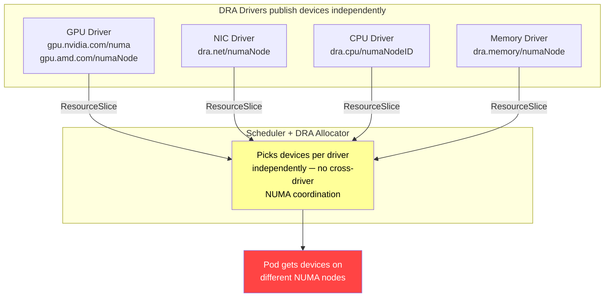
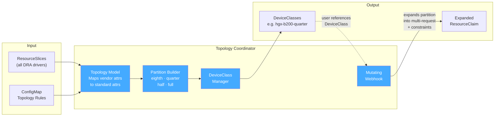
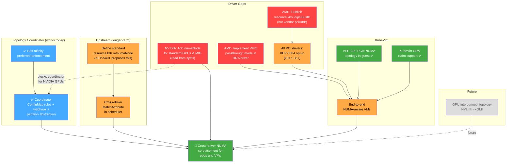

# DRA Topology-Aware Device Co-Placement

**Date:** 2026-04-02
**Repos analyzed:**
- `kubernetes/dynamic-resource-allocation`
- `kubernetes/dra-driver-cpu`
- `kubernetes/dra-driver-memory`
- `kubernetes/dra-driver-sriov`
- `nvidia/k8s-dra-driver-gpu`
- `nvidia/kubevirt-gpu-device-plugin`
- `amd/k8s-gpu-dra-driver`
- `amd/k8s-device-plugin`
- `kubernetes/k8s-dra-topology-coordinator`

## Goal

Maximize AI/HPC workload performance on Kubernetes by ensuring that GPUs, NICs, CPUs, and memory assigned to a pod or VM are co-located on the same NUMA boundary. Cross-NUMA device placement can degrade throughput by 30-50% and prevent GPU Direct RDMA entirely. Today, DRA allocates each resource type independently — a GPU may land on NUMA node 0 while its NIC lands on NUMA node 1, with no mechanism to prevent this. This project extends DRA with cross-driver topology awareness to close that gap.

## Why All Four Resource Types Matter

Full NUMA alignment requires co-locating four resource types on the same NUMA node: GPUs, NICs, CPUs, and memory. Aligning only a subset still leaves cross-NUMA data movement in the critical path:

- **GPU + NIC on same NUMA, but CPUs on a different NUMA** — every CPU-GPU transfer (launching kernels, copying buffers) and CPU-NIC transfer (protocol processing) crosses NUMA boundaries
- **GPU + NIC + CPU aligned, but memory on a different NUMA** — the kernel may allocate buffers on a remote NUMA node, adding latency to every memory access

The GPU and NIC DRA drivers handle accelerator placement. The CPU and memory DRA drivers handle the compute and memory side:

| DRA Driver | Replaces | What It Does |
|-----------|----------|-------------|
| [dra-driver-cpu](https://github.com/kubernetes-sigs/dra-driver-cpu) (kubernetes-sigs) | Kubelet CPU Manager | Exclusive CPU assignment with NUMA/socket/L3 cache topology attributes. Scheduler-visible (unlike CPU Manager which is kubelet-internal and opaque to the scheduler). |
| [dra-driver-memory](https://github.com/kad/dra-driver-memory) (early development) | Kubelet Memory Manager | Per-NUMA-zone memory and hugepage allocation with NRI-based `cpuset.mems` pinning. Adds runtime hugepage provisioning via `HugePageProvision` CRD. |

Both drivers publish NUMA node attributes, making them compatible with the topology coordinator's partition model — a "quarter partition" can include CPUs and memory alongside GPUs and NICs, all constrained to the same NUMA node.

**Maturity caveat:** `dra-driver-cpu` is a kubernetes-sigs project and is mature. `dra-driver-memory` is on a personal repo and still in early development — memory NUMA pinning may need to rely on the existing kubelet Memory Manager in the near term.

---

## Current State: No Topology Awareness



---

## The Problem

DRA allocates each resource type independently. The `MatchAttribute` constraint only works within a single driver's devices — there is no mechanism to coordinate across the GPU driver, NIC driver, and CPU driver to ensure they all pick devices from the same NUMA node. A pod requesting 2 GPUs + 1 NIC + CPUs may get a GPU from NUMA 0, a NIC from NUMA 1, and CPUs from NUMA 2, with no way to prevent this.

Node selection is also affected: the scheduler does not check whether NUMA-aligned allocation is possible on a node before selecting it. However, this is implicitly solved when cross-driver `matchAttribute` constraints are present in the claim — the DRA allocator will fail to find a valid allocation on nodes where no NUMA node has all the required devices, causing the scheduler to naturally try other nodes.

### Gaps

#### Cross-driver coordination gaps

| Gap | Description | Layer |
|-----|-------------|-------|
| **Gap 1: No standard NUMA attribute** | Every driver uses its own attribute name (`dra.cpu/numaNodeID`, `gpu.amd.com/numaNode`, etc.). No `resource.kubernetes.io/numaNode` exists. KEP-5491 proposes it but it is not yet merged. | Upstream Kubernetes |
| **Gap 2: No cross-driver constraints** | `MatchAttribute` only works within a single driver's devices. No mechanism to say "match NUMA across GPU, NIC, and CPU drivers simultaneously" without hardcoding the node ID. | Upstream Kubernetes |

#### Driver-specific gaps

| Gap | Description | Layer |
|-----|-------------|-------|
| **Gap 3: AMD vendor-specific `pciBusID`** | AMD GPU DRA driver publishes PCI address as `pciAddr` instead of `resource.kubernetes.io/pciBusID` (KEP-4381). Breaks KEP-5304 metadata and KubeVirt device discovery. | AMD GPU DRA driver |
| **Gap 4: NVIDIA no NUMA for standard GPUs** | NUMA node info only exposed for VFIO/passthrough devices. Standard GPU and MIG types have no `numaNode` attribute, even though the data is in sysfs. Blocks NUMA-aware placement for NVIDIA container workloads. | NVIDIA GPU DRA driver |
| **Gap 5: AMD no VFIO passthrough** | AMD GPU DRA driver only supports ROCm containers. No VFIO mode for VM passthrough. Blocks KubeVirt DRA integration for AMD GPUs. | AMD GPU DRA driver |
| **Gap 6: KEP-5304 opt-in incomplete** | DRA drivers need three code changes for KEP-5304 metadata file generation. Without this, KubeVirt cannot discover device PCI addresses via DRA. | Each PCI DRA driver |

| Driver | KEP-5304 Status |
|--------|----------------|
| NVIDIA GPU DRA | In progress (issue #916, v26.4.0) |
| AMD GPU DRA | Not started |
| SR-IOV NIC DRA | Not started |

#### VM support gaps

| Gap | Description | Layer |
|-----|-------------|-------|
| **Gap 7: KubeVirt cannot influence placement** | VEP 115 maps device NUMA placement into guest topology but only reports — it cannot request co-placement. Requires cross-driver constraints to guarantee alignment before VEP 115 maps it into the guest. | KubeVirt + coordination layer |

#### Future optimization

| Gap | Description | Layer |
|-----|-------------|-------|
| **Gap 8: No GPU interconnect topology** | AMD does not advertise xGMI/Infinity Fabric. NVIDIA exposes NVLink only via ComputeDomains for multi-node, not intra-node. | GPU DRA drivers |

---

## Solutions

### Topology Coordinator

A [POC by Fabien Dupont](https://github.com/fabiendupont/k8s-dra-topology-coordinator) (not upstream) — a controller + mutating webhook that solves cross-driver NUMA coordination using only existing Kubernetes APIs:

1. **Controller** watches `ResourceSlices` from all DRA drivers and builds a cross-driver topology model
2. **ConfigMap-based topology rules** map vendor-specific attributes to standard topology concepts (e.g., `gpu.nvidia.com/numaNode` → `numaNode`, `dra.cpu/numaNodeID` → `numaNode`)
3. **Partition builder** groups co-located devices into hierarchical partitions — eighth (PCIe root), quarter (NUMA node), half (socket), full (node)
4. **DeviceClass manager** publishes discovered partition types as standard DeviceClasses (e.g., `hgx-b200-quarter`)
5. **Mutating webhook** intercepts simple ResourceClaims and expands them into multi-request claims with `matchAttribute` constraints

```
User creates:                        Webhook expands to:
┌──────────────────────────┐         ┌─────────────────────────────────┐
│ ResourceClaim            │         │ ResourceClaim                   │
│   requests:              │         │   requests:                     │
│   - name: partition      │  ────►  │   - name: partition-gpu         │
│     deviceClassName:     │         │     deviceClassName: gpu.nvidia │
│       hgx-b200-quarter   │         │     count: 2                    │
│     count: 1             │         │   - name: partition-rdma        │
└──────────────────────────┘         │     deviceClassName: rdma.mlnx  │
                                     │     count: 1                    │
                                     │   constraints:                  │
                                     │   - matchAttribute: numaNode    │
                                     │     requests: [partition-gpu,   │
                                     │       partition-rdma]           │
                                     └─────────────────────────────────┘
```



**What the coordinator solves:**

| Gap | Solves? | How |
|-----|---------|-----|
| Gap 1: No standard NUMA attribute | **Yes** | ConfigMap rules map any driver attribute to `numaNode` |
| Gap 2: No cross-driver constraints | **Yes** | Webhook expands claims so existing `MatchAttribute` works |
| Gap 4: NVIDIA no NUMA for standard GPUs | **No — blocks coordinator** | Can't map an attribute that doesn't exist |
| Gap 7: KubeVirt placement | **Yes** | Guarantees co-placement before VEP 115 reports it |
| Gap 8: GPU interconnect topology | **Partial** | Can group by NVLink domain if driver publishes it |

**Node selection is implicitly handled:** The expanded claim's `matchAttribute` constraints cause the DRA allocator to fail on nodes where NUMA alignment is impossible, so the scheduler naturally skips them. No separate scheduler plugin is needed for node filtering.

**Soft affinity (preferred enforcement):** Topology rules can specify `enforcement: preferred`. At expansion time, the webhook checks `IsConstraintSatisfiable()` against current cluster state. If no node can satisfy the constraint, it is omitted from the expanded claim — the pod still gets its devices, just without NUMA alignment. If the constraint IS satisfiable, it is emitted normally. This closes the soft affinity gap without any upstream changes.

### Solution for driver gaps: DRA driver changes

These are independent of the coordination layer — they must be fixed regardless of whether the coordinator, a scheduler plugin, or upstream cross-driver constraints are used:

| Gap | Which Driver | Change Needed |
|-----|-------------|---------------|
| Gap 3: Vendor-specific `pciBusID` | AMD GPU DRA | Publish `resource.kubernetes.io/pciBusID` instead of `pciAddr` |
| Gap 4: No NUMA for standard GPUs | NVIDIA GPU DRA | Read `/sys/bus/pci/devices/<BDF>/numa_node` for GPU and MIG types |
| Gap 5: No VFIO passthrough | AMD GPU DRA | Implement VFIO mode (bind VFs to `vfio-pci`, CDI-inject `/dev/vfio/*`) |
| Gap 6: KEP-5304 opt-in | NVIDIA GPU, AMD GPU, SR-IOV NIC | Three code changes: `EnableDeviceMetadata(true)`, populate `Metadata`, target k8s 1.36+ |

### Long-term upstream path

Upstream changes reduce operational complexity and eventually make the coordinator optional for simple cases:

| Work Item | Forum | Gaps Closed | Impact |
|-----------|-------|------------|--------|
| Define `resource.kubernetes.io/numaNode` | KEP-5491 / SIG Node | Gap 1 | All drivers use one attribute name; simplifies coordinator rules |
| Cross-driver `MatchAttribute` in scheduler | SIG Scheduling / SIG Node | Gap 2 | Users can write `matchAttribute: resource.kubernetes.io/numaNode` directly |
| Scheduler plugin for topology-aware scoring | SIG Scheduling | — | Optimize node selection by preferring nodes with more alignment options (the coordinator already handles node filtering implicitly) |

The coordinator continues to add value after upstream standardization through the partition abstraction ("give me a quarter of an HGX node"), automatic claim expansion, and soft affinity via preferred enforcement.

---

## Proposed Plan



**Legend:** 🟢 Done  🔵 POC (works today)  🟠 In progress / needs work  🔴 Not started  ⬜ Future

### Phase 1: NUMA-aligned containers (works now)

**Deploy the topology coordinator** using existing DRA APIs and current driver attributes. No upstream changes or driver modifications needed. The coordinator handles both device-level NUMA alignment (via expanded `matchAttribute` constraints) and implicit node filtering (the scheduler naturally skips nodes where the constraints can't be satisfied).

- Deploy topology coordinator with ConfigMap rules for deployed drivers
- Validate with GPU + NIC + CPU partitions on multi-NUMA hardware
- Soft affinity via `enforcement: preferred` rules — constraints are skipped when unsatisfiable, so pods don't get stuck
- Provides immediate value for container workloads on AMD GPUs (which already publish NUMA)

**Blocked for NVIDIA GPUs** until Gap 4 is closed — NVIDIA must add NUMA attributes for standard GPU types.

### Phase 2: Close driver gaps for broader coverage

These are independent driver changes that can proceed in parallel:

| Work Item | Owner | Gaps Closed | Enables |
|-----------|-------|------------|---------|
| NVIDIA: Add `numaNode` for standard GPUs and MIG | NVIDIA | Gap 4 | NUMA-aware placement for NVIDIA container workloads (with or without coordinator) |
| AMD: Publish `resource.kubernetes.io/pciBusID` | AMD | Gap 3 | KEP-5304 metadata for AMD GPUs, KubeVirt device discovery |
| AMD: Implement VFIO passthrough in DRA driver | AMD | Gap 5 | KubeVirt DRA integration for AMD GPU VMs |
| NVIDIA: Complete KEP-5304 opt-in | NVIDIA | Gap 6 (partial) | KubeVirt DRA integration for NVIDIA GPU VMs |
| SR-IOV NIC: KEP-5304 opt-in | k8snetworkplumbingwg | Gap 6 (partial) | KubeVirt DRA integration for NIC passthrough |

### Phase 3: End-to-end NUMA-aware VMs

**Requires:** Phase 2 driver gaps closed + topology coordinator

- Topology coordinator guarantees GPU + NIC co-placement on same NUMA node
- KEP-5304 delivers PCI BDF to KubeVirt via metadata files
- VEP 115 maps co-located devices into correct guest NUMA topology
- Guest AI frameworks detect GPU-NIC co-locality, enable GPU Direct RDMA

### Phase 4: Upstream standardization (longer-term)

Reduce operational complexity and enable users to write topology constraints directly without the coordinator:

| Work Item | Forum | Gaps Closed | Impact |
|-----------|-------|------------|--------|
| Define `resource.kubernetes.io/numaNode` | KEP-5491 / SIG Node | Gap 1 | All drivers use one attribute name; simplifies coordinator rules |
| Cross-driver `MatchAttribute` in scheduler | SIG Scheduling / SIG Node | Gap 2 | Native cross-driver coordination without coordinator webhook |
| All drivers adopt standard NUMA attribute | Each driver repo | Gap 1 (driver-side) | Ecosystem-wide interoperability |

The coordinator continues to add value after upstream standardization through the partition abstraction ("give me a quarter of an HGX node"), automatic claim expansion, and soft affinity via preferred enforcement.

### Phase 5: GPU interconnect topology (future)

| Work Item | Owner | Gap Closed |
|-----------|-------|-----------|
| NVIDIA: Expose intra-node NVLink topology as device attributes | NVIDIA | Gap 8 |
| AMD: Expose xGMI / Infinity Fabric distance metrics | AMD | Gap 8 |
| Coordinator: Group by GPU interconnect domain | Coordinator | Gap 8 (partial, with above) |

---

## Gap Status Summary

| Gap | Status | Solved By | Phase |
|-----|--------|-----------|-------|
| 1. No standard NUMA attribute | 🟠 KEP-5491 proposes it | Coordinator (now) / Upstream (later) | 1 / 4 |
| 2. No cross-driver constraints | 🟠 Needs KEP work | Coordinator (now) / Upstream (later) | 1 / 4 |
| 3. AMD vendor-specific `pciBusID` | 🔴 Not started | AMD GPU DRA driver | 2 |
| 4. NVIDIA no NUMA for standard GPUs | 🔴 Not started | NVIDIA GPU DRA driver | 2 |
| 5. AMD no VFIO passthrough | 🔴 Not started | AMD GPU DRA driver | 2 |
| 6. KEP-5304 opt-in | 🟠 NVIDIA in progress | Each PCI DRA driver | 2 |
| 7. KubeVirt placement | 🟠 VEP 115 done, needs coordination | Coordinator + driver gaps | 3 |
| 8. GPU interconnect topology | ⬜ Future | Driver attributes + coordinator | 5 |

---

## Relationship to the NUMA Resources Operator

The [NUMA Resources Operator](https://github.com/openshift-kni/numaresources-operator) is the existing OpenShift solution for NUMA-aware scheduling. It solves a similar problem but for the **device plugin resource model**, not DRA:

| | NUMA Resources Operator | DRA Topology Coordinator |
|---|---|---|
| Resource model | Device plugins + `resources.requests` | DRA ResourceSlices + ResourceClaims |
| Topology data | RTE daemon scrapes kubelet PodResource API → NRT CRD | Drivers publish topology in ResourceSlices directly |
| Scheduling | Secondary scheduler with NodeResourceTopologyMatch plugin | Mutating webhook + existing DRA allocator |
| Soft affinity | Scoring strategies (MostAllocated, Balanced, etc.) | `enforcement: preferred` on topology rules |
| DRA awareness | None | Native |

### Transition path

**Fully on DRA (all resource types via DRA drivers):** The NUMA Resources Operator is no longer needed. Its three components become redundant:
- **RTE** — DRA drivers publish topology info directly in ResourceSlices
- **NRT CRD** — ResourceSlices already contain per-device NUMA attributes
- **Secondary scheduler** — the coordinator's webhook injects `matchAttribute` constraints, and the existing DRA allocator handles the rest

**Mixed clusters (some DRA, some device plugins):** Both systems coexist. Device plugin workloads use the NUMA Resources Operator; DRA workloads use the topology coordinator. They don't conflict — they operate on different resource models — but it's two topology systems to maintain.

**What drives the transition:** GPU vendors are migrating from device plugins to DRA drivers at different speeds. The full replacement also requires `dra-driver-cpu` and `dra-driver-memory` to be production-ready, since the NUMA Resources Operator currently handles CPU and memory NUMA alignment via the kubelet's CPU Manager and Memory Manager.

---

# Supporting Analysis

## Overview

Kubernetes DRA defines a reserved prefix `resource.kubernetes.io/` for standard device attributes. Drivers are expected to use these names when conveying the same concept, so that cross-driver topology constraints work uniformly.

Can a user request GPUs, NICs, CPUs, and memory on the same NUMA node and have them co-scheduled? **Partially yes, but with significant gaps.** NUMA-aligned allocation works for some resource combinations, but there is no single unified mechanism that guarantees "give me GPUs + NICs + CPUs + memory all on NUMA node X" automatically.

---

## Standardized Attributes Today (KEP-4381)

Only two standard attributes are currently defined in the upstream `k8s.io/dynamic-resource-allocation/deviceattribute` library:

| Standard Attribute | Format | Purpose |
|---|---|---|
| `resource.kubernetes.io/pcieRoot` | `pci<domain>:<bus>` (e.g., `pci0002:00`) | Identifies the PCIe Root Complex a device is behind |
| `resource.kubernetes.io/pciBusID` | `<domain>:<bus>:<device>.<function>` (e.g., `0000:87:00.0`) | PCI BDF address |

Both are in the shared library at `k8s.io/dynamic-resource-allocation/deviceattribute/`. The library provides `GetPCIeRootAttributeByPCIBusID()` which reads sysfs symlinks (`/sys/bus/pci/devices/<BDF>` -> `/sys/devices/pci<domain>:<bus>/...`) to resolve the root complex. Both the AMD and NVIDIA DRA drivers use this identical function.

> **Important:** DRA drivers that expose PCI devices MUST publish the PCI address as `resource.kubernetes.io/pciBusID` in their ResourceSlice attributes — the Kubernetes-standard attribute name — not a vendor-specific name. This is required for KEP-5304 metadata file generation and for KubeVirt to discover device BDFs for passthrough. Drivers that use vendor-specific attribute names (e.g., `pciAddr`) will not work with downstream consumers that rely on the standard name.

---

## What's NOT Standardized Yet

`numaNode` is driver-specific -- there is no `resource.kubernetes.io/numaNode` standard attribute today. Drivers expose it with different names:

| Driver | NUMA Attribute Name | Namespace |
|---|---|---|
| AMD GPU DRA Driver | `numaNode` | `gpu.amd.com/numaNode` |
| NVIDIA GPU DRA Driver | `numa` | `gpu.nvidia.com/numa` (VFIO type only) |
| CPU DRA Driver | `numaNodeID` | `dra.cpu/numaNodeID` |
| Memory DRA Driver | `numaNode` | `dra.memory/numaNode` |

This means you cannot write a cross-driver topology constraint like `matchAttribute: resource.kubernetes.io/numaNode` to co-locate an AMD GPU and a CPU on the same NUMA node. Each driver uses its own namespace.

KEP-5491 (List Types for Attributes) uses `resource.kubernetes.io/numaNode` as a proposed future standard attribute, but it is described as "imaginary" in the current text — proposed but not yet merged.

---

## What Each Driver Advertises for Topology

| Driver | NUMA Attribute | `resource.kubernetes.io/pciBusID` | PCIe Root | Other Topology |
|--------|---------------|----------------------------------|-----------|----------------|
| **CPU** (`dra-driver-cpu`) | `dra.cpu/numaNodeID` + `dra.net/numaNode` | N/A | No | Socket ID, L3 cache ID |
| **Memory** (`dra-driver-memory`) | `dra.memory/numaNode` + `dra.cpu/numaNodeID` + `dra.net/numaNode` | N/A | No | Page size |
| **SR-IOV** (`dra-driver-sriov`) | `dra.net/numaNode` | **Yes** | Yes | — |
| **AMD GPU** (`amd/k8s-gpu-dra-driver`) | `gpu.amd.com/numaNode` | **No** — uses vendor-specific `pciAddr` | Yes (`resource.kubernetes.io/pcieRoot`) | — |
| **NVIDIA GPU** (`nvidia/k8s-dra-driver-gpu`) | **Only for VFIO/passthrough** (not standard GPUs) | **Yes** (VFIO mode only) | Yes (`resource.kubernetes.io/pcieRoot`) | NVLink via ComputeDomains |

---

## NVIDIA vs AMD DRA Driver Comparison

### Device Types Supported

| | NVIDIA (`gpu.nvidia.com`) | AMD (`gpu.amd.com`) |
|---|---|---|
| Full GPU | `type: gpu` | `type: amdgpu` |
| Partitioned device | `type: mig` (MIG devices) | `type: amdgpu-partition` (XCP) |
| VFIO passthrough | `type: vfio` | Not supported |
| Compute Domain | channels + daemons | Not supported |

### Topology-Related Attributes per Full GPU

| Attribute | NVIDIA | AMD |
|---|---|---|
| `resource.kubernetes.io/pcieRoot` | Yes (from upstream lib) | Yes (from upstream lib) |
| `resource.kubernetes.io/pciBusID` | Yes | Yes (as driver-scoped `pciAddr`) |
| NUMA node | No (only on VFIO type, as `numa`) | Yes (`numaNode`, all device types) |
| `partitionProfile` | N/A | Yes (e.g., `cpx_nps4`) |
| `cardIndex` / `renderIndex` | No | Yes |

### NVIDIA-Specific Attributes (no AMD equivalent)

| Attribute | Type | Notes |
|---|---|---|
| `uuid` | string | GPU UUID |
| `brand` | string | e.g., "NVIDIA" |
| `architecture` | string | e.g., "Hopper" |
| `cudaComputeCapability` | semver | e.g., "9.0.0" |
| `cudaDriverVersion` | semver | CUDA driver version |
| `addressingMode` | string | Optional |

### AMD-Specific Attributes (no NVIDIA equivalent)

| Attribute | Type | Notes |
|---|---|---|
| `family` | string | GPU family string |
| `deviceID` | string | PCI device identifier |
| `driverSrcVersion` | string | Kernel driver source hash |
| `partitionProfile` | string | Compute+memory profile (e.g., `spx_nps1`) |
| `cardIndex` | int | DRM card index |
| `renderIndex` | int | DRM render node index |

### Capacities Compared

| Capacity | NVIDIA | AMD |
|---|---|---|
| `memory` | Yes (bytes) | Yes (bytes) |
| `computeUnits` | No | Yes |
| `simdUnits` | No | Yes |
| `multiprocessors` | Yes (MIG only) | No |
| `copyEngines` | Yes (MIG only) | No |
| `decoders` / `encoders` | Yes (MIG only) | No |
| `memorySlice<N>` | Yes (MIG, per-slice placement) | No |

---

## CRDs / Config API Objects

### NVIDIA -- `resource.nvidia.com/v1beta1` -- 7 API Types

| Kind | Purpose | True CRD? |
|---|---|---|
| `GpuConfig` | GPU sharing config (time-slicing, MPS) | No (opaque config in ResourceClaim) |
| `MigDeviceConfig` | MIG device sharing config | No (opaque config) |
| `VfioDeviceConfig` | VFIO passthrough config | No (opaque config) |
| `ComputeDomainChannelConfig` | IMEX channel config | No (opaque config) |
| `ComputeDomainDaemonConfig` | IMEX daemon config | No (opaque config) |
| `ComputeDomain` | Multi-node GPU memory sharing (IMEX) | **Yes** (namespaced, spec/status) |
| `ComputeDomainClique` | NVLink partition grouping | **Yes** |

NVIDIA sharing strategies:
- **Time-Slicing** -- Default, Short, Medium, Long intervals
- **MPS** (Multi-Process Service) -- configurable thread percentage, per-device pinned memory limits
- Feature-gated: `TimeSlicingSettings`, `MPSSupport`, `PassthroughSupport`

### AMD -- `gpu.resource.amd.com/v1alpha1` -- 1 API Type

| Kind | Purpose | True CRD? |
|---|---|---|
| `GpuConfig` | Placeholder -- "No configs are supported yet" | No (empty struct) |

AMD's `GpuConfig` is a stub with no fields. No sharing strategies, no VFIO config, no compute domain CRDs.

---

## What's Coming (KEP-5491: List Types for Attributes)

KEP-5491 addresses a limitation: some topology relationships can't be expressed as scalars. For example, a CPU may be adjacent to multiple PCIe root complexes. The current scalar `pcieRoot` attribute can only hold one value.

This KEP proposes:
- **List-typed attributes** -- a device can have a list of values for an attribute
- Extended `matchAttribute` / `distinctAttribute` semantics for lists
- `resource.kubernetes.io/numaNode` is used in the KEP as a proposed future standard attribute (described as "imaginary" in the current text, meaning proposed but not yet merged)

---

## CPU and Memory DRA Drivers: Topology Companions

### dra-driver-cpu (kubernetes-sigs)

A [kubernetes-sigs project](https://github.com/kubernetes-sigs/dra-driver-cpu) that manages exclusive CPU assignment to pods -- the DRA replacement for kubelet's CPU Manager. Runs as a DaemonSet with a DRA driver (publishes ResourceSlices) and an NRI plugin (enforces cpuset pinning at the container runtime level).

**Two operating modes:**

**Individual mode** -- each logical CPU is a separate DRA device:

| Attribute | Type | Description |
|---|---|---|
| `dra.cpu/cpuID` | int64 | Logical CPU identifier |
| `dra.cpu/coreID` | int64 | Physical core ID (unique within socket) |
| `dra.cpu/socketID` | int64 | Physical socket ID |
| `dra.cpu/numaNodeID` | int64 | NUMA node ID |
| `dra.cpu/cacheL3ID` | int64 | L3 cache ID (Uncore Cache) |
| `dra.cpu/coreType` | string | Core type: "standard", "p-core", or "e-core" |
| `dra.cpu/smtEnabled` | bool | Whether SMT is enabled |
| `dra.net/numaNode` | int64 | NUMA node (compatibility attribute) |

**Grouped mode** (default) -- CPUs grouped by NUMA node or socket, with consumable capacity:

| Attribute | Type | Description |
|---|---|---|
| `dra.cpu/socketID` | int64 | Physical socket ID |
| `dra.cpu/numaNodeID` | int64 | NUMA node ID |
| `dra.cpu/numCPUs` | int64 | Total CPUs in the group |
| `dra.cpu/smtEnabled` | bool | Whether SMT is enabled |
| `dra.net/numaNode` | int64 | NUMA node (compatibility attribute) |

Capacity (grouped mode): `dra.cpu/cpu` (number of CPUs available in the group).

No CRDs. Uses standard DRA types only (`DeviceClass`, `ResourceSlice`, `ResourceClaim`).

**Topology-Aware Allocation Algorithm (TakeByTopologyNUMAPacked):**

Adapted from kubelet's CPU Manager, the allocation priority is:
1. Full NUMA nodes first
2. Full sockets
3. L3 cache-aligned groups (Uncore Cache)
4. Full physical cores
5. Individual CPUs as last resort

This runs during `NodePrepareResources` after the scheduler picks a node. Two sorting strategies: `Packed` (cache locality) and `Spread` (isolation).

**CPU Manager Feature Parity:**

| Feature | Status | Implementation |
|---|---|---|
| AlignBySocket | alpha | `--cpu-device-mode grouped --group-by socket` |
| PreferAlignByUnCoreCache | beta | Built-in; enabled by default |
| StrictCPUReservation | GA | Built-in; enabled by default |
| DistributeCPUsAcrossNUMA | beta | Via CEL selectors on multiple requests |

### dra-driver-memory (early development)

A [personal project](https://github.com/kad/dra-driver-memory) (not yet a kubernetes-sigs project) that manages memory and hugepage allocation per NUMA zone -- the DRA replacement for kubelet's Memory Manager. Still in early development. Runs as a DaemonSet with DRA + NRI.

**Devices -- one per NUMA zone per resource type:**

| Attribute | Type | Description |
|---|---|---|
| `dra.memory/numaNode` | int64 | NUMA node where memory resides |
| `dra.memory/pageSize` | string | `4k`, `2m`, or `1g` |
| `dra.memory/hugeTLB` | bool | Whether this is hugepage memory |
| `dra.cpu/numaNodeID` | int64 | Compatibility with CPU driver |
| `dra.net/numaNode` | int64 | Compatibility with network driver |

Capacity: `size` (bytes available on that NUMA zone for that page size).

**One CRD defined:** `HugePageProvision` -- for runtime hugepage allocation (specifying size, count, and optional NUMA node).

**NUMA Pinning via NRI:**

When a memory claim is allocated, the NRI plugin:
1. Reads the allocated NUMA zones from CDI environment variables
2. Sets `cpuset.mems` on the container's cgroup to pin memory allocation to those zones
3. Enforces hugepage cgroup limits per-zone

---

## The Cross-Driver Compatibility Pattern

The most important thing about the CPU, memory, and network drivers is the **compatibility attributes**:

| Driver | Its own attribute | Also publishes |
|---|---|---|
| CPU | `dra.cpu/numaNodeID` | `dra.net/numaNode` |
| Memory | `dra.memory/numaNode` | `dra.cpu/numaNodeID`, `dra.net/numaNode` |

All publish the same NUMA node value under `dra.net/numaNode`. This doesn't enable cross-ResourceClaim constraints directly -- but it establishes a convention that a pod consuming multiple claims can use CEL selectors with hard-coded NUMA node values to manually align them:

```yaml
# CPU claim: pin to NUMA 0
selectors:
  - cel:
      expression: 'device.attributes["dra.cpu"].numaNodeID == 0'

# Memory claim: also pin to NUMA 0
selectors:
  - cel:
      expression: 'device.attributes["dra.memory"].numaNode == 0'
```

This is a workaround, not a real cross-claim constraint. You're hard-coding the NUMA node, which defeats scheduler flexibility.

---

## DRA Framework: MatchAttribute Constraint

The structured allocator in `dynamic-resource-allocation` has a built-in `MatchAttribute` constraint (stable channel) that ensures all devices allocated for a claim share the same value for a given attribute. This is generic — it works with any attribute name, including NUMA.

Example from the allocator test suite:

```go
intAttribute := resourceapi.FullyQualifiedName(driverA + "/" + "numa")

claimWithRequests(
    claim0,
    []resourceapi.DeviceConstraint{
        {MatchAttribute: &intAttribute},  // All devices must have same NUMA value
    },
    request(req0, classA, 1),
    request(req1, classA, 1),
)
```

Additional constraint types:
- **DistinctAttribute** (incubating/experimental) — ensures all devices have *different* values for an attribute
- **CEL selectors** — filter devices by attribute expressions (e.g., `device.attributes["dra.cpu/numaNodeID"].intValue == 0`)

### Practical Implications

**Works Today (within a single driver):**

```yaml
# AMD example: two GPUs on the same NUMA node
apiVersion: resource.k8s.io/v1
kind: ResourceClaim
spec:
  devices:
    constraints:
    - matchAttribute: gpu.amd.com/numaNode
    requests:
    - name: gpu1
      deviceClassName: gpu.amd.com
    - name: gpu2
      deviceClassName: gpu.amd.com
```

Other within-driver examples:
- `matchAttribute: gpu.amd.com/numaNode` -- co-locate AMD GPUs on same NUMA node
- `matchAttribute: gpu.amd.com/deviceID` -- co-locate AMD GPU partitions on same physical GPU
- `matchAttribute: resource.kubernetes.io/pcieRoot` -- co-locate PCI devices under same root complex

AMD ships working examples: `example-numa-aligned-gpus.yaml`, `example-two-gpus-same-pcieroot.yaml`

**Does NOT Work Today (cross-driver):**

Cross-driver NUMA alignment requires hardcoding the NUMA node ID via CEL selectors:

```yaml
apiVersion: resource.k8s.io/v1
kind: ResourceClaim
spec:
  devices:
    requests:
    - name: cpus
      deviceClassName: dra.cpu
      selectors:
      - cel:
          expression: 'device.attributes["dra.cpu/numaNodeID"].intValue == 0'
    - name: memory
      deviceClassName: dra.memory
      selectors:
      - cel:
          expression: 'device.attributes["dra.cpu/numaNodeID"].intValue == 0'
    - name: nic
      deviceClassName: sriovnetwork
      selectors:
      - cel:
          expression: 'device.attributes["dra.net/numaNode"].intValue == 0'
    - name: gpu
      deviceClassName: gpu.amd.com
      selectors:
      - cel:
          expression: 'device.attributes["gpu.amd.com/numaNode"].intValue == 0'
```

- "Give me an AMD GPU and CPUs on the same NUMA node" -- impossible without hardcoding the NUMA node ID because `gpu.amd.com/numaNode` and `dra.cpu/numaNodeID` are different attribute namespaces
- `matchAttribute` only works within a single ResourceClaim's requests (which target one driver's DeviceClass)
- DRA constraints cannot span across separate ResourceClaims

### The `pcieRoot` Attribute is the Only Truly Cross-Driver Topology Mechanism

If both NVIDIA and AMD drivers emit `resource.kubernetes.io/pcieRoot`, a constraint can theoretically co-locate devices from either driver under the same PCIe root. But in practice, a ResourceClaim targets a single `DeviceClass`, so cross-driver claims require multiple claims consumed by the same pod -- and DRA constraints can't span across separate ResourceClaims.

---

## The Fundamental Topology Gap in DRA

These drivers reveal the core limitations:

1. **No cross-claim constraints** -- DRA's `matchAttribute`/`distinctAttribute` only works within a single ResourceClaim. A pod needing "4 CPUs + 16GiB memory + 1 GPU all on NUMA node 0" must use three separate ResourceClaims (one per driver), and there's no way to constrain them to the same NUMA node without hard-coding the NUMA ID.

2. **The compatibility attributes are a social contract, not an API** -- `dra.cpu/numaNodeID`, `dra.memory/numaNode`, and `dra.net/numaNode` all carry the same value, but the drivers chose different attribute names in different namespaces. The `dra.net/numaNode` convention appears to be an attempt at a shared key, but it has no upstream standard backing.

3. **The real fix requires KEP-level work** -- either cross-claim constraints in the scheduler, or a standardized `resource.kubernetes.io/numaNode` attribute with scheduler awareness. KEP-5491 (list types) gestures toward this but doesn't solve cross-claim alignment.

4. **The CPU driver is the most topology-rich DRA driver that exists** -- it exposes socket, NUMA, L3 cache, core type, and SMT in a way that none of the GPU drivers do. The GPU drivers only expose NUMA and PCIe root.

### Gaps

**1. NVIDIA Does Not Advertise NUMA for Standard GPUs**

The NVIDIA DRA driver only exposes NUMA node info for **VFIO/passthrough devices** — not for regular GPU or MIG allocations. The `GpuInfo` struct has no `numaNode` field. This means NUMA-aligned GPU+CPU+memory is impossible with NVIDIA unless using GPU passthrough (e.g., for KubeVirt VMs).

Standard NVIDIA GPU attributes: UUID, productName, brand, architecture, cudaComputeCapability, driverVersion, pciBusID, pcieRoot, addressingMode. No NUMA.

**2. No Automatic Cross-Driver Coordination**

The `MatchAttribute` constraint only works within a single claim's requests **from the same driver**. There is no mechanism to say "match the NUMA node across CPU, memory, GPU, and NIC drivers simultaneously" without hardcoding the node ID.

What is missing:
```yaml
# THIS DOES NOT EXIST TODAY
constraints:
- matchAttribute: "*/numaNode"   # match across ALL drivers
```

**3. Attribute Names Are Not Unified**

| Driver | NUMA Attribute Name(s) |
|--------|----------------------|
| CPU | `dra.cpu/numaNodeID`, `dra.net/numaNode` |
| Memory | `dra.memory/numaNode`, `dra.cpu/numaNodeID`, `dra.net/numaNode` |
| SR-IOV | `dra.net/numaNode` |
| AMD GPU | `gpu.amd.com/numaNode` |
| NVIDIA GPU | `numa` (VFIO only, under driver domain) |

The CPU/memory/SR-IOV drivers made a good effort with shared compatibility attributes, but the GPU drivers use their own namespaces. There is no standard like `resource.kubernetes.io/numaNode`.

**4. No Topology Distance Awareness**

You can express "same NUMA node" but not "closest NUMA node" or "within N hops." There is no concept of topology distance, preference (vs. hard requirement), or NUMA distance metrics.

**5. No xGMI / Infinity Fabric / NVLink Topology for Single-Node**

- AMD: No xGMI or Infinity Fabric distance metrics advertised
- NVIDIA: NVLink topology only available via ComputeDomains for multi-node MNNVL scenarios, not for intra-node GPU-to-GPU NVLink topology

---

## VM (KubeVirt) Support

### KEP-5304: DRA Device Attributes Downward API

KEP-5304 defines how DRA drivers communicate device metadata (especially PCI BDF addresses) to pods via JSON files at a standard path:

```
/var/run/dra-device-attributes/<claimName>/<requestName>/<driver>-metadata.json
```

Key attributes for VM passthrough:
- `resource.kubernetes.io/pciBusID` — PCI Bus Device Function address for passthrough GPUs and NICs
- `mdevUUID` — UUID for mediated devices (vGPUs)

KEP-5304 is **necessary but not sufficient** for KubeVirt DRA integration. It solves device discovery (how the VM knows which PCI device was allocated), but the full chain also requires:

1. **DRA drivers must implement VFIO passthrough mode** — binding VFs to `vfio-pci`, managing IOMMU groups, CDI-injecting `/dev/vfio/*`
2. **Drivers must publish BDF using the standard attribute name** — `resource.kubernetes.io/pciBusID`, not vendor-specific names
3. **Drivers must opt into KEP-5304** — three code changes: `EnableDeviceMetadata(true)`, populate `Metadata` in `PrepareResourceClaims`, target k8s 1.36+
4. **KubeVirt VEP 115** — maps device BDF to host NUMA node via sysfs, creates per-NUMA `pxb-pcie` buses in guest domain XML so AI frameworks detect GPU-NIC co-locality
5. **Cross-driver NUMA co-scheduling** — no mechanism exists to guarantee GPU and NIC land on the same NUMA node before VEP 115 reports their placement in the guest

### KEP-5304 Driver Opt-In Status

Drivers MUST publish `resource.kubernetes.io/pciBusID` as a ResourceSlice attribute — the Kubernetes-standard name. This is a prerequisite for KEP-5304 metadata file generation; the kubelet reads this standard attribute from the ResourceSlice and writes it into the metadata JSON file. Vendor-specific attribute names (e.g., `pciAddr`, `pciBusID` under a driver domain) are **not** picked up by the kubelet and will not appear in KEP-5304 metadata files.

| Driver | VFIO Passthrough | `resource.kubernetes.io/pciBusID` in ResourceSlice | KEP-5304 Opt-In |
|--------|-----------------|---------------------------------------------------|----------------|
| NVIDIA GPU DRA | **Done** | **Yes** (VFIO mode) | In progress (issue #916, v26.4.0) |
| AMD GPU DRA | Not started | **No** — uses vendor-specific `pciAddr` instead | Not started |
| SR-IOV NIC DRA | Partial | **Yes** | Not started |

### KubeVirt Implementation Status

KubeVirt already has working code for the DRA path:
- **KEP-5304 metadata reader** — `pkg/dra/utils.go` reads BDF from metadata files
- **DRA HostDevice creation** — `pkg/virt-launcher/virtwrap/device/hostdevice/dra/generic_hostdev.go` creates PCI passthrough or mediated device based on attributes
- **VEP 115 NUMA placement** — `pkg/virt-launcher/virtwrap/converter/pci-placement.go` (Alpha, feature gate `PCINUMAAwareTopology`)
- **VM API `claimRequest` fields** — replaces device plugin's `deviceName` with `{claimName, requestName}`

### Device Discovery Paths

KubeVirt supports three paths for passthrough device PCI address discovery, all converging into `domain.Spec.Devices.HostDevices` before VEP 115 processes them:

| Path | Mechanism | NUMA Support |
|------|-----------|-------------|
| Multus SR-IOV | Network attachment definitions | Works today |
| Device Plugin | `PCI_RESOURCE_*` env vars from `Allocate()` | Works today (NVIDIA GPU, AMD GPU in `gpu-virtualization` branch) |
| DRA (KEP-5304) | JSON metadata files at standard path | Blocked on driver opt-in and k8s 1.36+ |

### Remaining Gap for VMs

VEP 115 faithfully reports device NUMA placement in the guest topology but cannot influence it. If the scheduler places a GPU on NUMA node 0 and a NIC on NUMA node 1, the guest will see split topology and fall back to slower cross-NUMA paths. The cross-driver NUMA co-scheduling problem directly impacts VM workloads.

See [kubevirt-dra-integration-requirements.md](../kubevirt-dra-integration-requirements.md) for the full dependency chain and prioritized action items.

---

## Capability Matrix

| Scenario | Works Today? | Notes |
|----------|-------------|-------|
| 2 AMD GPUs on same NUMA node | **Yes** | AMD driver has examples |
| 2 NVIDIA GPUs on same NUMA node | **No** | NUMA not advertised for standard GPUs |
| CPUs + memory on same NUMA node | **Yes** | Shared compatibility attributes |
| SR-IOV NIC + CPUs on same NUMA node | **Yes** | Via `dra.net/numaNode` |
| GPU + NIC + CPU + memory all on same NUMA | **AMD only** | Requires hardcoding NUMA node ID |
| Automatic best-fit NUMA node for all resources | **No** | No cross-driver MatchAttribute |
| Topology-aware VM device assignment | **No** | KubeVirt + DRA integration immature |
| GPU-to-GPU interconnect topology (NVLink/xGMI) | **Partial** | NVIDIA ComputeDomains for multi-node only |
| NUMA distance / preference (soft affinity) | **No** | Only hard constraints supported |

---

## What Would Be Needed

1. **All PCI DRA drivers must publish `resource.kubernetes.io/pciBusID`** — This is the Kubernetes-standard ResourceSlice attribute for PCI device identity (defined in KEP-4381, implemented in the upstream `deviceattribute` library). It is required for KEP-5304 metadata file generation and for KubeVirt device discovery. Drivers that publish BDF under vendor-specific attribute names (e.g., AMD's `pciAddr`) must switch to the standard name. Without this, the kubelet will not include the BDF in KEP-5304 metadata files and downstream consumers (KubeVirt, device monitoring, etc.) cannot discover allocated devices.
2. **Unified NUMA attribute** — A standard attribute like `resource.kubernetes.io/numaNode` that all drivers adopt (same pattern as `resource.kubernetes.io/pciBusID` for PCI addresses). KEP-5491 (List Types for Attributes) already uses this name as a proposed future standard, though it is not yet merged.
3. **Cross-driver MatchAttribute** — Scheduler support for matching attributes across different driver domains within a single ResourceClaim
4. **NVIDIA NUMA for standard GPUs** — The NVIDIA DRA driver should expose `numaNode` for all device types, not just VFIO
5. **Topology distance / soft affinity** — A preference-based constraint ("prefer same NUMA, but don't fail") alongside the existing hard `MatchAttribute`
6. **KubeVirt DRA integration** — Mature support for passing DRA-allocated devices (with topology awareness) into VMs

---

## Key Architectural Differences

- **NVIDIA has VFIO as a first-class DRA device type** -- bridging the DRA-to-KubeVirt gap within a single driver. AMD keeps VFIO on the Device Plugin path.
- **NVIDIA's ComputeDomain CRD is novel** -- it orchestrates IMEX daemons across nodes for multi-node GPU memory sharing (NVLink domains). No AMD equivalent exists.
- **AMD's strength is hardware-level partitioning** -- XCP partitions are firmware-level splits with dedicated CUs and VRAM, not time-shared. NVIDIA MIG is conceptually similar but NVIDIA creates/destroys MIG devices dynamically via NVML, while AMD reads pre-partitioned devices from sysfs (partitioning is done externally by DCM).

---

## Key Source Files

### DRA Framework
- `dynamic-resource-allocation/structured/internal/stable/allocator_stable.go` — MatchAttribute constraint implementation (lines 641-756)
- `dynamic-resource-allocation/structured/internal/allocatortesting/allocator_testing.go` — NUMA test cases (lines 1880-1970, 5495-5542, 5870-5969)

### CPU/Memory/SR-IOV Drivers
- `dra-driver-cpu/pkg/device/attributes.go` — `SetCompatibilityAttributes()` sets `dra.net/numaNode`
- `dra-driver-memory/pkg/sysinfo/rslice.go` — `MakeAttributes()` creates NUMA compatibility attributes (lines 34-50)
- `dra-driver-sriov/pkg/devicestate/discovery.go` — NUMA node discovery via `GetNumaNode()` (lines 78-84)

### AMD GPU DRA Driver
- `amd/k8s-gpu-dra-driver/pkg/amd/discovery.go` — NUMA node read from sysfs (lines 142-171)
- `amd/k8s-gpu-dra-driver/docs/driver-attributes.md` — Topology attribute documentation (lines 155-210)
- `amd/k8s-gpu-dra-driver/example/example-numa-aligned-gpus.yaml`
- `amd/k8s-gpu-dra-driver/example/example-two-gpus-same-pcieroot.yaml`

### NVIDIA GPU DRA Driver
- `nvidia/k8s-dra-driver-gpu/cmd/gpu-kubelet-plugin/deviceinfo.go` — VFIO NUMA attribute (lines 261-263), standard GPU attributes (lines 159-203)
- `nvidia/k8s-dra-driver-gpu/api/nvidia.com/resource/v1beta1/computedomain.go` — NVLink ComputeDomain topology

---

## References

- [KEP-4381: DRA Structured Parameters](https://github.com/kubernetes/enhancements/blob/master/keps/sig-node/4381-dra-structured-parameters/README.md)
- [KEP-5491: List Types for Attributes](https://github.com/kubernetes/enhancements/tree/master/keps/sig-scheduling/5491-dra-list-types-for-attributes)
- [NVIDIA DRA Driver](https://github.com/NVIDIA/k8s-dra-driver-gpu)
- [AMD GPU DRA Driver](https://github.com/ROCm/k8s-gpu-dra-driver)
- [CPU DRA Driver](https://github.com/kubernetes-sigs/dra-driver-cpu) (kubernetes-sigs)
- [Memory DRA Driver](https://github.com/kad/dra-driver-memory) (personal repo, early development)
- [Node Partition Topology Coordinator](https://github.com/fabiendupont/k8s-dra-topology-coordinator) (POC by Fabien Dupont, not upstream)
- [NVIDIA DRA driver pcieRoot crash issue](https://github.com/NVIDIA/k8s-dra-driver-gpu/issues/575)
- [Kubernetes DRA Documentation](https://kubernetes.io/docs/concepts/scheduling-eviction/dynamic-resource-allocation/)
