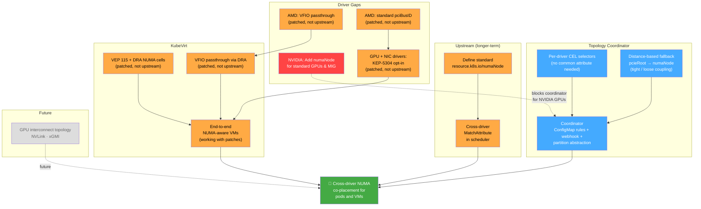

# DRA Topology-Aware Device Co-Placement

**Date:** 2026-04-20 (updated)

## Goal

Maximize AI/HPC workload performance on Kubernetes by ensuring that GPUs, NICs, CPUs, and memory assigned to a pod or VM are co-located on the same NUMA boundary. Benchmarks on NVIDIA B200 GPUs with Mellanox RoCE NICs show that topologically aligned GPU+NIC placement achieves **46.93 GB/s** on NCCL all_reduce (8 GB messages) versus **29.68 GB/s** unaligned — a **58% throughput improvement** with near-zero variance (±0.04 vs ±6.74 GB/s). The unaligned case suffers not just lower throughput but wildly unpredictable performance, reflecting the "lottery" of random device assignment ([Ojea 2025](https://arxiv.org/abs/2506.23628)). Today, DRA allocates each resource type independently — a GPU may land on NUMA node 0 while its NIC lands on NUMA node 1, with no mechanism to prevent this. This project extends DRA with cross-driver topology awareness to close that gap.

## Why All Four Resource Types Matter

Full NUMA alignment requires co-locating four resource types on the same NUMA node: GPUs, NICs, CPUs, and memory. Aligning only a subset still leaves cross-NUMA data movement in the critical path:

- **GPU + NIC on same NUMA, but CPUs on a different NUMA** — every CPU-GPU transfer (launching kernels, copying buffers) and CPU-NIC transfer (protocol processing) crosses NUMA boundaries
- **GPU + NIC + CPU aligned, but memory on a different NUMA** — the kernel may allocate buffers on a remote NUMA node, adding latency to every memory access

| DRA Driver | Replaces | What It Does |
|-----------|----------|-------------|
| [dra-driver-cpu](https://github.com/kubernetes-sigs/dra-driver-cpu) (kubernetes-sigs) | Kubelet CPU Manager | Exclusive CPU assignment with NUMA/socket/L3 cache topology attributes. Scheduler-visible. |
| [dra-driver-memory](https://github.com/kad/dra-driver-memory) (early development) | Kubelet Memory Manager | Per-NUMA-zone memory and hugepage allocation with NRI-based `cpuset.mems` pinning. |

---

## The Problem

DRA allocates each resource type independently. The `MatchAttribute` constraint only works within a single driver's devices — there is no mechanism to coordinate across the GPU driver, NIC driver, and CPU driver to ensure they all pick devices from the same NUMA node. Without topology-aware placement, GPU assignment is effectively random — on an 8-GPU node, there is only a 1-in-8 chance that a randomly assigned GPU lands on the same PCIe root as the requested NIC ([Ojea 2025](https://arxiv.org/abs/2506.23628)).

See [Gap Analysis](docs/gap-analysis.md) for the detailed technical breakdown of 8 specific gaps.

---

## Solutions

### 1. Topology Coordinator (works today)

A [POC by Fabien Dupont](https://github.com/fabiendupont/k8s-dra-topology-coordinator) — a controller + mutating webhook that solves cross-driver NUMA coordination using only existing Kubernetes APIs:

```
User creates:                        Webhook expands to:
┌──────────────────────────┐         ┌─────────────────────────────────┐
│ ResourceClaim            │         │ ResourceClaim                   │
│   requests:              │         │   requests:                     │
│   - name: partition      │  ────►  │   - name: partition-gpu         │
│     deviceClassName:     │         │     deviceClassName: gpu.nvidia │
│       hgx-b200-quarter   │         │     count: 2                    │
│     count: 1             │         │   - name: partition-rdma        │
└──────────────────────────┘         │     deviceClassName: rdma.mlnx  │
                                     │     count: 1                    │
                                     │   constraints:                  │
                                     │   - matchAttribute: numaNode    │
                                     │     requests: [partition-gpu,   │
                                     │       partition-rdma]           │
                                     └─────────────────────────────────┘
```

See [Topology Coordinator Design](docs/topology-coordinator.md) for architecture, partition levels, and constraint generation modes.

### 2. DRA Driver Changes (for pods)

Driver fixes needed for topology-aware pod placement:

| Gap | Driver | Change | Status |
|-----|--------|--------|--------|
| AMD vendor-specific `pciBusID` | AMD GPU DRA | Publish `resource.kubernetes.io/pciBusID` instead of `pciAddr` | Patched, not upstream |
| NVIDIA no NUMA for standard GPUs | NVIDIA GPU DRA | Read `/sys/bus/pci/devices/<BDF>/numa_node` for GPU and MIG types | Not started |
| KEP-5304 opt-in | GPU + NIC drivers | Enable metadata API (k8s 1.36+) | Patched, not upstream |

### 3. Additional Changes (for KubeVirt VMs)

Additional patches needed to extend topology-aware placement into KubeVirt VMs with VFIO passthrough:

| Gap | Component | Change | Status |
|-----|-----------|--------|--------|
| AMD VFIO passthrough | AMD GPU DRA driver | VFIO bind/unbind, CDI spec for `/dev/vfio/*` | Patched, not upstream |
| VEP 115 + DRA NUMA cells | KubeVirt virt-launcher | Guest NUMA topology from KEP-5304 metadata, device-only cells | Patched, not upstream |
| VFIO capabilities/security | KubeVirt virt-controller | Root mode, memlock, seccomp, permittedHostDevices skip | Patched, not upstream |
| GIM kernel 6.17 compat | AMD MxGPU-Virtualization | `vm_flags_set()` for kernel 6.3+ | Patched, not upstream |

See [Upstream Roadmap](docs/upstream-roadmap.md) for the full patch inventory, and [Patched Repos](docs/patched-repos.md) for all forks and branches.

### 4. Upstream Standardization (longer-term)

Define `resource.kubernetes.io/numaNode` and cross-driver `MatchAttribute` in the scheduler. There is [active disagreement](docs/topology-attribute-debate.md) about whether `numaNode` should be standardized — sysfs NUMA indices don't reflect real hardware topology under Intel SNC or AMD NPS modes. An alternative approach has CPUs publish `pcieRoot` as a list ([WIP](https://github.com/kubernetes/kubernetes/pull/138297)).

See [Topology Attribute Debate](docs/topology-attribute-debate.md) for the full upstream discussion.

---

## Gap Status

### Pods (topology-aware placement)

| Gap | Status | Solved By |
|-----|--------|-----------|
| No standard topology attribute beyond pcieRoot | 🟠 Actively debated upstream | Coordinator (now) / Upstream (later) |
| No cross-driver constraints | 🟠 Coordinator solves with per-driver CEL selectors | Coordinator (now) / Upstream (later) |
| AMD vendor-specific `pciBusID` | 🟡 Patched, not upstream | AMD GPU DRA driver |
| NVIDIA no NUMA for standard GPUs | 🔴 Not started | NVIDIA GPU DRA driver |
| KEP-5304 opt-in | 🟡 Patched for AMD GPU + SR-IOV NIC | Each PCI DRA driver |
| GPU interconnect topology | ⬜ Future | Driver attributes + coordinator |

### KubeVirt VMs (VFIO passthrough + guest NUMA)

| Gap | Status | Solved By |
|-----|--------|-----------|
| AMD VFIO passthrough | 🟡 Patched, not upstream | AMD GPU DRA driver |
| VEP 115 + DRA NUMA cells | 🟡 Working end-to-end with patches | KubeVirt virt-launcher |
| VFIO capabilities/security | 🟡 Patched, not upstream | KubeVirt virt-controller |
| Multi-device DRA requests | 🟠 Workaround (count:1 per claim) | KubeVirt ([proposal](docs/upstream-proposals/kubevirt-multi-device-dra-requests.md)) |
| GIM kernel 6.17 compat | 🟡 Patched, not upstream | AMD MxGPU-Virtualization |

---

## Proposed Plan



**Legend:** 🔵 Working (POC)  🟠 Patched, not upstream  🔴 Not started  ⬜ Future

### Phases

**Pods:**
1. **NUMA-aligned containers** — Topology coordinator with per-driver CEL selectors and distance-based fallback. Tested with 4 DRA drivers (GPU, NIC, CPU, memory) on XE9680 with SNC on and off. Working for AMD GPUs; blocked for NVIDIA until they publish `numaNode`.
2. **Close driver gaps** — NVIDIA NUMA for standard GPUs, upstream the AMD pciBusID/KEP-5304 patches. Independent changes, can proceed in parallel.

**KubeVirt:**
3. **End-to-end NUMA-aware VMs** — Topology coordinator + KEP-5304 + VEP 115 + KubeVirt VFIO patches. Tested: single-NUMA and dual-NUMA VMs with correct guest pxb-pcie placement. Needs upstream KubeVirt and AMD GPU driver PRs.

**Upstream:**
4. **Upstream standardization** — `resource.kubernetes.io/numaNode` + cross-driver `MatchAttribute`. Coordinator remains valuable for partition abstraction and distance-based fallback.
5. **GPU interconnect topology (future)** — NVLink / xGMI attributes for intra-node GPU-to-GPU topology.

---

## Testing

Tested on Dell XE9680 (2-socket Intel Xeon 6448Y, 8x AMD MI300X GPUs, 2x Mellanox ConnectX-6 Dx NICs, 128 CPUs, ~2 TiB RAM) with K8s 1.36.0-rc.0, Fedora 43.

| Test | Result |
|------|--------|
| 4-driver eighth pods (SNC off) | Running — 2 pods, each with CPU + memory + 2 GPUs + 2 NICs, NUMA-aligned |
| 4-driver quarter pods (SNC off) | Running — 2 pods, each with CPU + 258GB + 2 GPUs + 2 NICs |
| Tight vs loose coupling (SNC on) | Both running — tight (pcieRoot matched) + loose (NUMA-only) |
| KubeVirt single-NUMA VM | Running — GPU + NIC on guest NUMA 0 via pxb-pcie |
| KubeVirt dual-NUMA VM (SNC off) | Running — 2 pxb-pcie expanders, device-only guest NUMA cell |
| KubeVirt dual-NUMA VM (SNC on) | Running — host NUMA 0→guest 0, host NUMA 2→guest 1 |
| SNC-2 on vs off comparison | Coordinator adapts automatically — 9 vs 5 DeviceClasses |

See [Test Results Summary](testing/results/results-summary.md) for full details, hardware captures, and SNC comparison.

---

## Documentation

| Document | Description |
|----------|-------------|
| [Project Narrative](docs/project-narrative.md) | 3 stories: pod placement → KubeVirt VMs → upstream proposals |
| [Gap Analysis](docs/gap-analysis.md) | Detailed technical analysis of 8 gaps, driver comparisons, attribute tables |
| [Topology Attribute Debate](docs/topology-attribute-debate.md) | Upstream numaNode vs pcieRoot vs cpuSocketNumber debate, SNC/NPS problems |
| [Architecture](docs/architecture.md) | Component diagrams, hardware layout, allocation flows |
| [Topology Coordinator Design](docs/topology-coordinator.md) | Partition abstraction, webhook expansion, distance-based fallback |
| [KubeVirt Integration](docs/kubevirt-integration.md) | KEP-5304, VEP 115, VFIO passthrough, guest NUMA topology |
| [Upstream Roadmap](docs/upstream-roadmap.md) | Patches across 7 repos with status and upstream actions |
| [Patched Repos](docs/patched-repos.md) | All forks, branches, and descriptions |
| [Test Results Summary](testing/results/results-summary.md) | Comparison matrix across K8s versions, SNC on/off, bugs found |
| [Topology Attribute Tradeoffs (diagrams)](testing/diagrams/topology-attribute-tradeoffs.md) | Mermaid visualizations of NPS1, NPS4, SNC cases |

### Upstream Proposals

| Proposal | Description |
|----------|-------------|
| [Standardize numaNode with pcieRoot Fallback](docs/upstream-proposals/standardize-numanode-with-pcieroot-fallback.md) | Propose `resource.kubernetes.io/numaNode` as companion to pcieRoot with distance-based fallback |
| [KEP-5304 Auto-Populate Metadata](docs/upstream-proposals/kep5304-auto-populate-metadata.md) | Kubelet auto-copies ResourceSlice attributes into KEP-5304 metadata |
| [NUMA/SNC/NPS Topology Gap](docs/upstream-proposals/numa-snc-nps-topology-gap.md) | DRA ↔ kubelet topology manager coordination gap |
| [KubeVirt Multi-Device DRA Requests](docs/upstream-proposals/kubevirt-multi-device-dra-requests.md) | KubeVirt hostDevices with count>1 DRA requests |

---

## References

- [KEP-4381: DRA Structured Parameters](https://github.com/kubernetes/enhancements/blob/master/keps/sig-node/4381-dra-structured-parameters/README.md)
- [KEP-5491: List Types for Attributes](https://github.com/kubernetes/enhancements/tree/master/keps/sig-scheduling/5491-dra-list-types-for-attributes) (alpha in v1.36, feature gate `DRAListTypeAttributes`)
- [KEP-5491 implementation PR](https://github.com/kubernetes/kubernetes/pull/137190) (merged 2026-03-21)
- [KEP-5517: DRA for Native Resources](https://github.com/kubernetes/enhancements/pull/5755)
- [DRA driver interoperability tracking](https://github.com/kubernetes-sigs/dra-driver-cpu/issues/56)
- [`cpuSocketNumber` standardization discussion](https://github.com/kubernetes/enhancements/pull/5316#discussion_r2095270564)
- [WIP: `GetPCIeRootAttributeMapFromCPUId` helper](https://github.com/kubernetes/kubernetes/pull/138297)
- [NVIDIA DRA Driver](https://github.com/NVIDIA/k8s-dra-driver-gpu)
- [AMD GPU DRA Driver](https://github.com/ROCm/k8s-gpu-dra-driver)
- [CPU DRA Driver](https://github.com/kubernetes-sigs/dra-driver-cpu) (kubernetes-sigs)
- [Memory DRA Driver](https://github.com/kad/dra-driver-memory) (personal repo, early development)
- [Node Partition Topology Coordinator](https://github.com/fabiendupont/k8s-dra-topology-coordinator) (POC by Fabien Dupont)
- [The Kubernetes Network Driver Model](https://arxiv.org/abs/2506.23628) — GPU/NIC DRA alignment benchmarks (Ojea 2025)
- [Kubernetes DRA Documentation](https://kubernetes.io/docs/concepts/scheduling-eviction/dynamic-resource-allocation/)
