# DRA Topology-Aware Architecture

**Date:** 2026-04-16

## Overview

DRA (Dynamic Resource Allocation) enables NUMA-aware device co-placement across multiple drivers. The topology coordinator discovers devices from all DRA drivers, creates partition DeviceClasses with NUMA alignment constraints, and a webhook expands simple partition claims into multi-driver requests. This document consolidates the component architecture, hardware layout, allocation flows, and known issues across the 3-driver and 4-driver deployment models on a Dell XE9680 with AMD MI300X GPUs.

---

## Component Architecture

Main component diagram showing control plane, DRA drivers, NRI integration, and hardware topology.

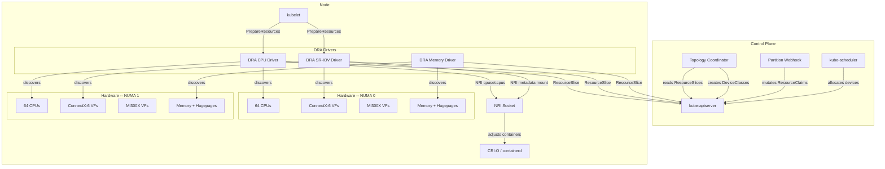
```mermaid
graph TB
    subgraph CP["Control Plane"]
        SCHED[kube-scheduler]
        API[kube-apiserver]
        COORD[Topology Coordinator]
        WEBHOOK[Partition Webhook]
    end

    subgraph NODE["Node"]
        KUBELET[kubelet]
        CRIO[CRI-O / containerd]
        NRI[NRI Socket]

        subgraph DRIVERS["DRA Drivers"]
            CPU_DRV[DRA CPU Driver]
            SRIOV_DRV[DRA SR-IOV Driver]
            MEM_DRV[DRA Memory Driver]
        end

        subgraph HW0["Hardware -- NUMA 0"]
            CPU0[64 CPUs]
            NIC0[ConnectX-6 VFs]
            GPU0[MI300X VFs]
            MEM0[Memory + Hugepages]
        end

        subgraph HW1["Hardware -- NUMA 1"]
            CPU1[64 CPUs]
            NIC1[ConnectX-6 VFs]
            GPU1[MI300X VFs]
            MEM1[Memory + Hugepages]
        end
    end

    CPU_DRV -->|ResourceSlice| API
    SRIOV_DRV -->|ResourceSlice| API
    MEM_DRV -->|ResourceSlice| API

    CPU_DRV -->|discovers| CPU0
    CPU_DRV -->|discovers| CPU1
    SRIOV_DRV -->|discovers| NIC0
    SRIOV_DRV -->|discovers| NIC1
    MEM_DRV -->|discovers| MEM0
    MEM_DRV -->|discovers| MEM1

    COORD -->|reads ResourceSlices| API
    COORD -->|creates DeviceClasses| API
    WEBHOOK -->|mutates ResourceClaims| API

    SCHED -->|allocates devices| API
    KUBELET -->|PrepareResources| CPU_DRV
    KUBELET -->|PrepareResources| SRIOV_DRV
    CPU_DRV -->|NRI cpuset.cpus| NRI
    SRIOV_DRV -->|NRI metadata mount| NRI
    NRI -->|adjusts containers| CRIO
```

---

## Hardware Layout: Dell XE9680

Detailed PCIe topology of the Dell XE9680 with 8x MI300X GPUs, 2x ConnectX-6 NICs, and 2 NUMA nodes.

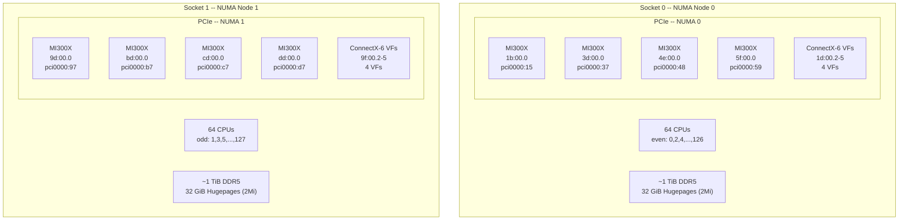
```mermaid
graph TB
    subgraph S0["Socket 0 -- NUMA Node 0"]
        CPU0_HW["64 CPUs<br/>even: 0,2,4,...,126"]
        subgraph PCIE0["PCIe -- NUMA 0"]
            GPU0A["MI300X<br/>1b:00.0<br/>pci0000:15"]
            GPU0B["MI300X<br/>3d:00.0<br/>pci0000:37"]
            GPU0C["MI300X<br/>4e:00.0<br/>pci0000:48"]
            GPU0D["MI300X<br/>5f:00.0<br/>pci0000:59"]
            NIC0_HW["ConnectX-6 VFs<br/>1d:00.2-5<br/>4 VFs"]
        end
        MEM0_HW["~1 TiB DDR5<br/>32 GiB Hugepages (2Mi)"]
    end

    subgraph S1["Socket 1 -- NUMA Node 1"]
        CPU1_HW["64 CPUs<br/>odd: 1,3,5,...,127"]
        subgraph PCIE1["PCIe -- NUMA 1"]
            GPU1A["MI300X<br/>9d:00.0<br/>pci0000:97"]
            GPU1B["MI300X<br/>bd:00.0<br/>pci0000:b7"]
            GPU1C["MI300X<br/>cd:00.0<br/>pci0000:c7"]
            GPU1D["MI300X<br/>dd:00.0<br/>pci0000:d7"]
            NIC1_HW["ConnectX-6 VFs<br/>9f:00.2-5<br/>4 VFs"]
        end
        MEM1_HW["~1 TiB DDR5<br/>32 GiB Hugepages (2Mi)"]
    end
```

---

## Simple View: 3-Driver Model

### Architecture

GPU + CPU + NIC via 3 DRA drivers with topology coordinator creating partition DeviceClasses.

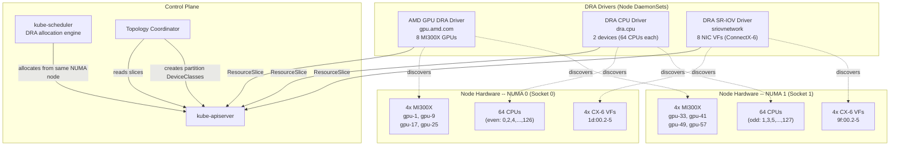
```mermaid
graph TB
    subgraph CP3["Control Plane"]
        API3[kube-apiserver]
        SCHED3["kube-scheduler<br/>DRA allocation engine"]
        COORD3[Topology Coordinator]
    end

    subgraph DRV3["DRA Drivers (Node DaemonSets)"]
        GPU_DRV3["AMD GPU DRA Driver<br/>gpu.amd.com<br/>8 MI300X GPUs"]
        CPU_DRV3["DRA CPU Driver<br/>dra.cpu<br/>2 devices (64 CPUs each)"]
        NIC_DRV3["DRA SR-IOV Driver<br/>sriovnetwork<br/>8 NIC VFs (ConnectX-6)"]
    end

    subgraph N0_3["Node Hardware -- NUMA 0 (Socket 0)"]
        direction LR
        CPU0_3["64 CPUs<br/>(even: 0,2,4,...,126)"]
        GPU0_3["4x MI300X<br/>gpu-1, gpu-9<br/>gpu-17, gpu-25"]
        NIC0_3["4x CX-6 VFs<br/>1d:00.2-5"]
    end

    subgraph N1_3["Node Hardware -- NUMA 1 (Socket 1)"]
        direction LR
        CPU1_3["64 CPUs<br/>(odd: 1,3,5,...,127)"]
        GPU1_3["4x MI300X<br/>gpu-33, gpu-41<br/>gpu-49, gpu-57"]
        NIC1_3["4x CX-6 VFs<br/>9f:00.2-5"]
    end

    GPU_DRV3 -->|ResourceSlice| API3
    CPU_DRV3 -->|ResourceSlice| API3
    NIC_DRV3 -->|ResourceSlice| API3

    GPU_DRV3 -.->|discovers| GPU0_3
    GPU_DRV3 -.->|discovers| GPU1_3
    CPU_DRV3 -.->|discovers| CPU0_3
    CPU_DRV3 -.->|discovers| CPU1_3
    NIC_DRV3 -.->|discovers| NIC0_3
    NIC_DRV3 -.->|discovers| NIC1_3

    COORD3 -->|reads slices| API3
    COORD3 -->|"creates partition DeviceClasses"| API3
    SCHED3 -->|"allocates from same NUMA node"| API3
```

### Device-to-NUMA Mapping (3-Driver)

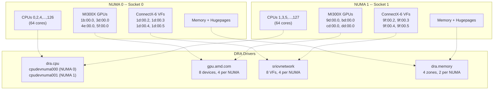
```mermaid
graph TB
    subgraph NUMA0_D["NUMA 0 -- Socket 0"]
        CPU0_D3["CPUs 0,2,4,...,126<br/>(64 cores)"]
        GPU0_D3["MI300X GPUs<br/>1b:00.0, 3d:00.0<br/>4e:00.0, 5f:00.0"]
        NIC0_D3["ConnectX-6 VFs<br/>1d:00.2, 1d:00.3<br/>1d:00.4, 1d:00.5"]
        MEM0_D3["Memory + Hugepages"]
    end

    subgraph NUMA1_D["NUMA 1 -- Socket 1"]
        CPU1_D3["CPUs 1,3,5,...,127<br/>(64 cores)"]
        GPU1_D3["MI300X GPUs<br/>9d:00.0, bd:00.0<br/>cd:00.0, dd:00.0"]
        NIC1_D3["ConnectX-6 VFs<br/>9f:00.2, 9f:00.3<br/>9f:00.4, 9f:00.5"]
        MEM1_D3["Memory + Hugepages"]
    end

    subgraph DDRVS["DRA Drivers"]
        D_CPU3["dra.cpu<br/>cpudevnuma000 (NUMA 0)<br/>cpudevnuma001 (NUMA 1)"]
        D_GPU3["gpu.amd.com<br/>8 devices, 4 per NUMA"]
        D_NIC3["sriovnetwork<br/>8 VFs, 4 per NUMA"]
        D_MEM3["dra.memory<br/>4 zones, 2 per NUMA"]
    end

    CPU0_D3 -.-> D_CPU3
    CPU1_D3 -.-> D_CPU3
    GPU0_D3 -.-> D_GPU3
    GPU1_D3 -.-> D_GPU3
    NIC0_D3 -.-> D_NIC3
    NIC1_D3 -.-> D_NIC3
    MEM0_D3 -.-> D_MEM3
    MEM1_D3 -.-> D_MEM3
```

---

## Full View: 4-Driver Model (K8s 1.36)

Full stack with DRAConsumableCapacity, containerd + NRI, and KEP-5304 native metadata support.

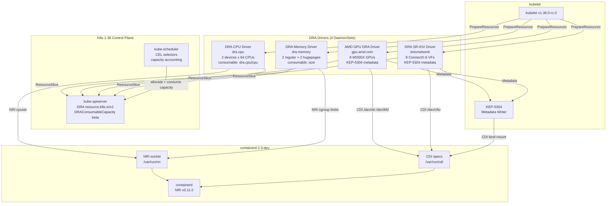
```mermaid
graph TB
    subgraph CP4["K8s 1.36 Control Plane"]
        API4["kube-apiserver<br/>DRA resource.k8s.io/v1<br/>DRAConsumableCapacity beta"]
        SCHED4["kube-scheduler<br/>CEL selectors<br/>capacity accounting"]
    end

    subgraph DRV4["DRA Drivers (4 DaemonSets)"]
        CPU_DRV4["DRA CPU Driver<br/>dra.cpu<br/>2 devices x 64 CPUs<br/>consumable: dra.cpu/cpu"]
        GPU_DRV4["AMD GPU DRA Driver<br/>gpu.amd.com<br/>8 MI300X GPUs<br/>KEP-5304 metadata"]
        NIC_DRV4["DRA SR-IOV Driver<br/>sriovnetwork<br/>8 ConnectX-6 VFs<br/>KEP-5304 metadata"]
        MEM_DRV4["DRA Memory Driver<br/>dra.memory<br/>2 regular + 2 hugepages<br/>consumable: size"]
    end

    subgraph CTD["containerd 2.3-dev"]
        CTR4["containerd<br/>NRI v0.11.0"]
        CDI4["CDI specs<br/>/var/run/cdi"]
        NRI4["NRI socket<br/>/var/run/nri"]
    end

    subgraph KUB4["kubelet"]
        KUBL4["kubelet v1.36.0-rc.0"]
        META4["KEP-5304<br/>Metadata Writer"]
    end

    CPU_DRV4 -->|ResourceSlice| API4
    GPU_DRV4 -->|ResourceSlice| API4
    NIC_DRV4 -->|ResourceSlice| API4
    MEM_DRV4 -->|ResourceSlice| API4

    SCHED4 -->|"allocate + consume capacity"| API4
    KUBL4 -->|PrepareResources| CPU_DRV4
    KUBL4 -->|PrepareResources| GPU_DRV4
    KUBL4 -->|PrepareResources| NIC_DRV4
    KUBL4 -->|PrepareResources| MEM_DRV4

    CPU_DRV4 -->|NRI cpuset| NRI4
    MEM_DRV4 -->|NRI cgroup limits| NRI4
    GPU_DRV4 -->|"CDI /dev/dri /dev/kfd"| CDI4
    NIC_DRV4 -->|"CDI /dev/vfio"| CDI4

    GPU_DRV4 -->|Metadata| META4
    NIC_DRV4 -->|Metadata| META4
    META4 -->|CDI bind mount| CDI4
    NRI4 --> CTR4
    CDI4 --> CTR4
```

---

## Allocation Flows

### Plain Pod Flow

How a NUMA-aligned pod gets CPU + NIC VFs from the same NUMA node.

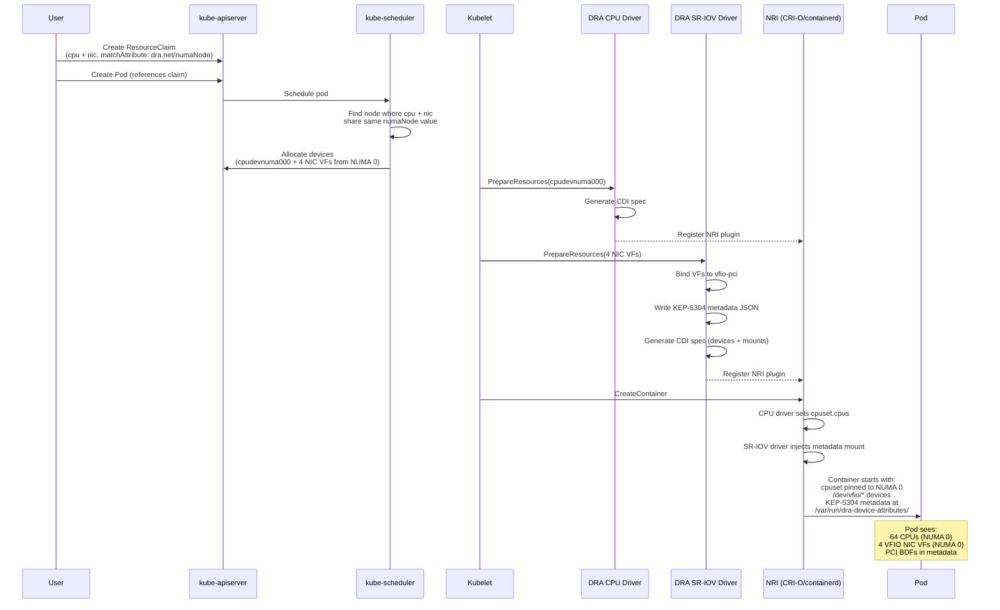
```mermaid
sequenceDiagram
    participant User
    participant API as kube-apiserver
    participant Sched as kube-scheduler
    participant Kubelet
    participant CPU as DRA CPU Driver
    participant SRIOV as DRA SR-IOV Driver
    participant NRI as NRI (CRI-O/containerd)
    participant Pod

    User->>API: Create ResourceClaim<br/>(cpu + nic, matchAttribute: dra.net/numaNode)
    User->>API: Create Pod (references claim)

    API->>Sched: Schedule pod
    Sched->>Sched: Find node where cpu + nic<br/>share same numaNode value
    Sched->>API: Allocate devices<br/>(cpudevnuma000 + 4 NIC VFs from NUMA 0)

    Kubelet->>CPU: PrepareResources(cpudevnuma000)
    CPU->>CPU: Generate CDI spec
    CPU-->>NRI: Register NRI plugin

    Kubelet->>SRIOV: PrepareResources(4 NIC VFs)
    SRIOV->>SRIOV: Bind VFs to vfio-pci
    SRIOV->>SRIOV: Write KEP-5304 metadata JSON
    SRIOV->>SRIOV: Generate CDI spec (devices + mounts)
    SRIOV-->>NRI: Register NRI plugin

    Kubelet->>NRI: CreateContainer
    NRI->>NRI: CPU driver sets cpuset.cpus
    NRI->>NRI: SR-IOV driver injects metadata mount
    NRI->>Pod: Container starts with:<br/>cpuset pinned to NUMA 0<br/>/dev/vfio/* devices<br/>KEP-5304 metadata at<br/>/var/run/dra-device-attributes/

    Note over Pod: Pod sees:<br/>64 CPUs (NUMA 0)<br/>4 VFIO NIC VFs (NUMA 0)<br/>PCI BDFs in metadata
```

### KubeVirt VM Flow

How a VM gets 2 guest NUMA nodes with GPU + NIC devices NUMA-aligned via VEP 115.

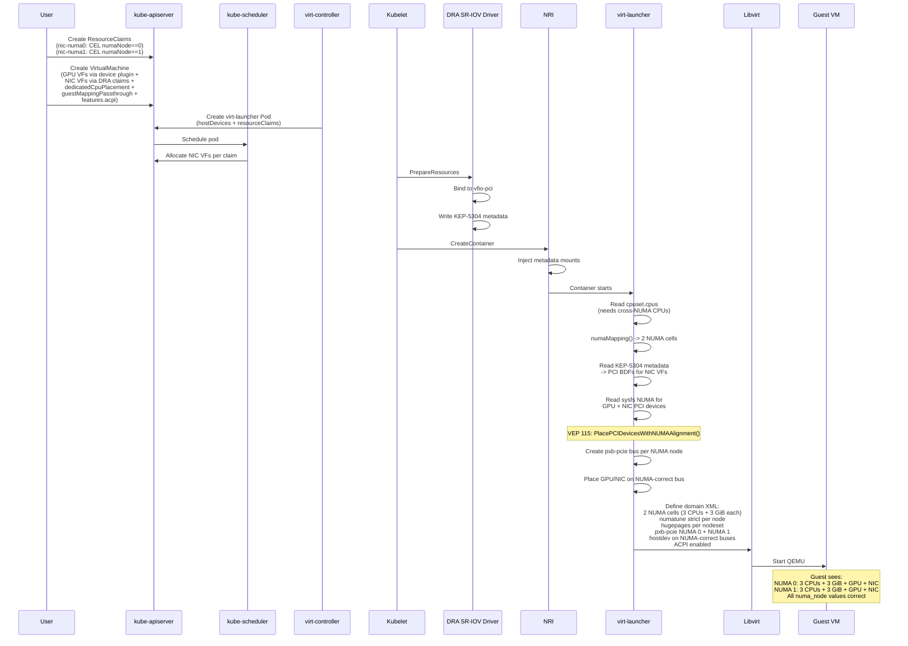
```mermaid
sequenceDiagram
    participant User
    participant API as kube-apiserver
    participant Sched as kube-scheduler
    participant VirtCtrl as virt-controller
    participant Kubelet
    participant SRIOV as DRA SR-IOV Driver
    participant NRI as NRI
    participant VirtLauncher as virt-launcher
    participant Libvirt
    participant VM as Guest VM

    User->>API: Create ResourceClaims<br/>(nic-numa0: CEL numaNode==0)<br/>(nic-numa1: CEL numaNode==1)
    User->>API: Create VirtualMachine<br/>(GPU VFs via device plugin +<br/>NIC VFs via DRA claims +<br/>dedicatedCpuPlacement +<br/>guestMappingPassthrough +<br/>features.acpi)

    VirtCtrl->>API: Create virt-launcher Pod<br/>(hostDevices + resourceClaims)

    API->>Sched: Schedule pod
    Sched->>API: Allocate NIC VFs per claim

    Kubelet->>SRIOV: PrepareResources
    SRIOV->>SRIOV: Bind to vfio-pci
    SRIOV->>SRIOV: Write KEP-5304 metadata

    Kubelet->>NRI: CreateContainer
    NRI->>NRI: Inject metadata mounts
    NRI->>VirtLauncher: Container starts

    VirtLauncher->>VirtLauncher: Read cpuset.cpus<br/>(needs cross-NUMA CPUs)
    VirtLauncher->>VirtLauncher: numaMapping() -> 2 NUMA cells
    VirtLauncher->>VirtLauncher: Read KEP-5304 metadata<br/>-> PCI BDFs for NIC VFs
    VirtLauncher->>VirtLauncher: Read sysfs NUMA for<br/>GPU + NIC PCI devices

    Note over VirtLauncher: VEP 115: PlacePCIDevicesWithNUMAAlignment()

    VirtLauncher->>VirtLauncher: Create pxb-pcie bus per NUMA node
    VirtLauncher->>VirtLauncher: Place GPU/NIC on NUMA-correct bus

    VirtLauncher->>Libvirt: Define domain XML:<br/>2 NUMA cells (3 CPUs + 3 GiB each)<br/>numatune strict per node<br/>hugepages per nodeset<br/>pxb-pcie NUMA 0 + NUMA 1<br/>hostdev on NUMA-correct buses<br/>ACPI enabled

    Libvirt->>VM: Start QEMU

    Note over VM: Guest sees:<br/>NUMA 0: 3 CPUs + 3 GiB + GPU + NIC<br/>NUMA 1: 3 CPUs + 3 GiB + GPU + NIC<br/>All numa_node values correct
```

### Topology Coordinator Partition Flow

How the coordinator creates partition DeviceClasses and the webhook expands claims.

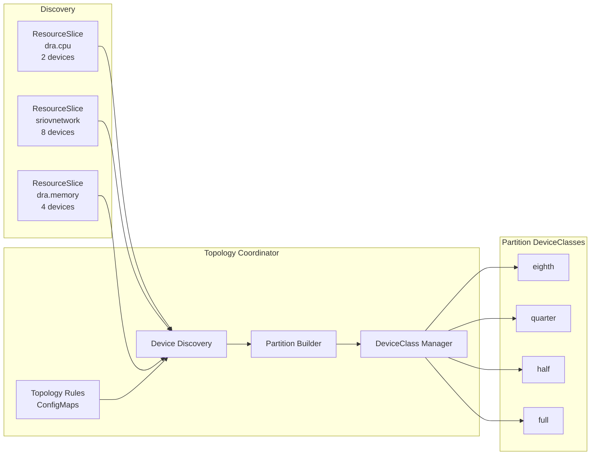
```mermaid
graph LR
    subgraph DISC["Discovery"]
        RS_CPU[ResourceSlice<br/>dra.cpu<br/>2 devices]
        RS_NIC[ResourceSlice<br/>sriovnetwork<br/>8 devices]
        RS_MEM[ResourceSlice<br/>dra.memory<br/>4 devices]
    end

    subgraph TC["Topology Coordinator"]
        RULES[Topology Rules<br/>ConfigMaps]
        DISCOVERY[Device Discovery]
        PARTITION[Partition Builder]
        DC_MGR[DeviceClass Manager]
    end

    subgraph PDC["Partition DeviceClasses"]
        DC_E[eighth]
        DC_Q[quarter]
        DC_H[half]
        DC_F[full]
    end

    RS_CPU --> DISCOVERY
    RS_NIC --> DISCOVERY
    RS_MEM --> DISCOVERY
    RULES --> DISCOVERY

    DISCOVERY --> PARTITION
    PARTITION --> DC_MGR

    DC_MGR --> DC_E
    DC_MGR --> DC_Q
    DC_MGR --> DC_H
    DC_MGR --> DC_F
```

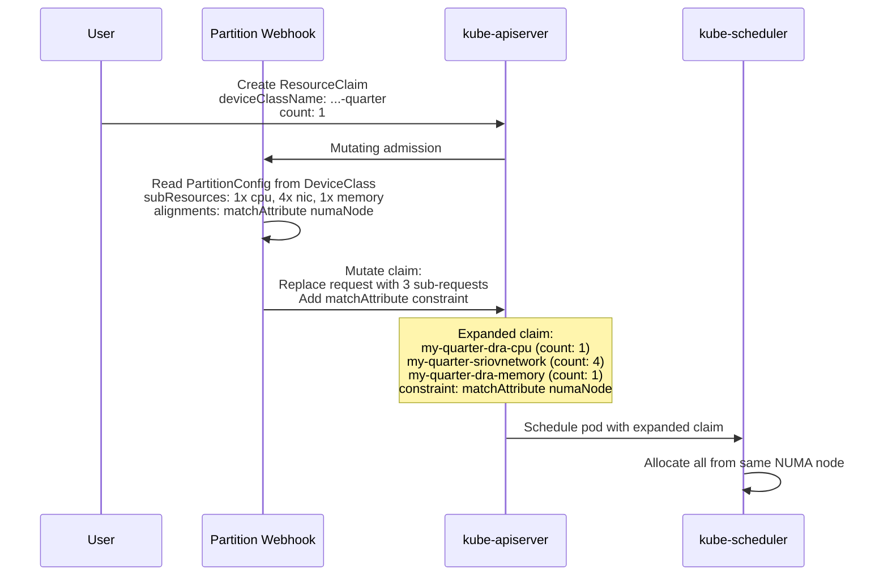
```mermaid
sequenceDiagram
    participant User
    participant Webhook as Partition Webhook
    participant API as kube-apiserver
    participant Sched as kube-scheduler

    User->>API: Create ResourceClaim<br/>deviceClassName: ...-quarter<br/>count: 1

    API->>Webhook: Mutating admission

    Webhook->>Webhook: Read PartitionConfig from DeviceClass<br/>subResources: 1x cpu, 4x nic, 1x memory<br/>alignments: matchAttribute numaNode

    Webhook->>API: Mutate claim:<br/>Replace request with 3 sub-requests<br/>Add matchAttribute constraint

    Note over API: Expanded claim:<br/>my-quarter-dra-cpu (count: 1)<br/>my-quarter-sriovnetwork (count: 4)<br/>my-quarter-dra-memory (count: 1)<br/>constraint: matchAttribute numaNode

    API->>Sched: Schedule pod with expanded claim
    Sched->>Sched: Allocate all from same NUMA node
```

---

## Quarter-Machine Allocation

### 3-Driver Model (GPU + NIC)

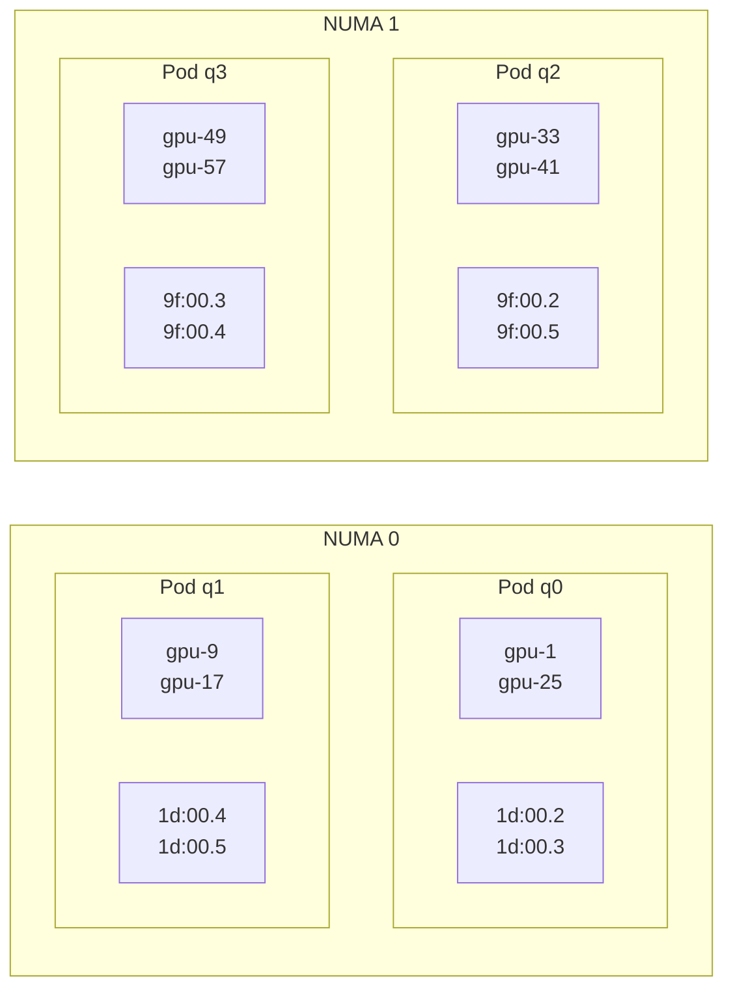
```mermaid
graph LR
    subgraph QN0["NUMA 0"]
        subgraph PQ0["Pod q0"]
            Q0G["gpu-1<br/>gpu-25"]
            Q0N["1d:00.2<br/>1d:00.3"]
        end
        subgraph PQ1["Pod q1"]
            Q1G["gpu-9<br/>gpu-17"]
            Q1N["1d:00.4<br/>1d:00.5"]
        end
    end

    subgraph QN1["NUMA 1"]
        subgraph PQ2["Pod q2"]
            Q2G["gpu-33<br/>gpu-41"]
            Q2N["9f:00.2<br/>9f:00.5"]
        end
        subgraph PQ3["Pod q3"]
            Q3G["gpu-49<br/>gpu-57"]
            Q3N["9f:00.3<br/>9f:00.4"]
        end
    end
```

### 4-Driver Model (GPU + CPU + NIC + Memory)

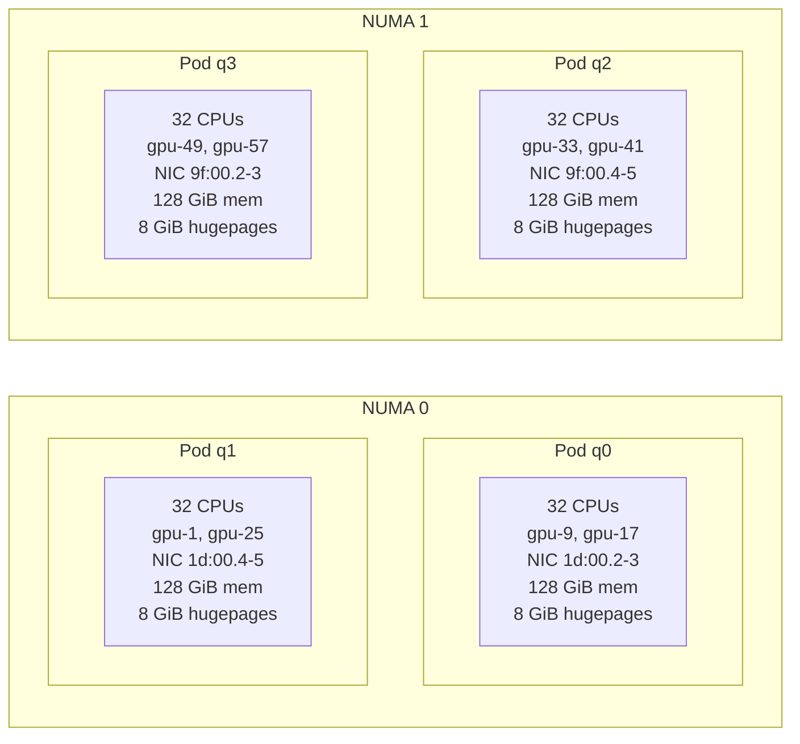
```mermaid
graph LR
    subgraph QFN0["NUMA 0"]
        subgraph FQ0["Pod q0"]
            FQ0D["32 CPUs<br/>gpu-9, gpu-17<br/>NIC 1d:00.2-3<br/>128 GiB mem<br/>8 GiB hugepages"]
        end
        subgraph FQ1["Pod q1"]
            FQ1D["32 CPUs<br/>gpu-1, gpu-25<br/>NIC 1d:00.4-5<br/>128 GiB mem<br/>8 GiB hugepages"]
        end
    end

    subgraph QFN1["NUMA 1"]
        subgraph FQ2["Pod q2"]
            FQ2D["32 CPUs<br/>gpu-33, gpu-41<br/>NIC 9f:00.4-5<br/>128 GiB mem<br/>8 GiB hugepages"]
        end
        subgraph FQ3["Pod q3"]
            FQ3D["32 CPUs<br/>gpu-49, gpu-57<br/>NIC 9f:00.2-3<br/>128 GiB mem<br/>8 GiB hugepages"]
        end
    end
```

---

## DRA Allocation Sequence

### 3-Driver Allocation Flow

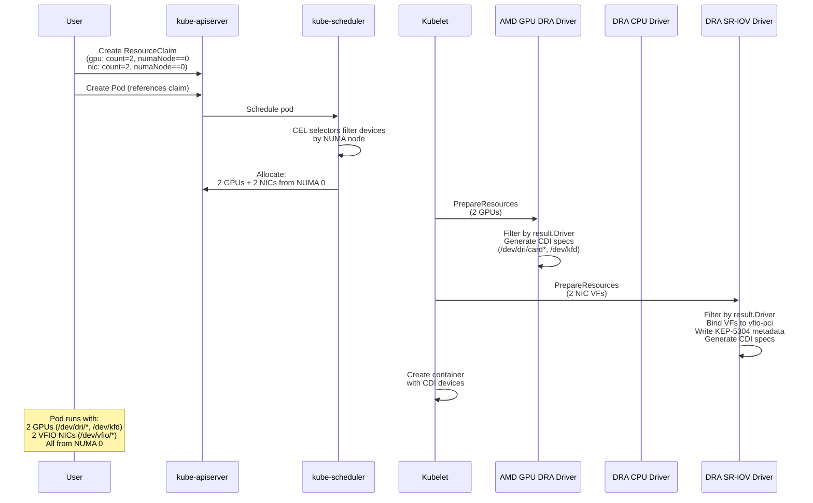
```mermaid
sequenceDiagram
    participant User
    participant API as kube-apiserver
    participant Sched as kube-scheduler
    participant Kubelet
    participant GPU as AMD GPU DRA Driver
    participant CPU as DRA CPU Driver
    participant NIC as DRA SR-IOV Driver

    User->>API: Create ResourceClaim<br/>(gpu: count=2, numaNode==0<br/> nic: count=2, numaNode==0)
    User->>API: Create Pod (references claim)

    API->>Sched: Schedule pod
    Sched->>Sched: CEL selectors filter devices<br/>by NUMA node
    Sched->>API: Allocate:<br/>2 GPUs + 2 NICs from NUMA 0

    Kubelet->>GPU: PrepareResources<br/>(2 GPUs)
    GPU->>GPU: Filter by result.Driver<br/>Generate CDI specs<br/>(/dev/dri/card*, /dev/kfd)

    Kubelet->>NIC: PrepareResources<br/>(2 NIC VFs)
    NIC->>NIC: Filter by result.Driver<br/>Bind VFs to vfio-pci<br/>Write KEP-5304 metadata<br/>Generate CDI specs

    Kubelet->>Kubelet: Create container<br/>with CDI devices

    Note over User: Pod runs with:<br/>2 GPUs (/dev/dri/*, /dev/kfd)<br/>2 VFIO NICs (/dev/vfio/*)<br/>All from NUMA 0
```

### DRAConsumableCapacity Flow (K8s 1.36)

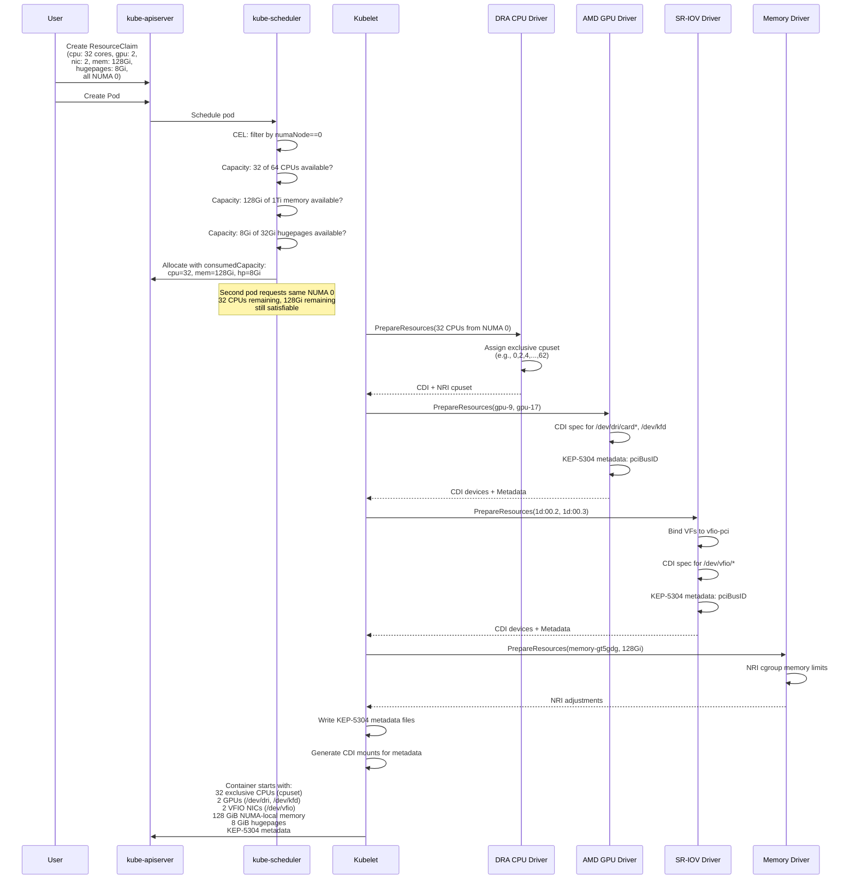
```mermaid
sequenceDiagram
    participant User
    participant API as kube-apiserver
    participant Sched as kube-scheduler
    participant Kubelet
    participant CPU as DRA CPU Driver
    participant GPU as AMD GPU Driver
    participant NIC as SR-IOV Driver
    participant MEM as Memory Driver

    User->>API: Create ResourceClaim<br/>(cpu: 32 cores, gpu: 2,<br/>nic: 2, mem: 128Gi,<br/>hugepages: 8Gi,<br/>all NUMA 0)

    User->>API: Create Pod

    API->>Sched: Schedule pod
    Sched->>Sched: CEL: filter by numaNode==0
    Sched->>Sched: Capacity: 32 of 64 CPUs available?
    Sched->>Sched: Capacity: 128Gi of 1Ti memory available?
    Sched->>Sched: Capacity: 8Gi of 32Gi hugepages available?
    Sched->>API: Allocate with consumedCapacity:<br/>cpu=32, mem=128Gi, hp=8Gi

    Note over Sched: Second pod requests same NUMA 0<br/>32 CPUs remaining, 128Gi remaining<br/>still satisfiable

    Kubelet->>CPU: PrepareResources(32 CPUs from NUMA 0)
    CPU->>CPU: Assign exclusive cpuset<br/>(e.g., 0,2,4,...,62)
    CPU-->>Kubelet: CDI + NRI cpuset

    Kubelet->>GPU: PrepareResources(gpu-9, gpu-17)
    GPU->>GPU: CDI spec for /dev/dri/card*, /dev/kfd
    GPU->>GPU: KEP-5304 metadata: pciBusID
    GPU-->>Kubelet: CDI devices + Metadata

    Kubelet->>NIC: PrepareResources(1d:00.2, 1d:00.3)
    NIC->>NIC: Bind VFs to vfio-pci
    NIC->>NIC: CDI spec for /dev/vfio/*
    NIC->>NIC: KEP-5304 metadata: pciBusID
    NIC-->>Kubelet: CDI devices + Metadata

    Kubelet->>MEM: PrepareResources(memory-gt5gdg, 128Gi)
    MEM->>MEM: NRI cgroup memory limits
    MEM-->>Kubelet: NRI adjustments

    Kubelet->>Kubelet: Write KEP-5304 metadata files
    Kubelet->>Kubelet: Generate CDI mounts for metadata
    Kubelet->>API: Container starts with:<br/>32 exclusive CPUs (cpuset)<br/>2 GPUs (/dev/dri, /dev/kfd)<br/>2 VFIO NICs (/dev/vfio)<br/>128 GiB NUMA-local memory<br/>8 GiB hugepages<br/>KEP-5304 metadata
```

---

## Additional Diagrams

### Device-to-NUMA Mapping (DRA Attributes)

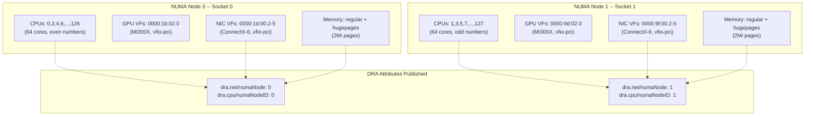
```mermaid
graph TB
    subgraph NUMA0_A["NUMA Node 0 -- Socket 0"]
        CPU0_DEV["CPUs: 0,2,4,6,...,126<br/>(64 cores, even numbers)"]
        GPU0_DEV["GPU VFs: 0000:1b:02.0<br/>(MI300X, vfio-pci)"]
        NIC0_DEV["NIC VFs: 0000:1d:00.2-5<br/>(ConnectX-6, vfio-pci)"]
        MEM0_DEV["Memory: regular + hugepages<br/>(2Mi pages)"]
    end

    subgraph NUMA1_A["NUMA Node 1 -- Socket 1"]
        CPU1_DEV["CPUs: 1,3,5,7,...,127<br/>(64 cores, odd numbers)"]
        GPU1_DEV["GPU VFs: 0000:9d:02.0<br/>(MI300X, vfio-pci)"]
        NIC1_DEV["NIC VFs: 0000:9f:00.2-5<br/>(ConnectX-6, vfio-pci)"]
        MEM1_DEV["Memory: regular + hugepages<br/>(2Mi pages)"]
    end

    subgraph ATTR["DRA Attributes Published"]
        A0["dra.net/numaNode: 0<br/>dra.cpu/numaNodeID: 0"]
        A1["dra.net/numaNode: 1<br/>dra.cpu/numaNodeID: 1"]
    end

    CPU0_DEV -.-> A0
    NIC0_DEV -.-> A0
    MEM0_DEV -.-> A0

    CPU1_DEV -.-> A1
    NIC1_DEV -.-> A1
    MEM1_DEV -.-> A1
```

### Topology Coordinator Rules

How per-driver NUMA attributes are mapped to a common `numaNode` key for partition alignment.

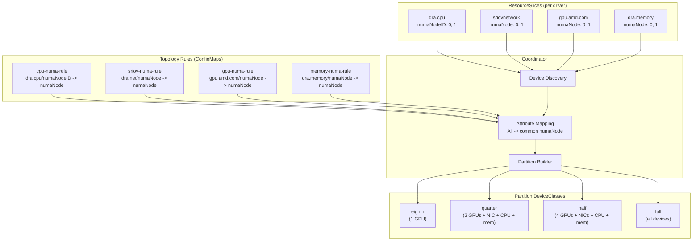
```mermaid
graph TB
    subgraph TRULES["Topology Rules (ConfigMaps)"]
        R1["cpu-numa-rule<br/>dra.cpu/numaNodeID -> numaNode"]
        R2["sriov-numa-rule<br/>dra.net/numaNode -> numaNode"]
        R3["gpu-numa-rule<br/>gpu.amd.com/numaNode -> numaNode"]
        R4["memory-numa-rule<br/>dra.memory/numaNode -> numaNode"]
    end

    subgraph RSLICES["ResourceSlices (per driver)"]
        S1["dra.cpu<br/>numaNodeID: 0, 1"]
        S2["sriovnetwork<br/>numaNode: 0, 1"]
        S3["gpu.amd.com<br/>numaNode: 0, 1"]
        S4["dra.memory<br/>numaNode: 0, 1"]
    end

    subgraph TCOORD["Coordinator"]
        DISC2[Device Discovery]
        MAP2["Attribute Mapping<br/>All -> common numaNode"]
        PART2[Partition Builder]
    end

    subgraph TPDC["Partition DeviceClasses"]
        DC_E2["eighth<br/>(1 GPU)"]
        DC_Q2["quarter<br/>(2 GPUs + NIC + CPU + mem)"]
        DC_H2["half<br/>(4 GPUs + NICs + CPU + mem)"]
        DC_F2["full<br/>(all devices)"]
    end

    R1 & R2 & R3 & R4 --> MAP2
    S1 & S2 & S3 & S4 --> DISC2
    DISC2 --> MAP2 --> PART2 --> DC_E2 & DC_Q2 & DC_H2 & DC_F2
```

### Device Attribute Namespaces and CEL Selectors

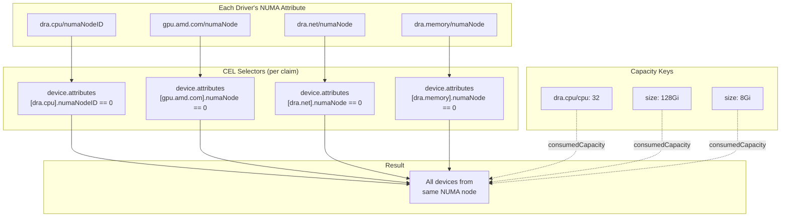
```mermaid
graph TB
    subgraph NATTR["Each Driver's NUMA Attribute"]
        A1_N["dra.cpu/numaNodeID"]
        A2_N["gpu.amd.com/numaNode"]
        A3_N["dra.net/numaNode"]
        A4_N["dra.memory/numaNode"]
    end

    subgraph CELSEL["CEL Selectors (per claim)"]
        C1_S["device.attributes<br/>[dra.cpu].numaNodeID == 0"]
        C2_S["device.attributes<br/>[gpu.amd.com].numaNode == 0"]
        C3_S["device.attributes<br/>[dra.net].numaNode == 0"]
        C4_S["device.attributes<br/>[dra.memory].numaNode == 0"]
    end

    subgraph RESULT["Result"]
        R_ALL["All devices from<br/>same NUMA node"]
    end

    A1_N --> C1_S
    A2_N --> C2_S
    A3_N --> C3_S
    A4_N --> C4_S
    C1_S & C2_S & C3_S & C4_S --> R_ALL

    subgraph CAPKEYS["Capacity Keys"]
        CAP1["dra.cpu/cpu: 32"]
        CAP2["size: 128Gi"]
        CAP3["size: 8Gi"]
    end

    CAP1 -.->|consumedCapacity| R_ALL
    CAP2 -.->|consumedCapacity| R_ALL
    CAP3 -.->|consumedCapacity| R_ALL
```

### KubeVirt Guest PCI NUMA Topology (VEP 115)

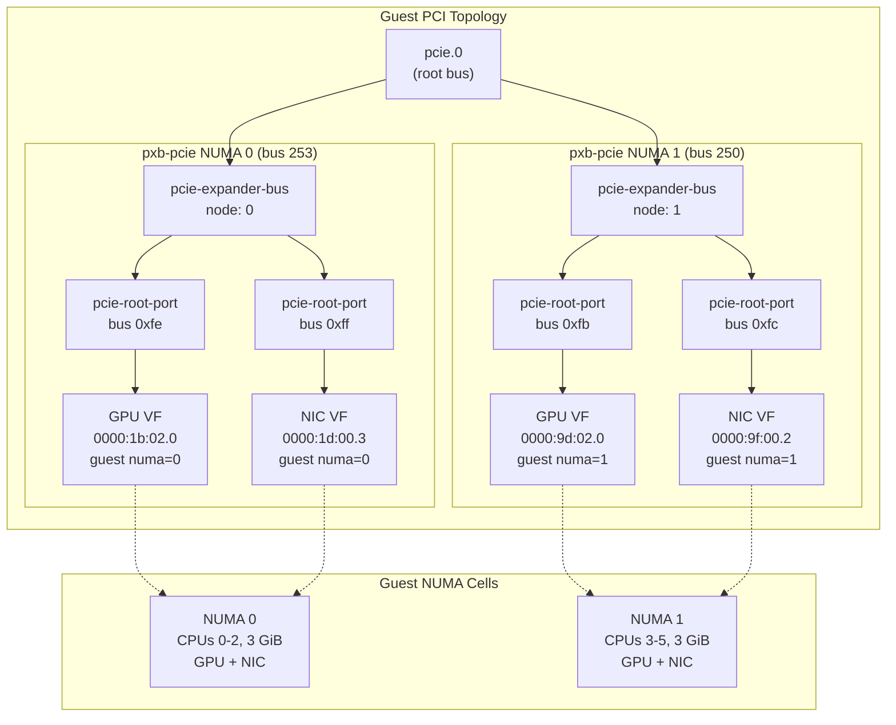
```mermaid
graph TB
    subgraph GPCI["Guest PCI Topology"]
        ROOT["pcie.0<br/>(root bus)"]

        subgraph PXB0["pxb-pcie NUMA 0 (bus 253)"]
            EXP0["pcie-expander-bus<br/>node: 0"]
            RP0A["pcie-root-port<br/>bus 0xfe"]
            RP0B["pcie-root-port<br/>bus 0xff"]
            GPU0_G["GPU VF<br/>0000:1b:02.0<br/>guest numa=0"]
            NIC0_G["NIC VF<br/>0000:1d:00.3<br/>guest numa=0"]
        end

        subgraph PXB1["pxb-pcie NUMA 1 (bus 250)"]
            EXP1["pcie-expander-bus<br/>node: 1"]
            RP1A["pcie-root-port<br/>bus 0xfb"]
            RP1B["pcie-root-port<br/>bus 0xfc"]
            GPU1_G["GPU VF<br/>0000:9d:02.0<br/>guest numa=1"]
            NIC1_G["NIC VF<br/>0000:9f:00.2<br/>guest numa=1"]
        end
    end

    ROOT --> EXP0
    ROOT --> EXP1
    EXP0 --> RP0A --> GPU0_G
    EXP0 --> RP0B --> NIC0_G
    EXP1 --> RP1A --> GPU1_G
    EXP1 --> RP1B --> NIC1_G

    subgraph GCELLS["Guest NUMA Cells"]
        CELL0["NUMA 0<br/>CPUs 0-2, 3 GiB<br/>GPU + NIC"]
        CELL1["NUMA 1<br/>CPUs 3-5, 3 GiB<br/>GPU + NIC"]
    end

    GPU0_G -.-> CELL0
    NIC0_G -.-> CELL0
    GPU1_G -.-> CELL1
    NIC1_G -.-> CELL1
```

### KEP-5304 Native Metadata Flow (K8s 1.36)

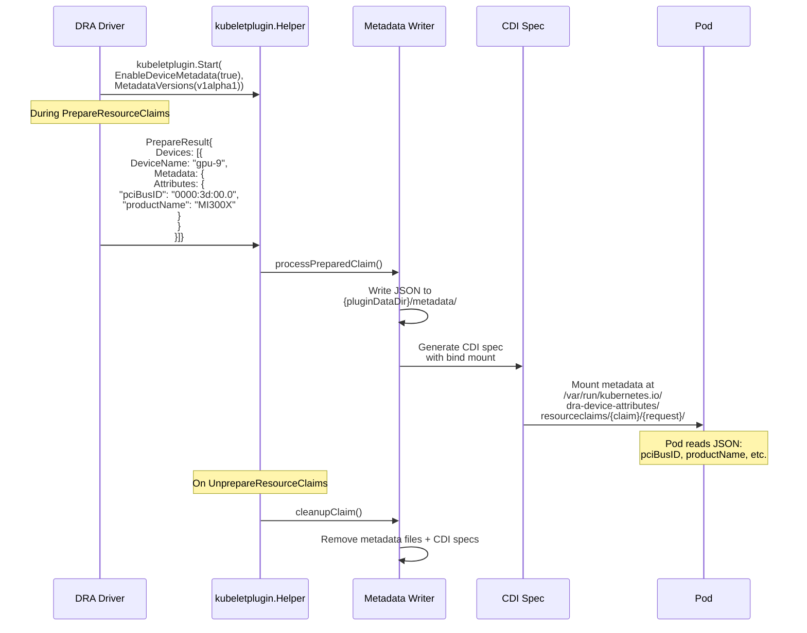
```mermaid
sequenceDiagram
    participant Driver as DRA Driver
    participant Helper as kubeletplugin.Helper
    participant MetaWriter as Metadata Writer
    participant CDI as CDI Spec
    participant Pod

    Driver->>Helper: kubeletplugin.Start(<br/>EnableDeviceMetadata(true),<br/>MetadataVersions(v1alpha1))

    Note over Driver: During PrepareResourceClaims

    Driver->>Helper: PrepareResult{<br/>Devices: [{<br/>  DeviceName: "gpu-9",<br/>  Metadata: {<br/>    Attributes: {<br/>      "pciBusID": "0000:3d:00.0",<br/>      "productName": "MI300X"<br/>    }<br/>  }<br/>}]}

    Helper->>MetaWriter: processPreparedClaim()
    MetaWriter->>MetaWriter: Write JSON to<br/>{pluginDataDir}/metadata/

    MetaWriter->>CDI: Generate CDI spec<br/>with bind mount

    CDI->>Pod: Mount metadata at<br/>/var/run/kubernetes.io/<br/>dra-device-attributes/<br/>resourceclaims/{claim}/{request}/

    Note over Pod: Pod reads JSON:<br/>pciBusID, productName, etc.

    Note over Helper: On UnprepareResourceClaims
    Helper->>MetaWriter: cleanupClaim()
    MetaWriter->>MetaWriter: Remove metadata files + CDI specs
```

### Patch Summary

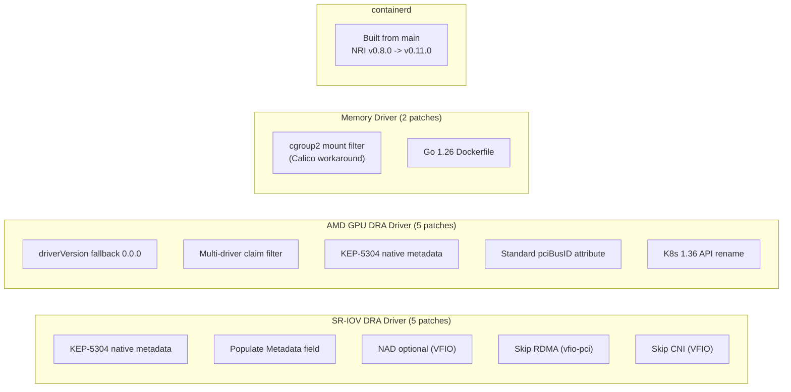
```mermaid
graph LR
    subgraph PSRIOV["SR-IOV DRA Driver (5 patches)"]
        S1_P["KEP-5304 native metadata"]
        S2_P["Populate Metadata field"]
        S3_P["NAD optional (VFIO)"]
        S4_P["Skip RDMA (vfio-pci)"]
        S5_P["Skip CNI (VFIO)"]
    end

    subgraph PGPU["AMD GPU DRA Driver (5 patches)"]
        G1_P["driverVersion fallback 0.0.0"]
        G2_P["Multi-driver claim filter"]
        G3_P["KEP-5304 native metadata"]
        G4_P["Standard pciBusID attribute"]
        G5_P["K8s 1.36 API rename"]
    end

    subgraph PMEM["Memory Driver (2 patches)"]
        M1_P["cgroup2 mount filter<br/>(Calico workaround)"]
        M2_P["Go 1.26 Dockerfile"]
    end

    subgraph PCTD["containerd"]
        C1_P["Built from main<br/>NRI v0.8.0 -> v0.11.0"]
    end
```

### Bugs Found

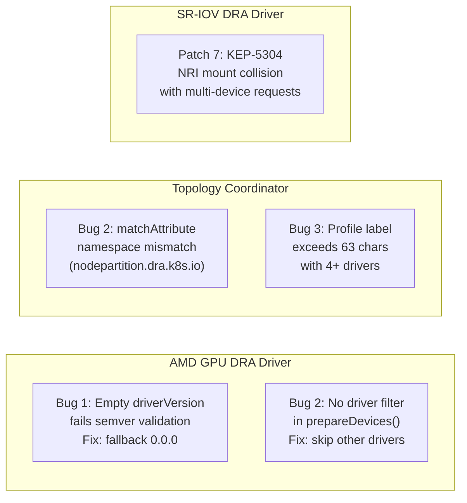
```mermaid
graph LR
    subgraph BGPU["AMD GPU DRA Driver"]
        B1["Bug 1: Empty driverVersion<br/>fails semver validation<br/>Fix: fallback 0.0.0"]
        B2["Bug 2: No driver filter<br/>in prepareDevices()<br/>Fix: skip other drivers"]
    end

    subgraph BCOORD["Topology Coordinator"]
        B3["Bug 2: matchAttribute<br/>namespace mismatch<br/>(nodepartition.dra.k8s.io)"]
        B4["Bug 3: Profile label<br/>exceeds 63 chars<br/>with 4+ drivers"]
    end

    subgraph BSRIOV["SR-IOV DRA Driver"]
        B5["Patch 7: KEP-5304<br/>NRI mount collision<br/>with multi-device requests"]
    end
```

---

## Known Issues

| Issue | Impact | Status |
|-------|--------|--------|
| Coordinator bug #2: `matchAttribute` uses `nodepartition.dra.k8s.io/numaNode` | Webhook-expanded claims unsatisfiable | Workaround: use `dra.net/numaNode` manually |
| SR-IOV driver needs opaque config | PrepareResources fails without VfConfig | Workaround: default config in DeviceClass |
| CPU pinning needs K8s 1.36 | cpuset swap hack required on K8s 1.34 | Fixed with `DRAConsumableCapacity` (K8s 1.36) |
| KubeVirt ACPI not auto-enabled | Guest PCI `numa_node=-1` without `features.acpi` | Workaround: add `features.acpi: {}` to VM spec |
| Memory driver capacity | PrepareResources fails on K8s 1.34 | Fixed with `DRAConsumableCapacity` (K8s 1.36) |
