# Topology Attribute Tradeoffs: numaNode vs. pcieRoot — 2026-04-15

## The Problem: NUMA Doesn't Always Mean What You Think

On most AI/HPC servers, NUMA node = socket. One NUMA node, one set of PCIe devices, one pool of memory. `numaNode` alignment works perfectly.

But modern CPUs support **sub-NUMA partitioning** — AMD NPS (Nodes Per Socket) and Intel SNC (Sub-NUMA Clustering) — which splits a single socket into multiple NUMA domains. This breaks the assumption that `numaNode` represents the physical topology boundary.

---

## Case 1: Standard Configuration (NPS1 / No SNC)

This is the simple case. One socket = one NUMA node. All PCIe devices local to a socket share the same NUMA node ID. `matchAttribute: dra.net/numaNode` correctly aligns everything.

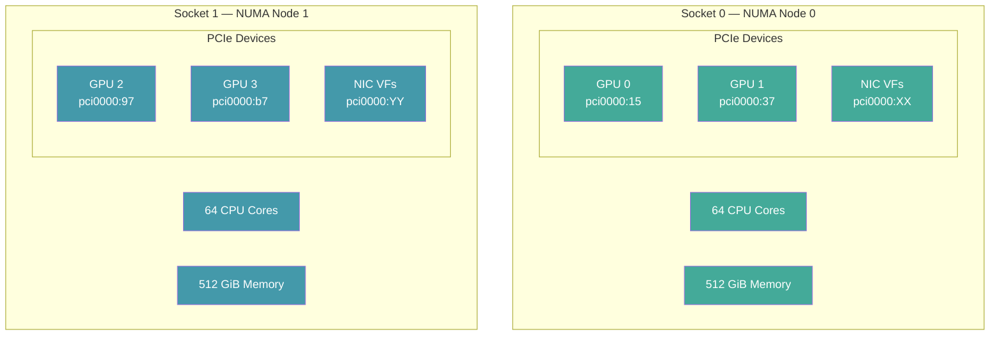

```yaml
# Works: one constraint aligns all devices on a NUMA node
constraints:
- matchAttribute: dra.net/numaNode
  requests: [gpu, nic, cpu, mem]
```

**Result:** All devices with `numaNode == 0` land together. Simple, correct, covers all resource types including memory.

---

## Case 2: AMD NPS4 — One Socket, Four NUMA Nodes

With NPS4 enabled, AMD splits each socket's memory controllers into 4 independent NUMA domains. The CPU cores and memory are partitioned across 4 NUMA nodes, but all PCIe devices on the socket are reported as local to **one** of the NUMA nodes (typically NUMA 0 on socket 0).

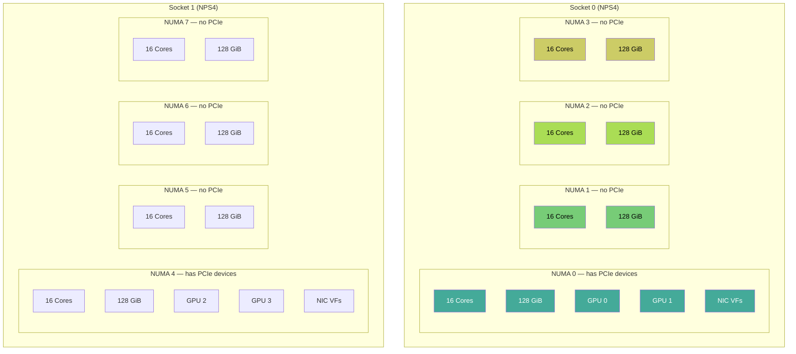

### The Problem

```yaml
# Fails: GPU/NIC report numaNode=0, but only 16 of 64 cores are on NUMA 0
# The other 48 cores on the same socket (NUMA 1,2,3) are excluded
constraints:
- matchAttribute: dra.net/numaNode
  requests: [gpu, nic, cpu, mem]
```

The constraint says "all devices must be on the same NUMA node." But under NPS4:
- GPUs and NICs report `numaNode: 0` (the NUMA node their PCIe root is on)
- Only 16 of 64 cores on socket 0 are on NUMA 0
- 48 cores on NUMA 1, 2, 3 are on the **same socket** with the same PCIe bandwidth to the GPUs — but `numaNode` matching excludes them

This artificially limits the available CPUs to 16 instead of 64, even though all 64 cores on the socket have equivalent access to the GPUs.

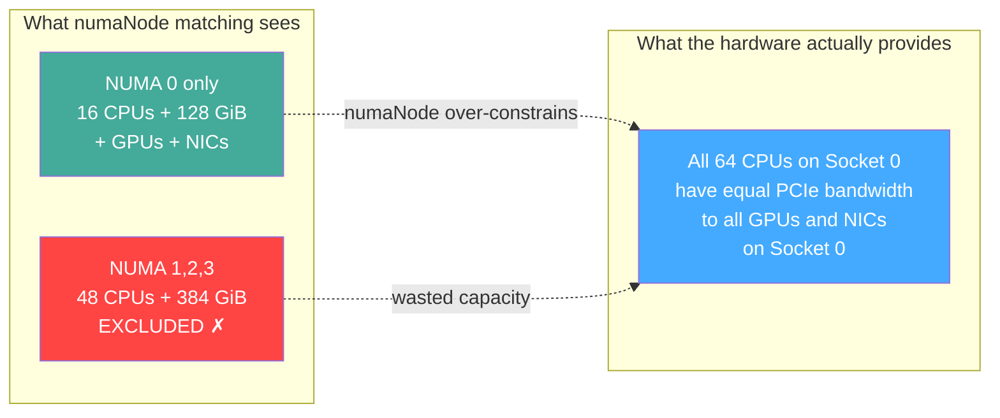

---

## Case 3: Intel Sub-NUMA Clustering (SNC)

Intel SNC splits each socket into 2 (SNC2) or 4 (SNC4) NUMA domains. Similar to NPS4, but with Intel CPUs.

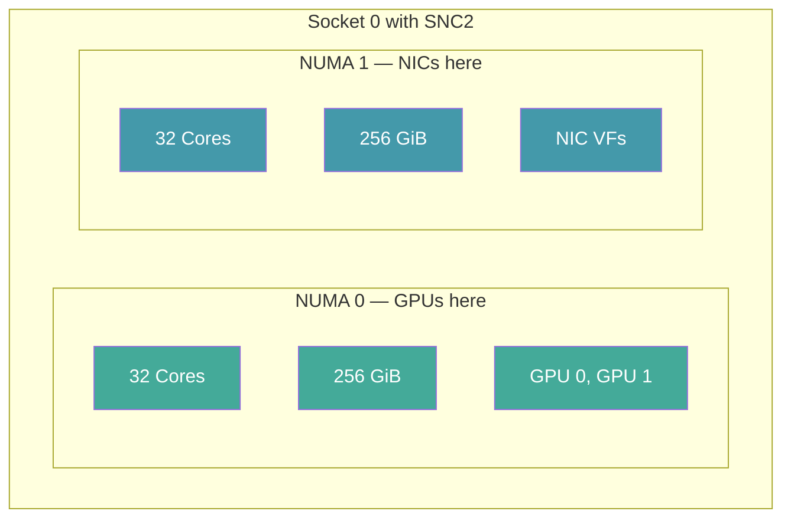

### The Problem

Under SNC2, GPUs and NICs on the **same socket** may report **different NUMA nodes** because each is connected to a different half of the socket's memory controller:

```yaml
# Fails: GPU reports numaNode=0, NIC reports numaNode=1
# They are on the SAME socket with fast interconnect
# but numaNode matching says they don't belong together
constraints:
- matchAttribute: dra.net/numaNode
  requests: [gpu, nic]    # ✗ unsatisfiable if GPU on NUMA 0, NIC on NUMA 1
```

This is worse than the NPS4 case — `numaNode` matching not only wastes CPU capacity but can make valid GPU+NIC alignments **unsatisfiable**, even though the devices are on the same socket with sub-millisecond interconnect latency.

---

## Solution A: pcieRoot as List (CPU as Pivot)

The CPU driver publishes all PCIe root complexes local to each CPU group as a list attribute. This uses the existing standard attribute — no new attribute needed.

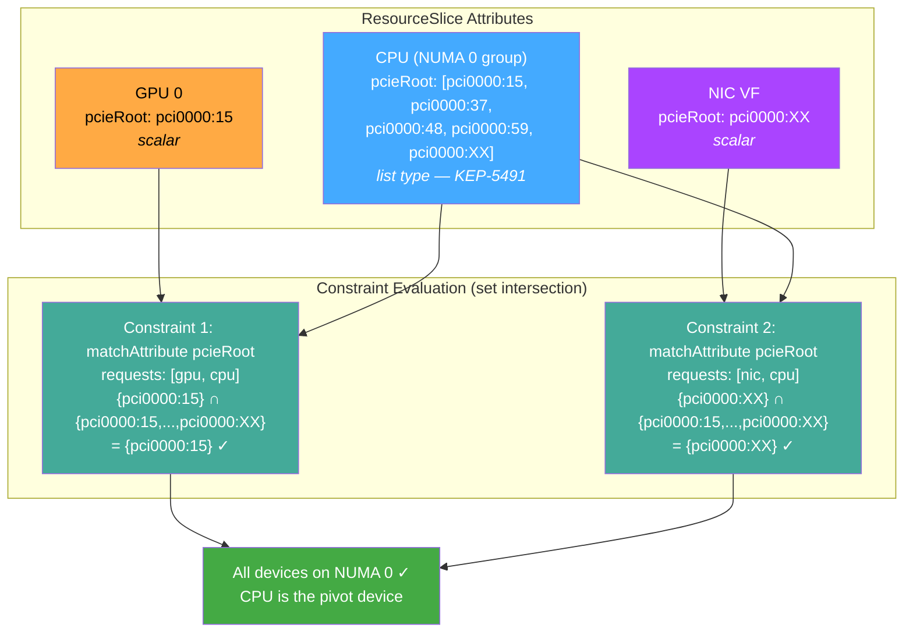

### What each driver publishes (ResourceSlices)

With `DRAListTypeAttributes` enabled (alpha in v1.36), the CPU driver publishes `pcieRoot` as a list. All other drivers publish it as a scalar (unchanged). The memory driver has no pcieRoot at all.

```yaml
# CPU driver ResourceSlice — publishes pcieRoot as a LIST of local roots
# Requires: DRAListTypeAttributes feature gate + dra-driver-cpu with pcieRoot scanning
apiVersion: resource.k8s.io/v1
kind: ResourceSlice
metadata:
  name: dra-cpu-node1
spec:
  driver: dra.cpu
  nodeName: node1
  devices:
  - name: numa-0
    attributes:
      dra.cpu/numaNodeID:
        int: 0
      dra.cpu/socketID:
        int: 0
      dra.net/numaNode:                          # compatibility attribute
        int: 0
      resource.kubernetes.io/pcieRoot:            # LIST type (KEP-5491)
        strings:                                  # all PCIe roots local to this CPU group
        - "pci0000:15"
        - "pci0000:37"
        - "pci0000:48"
        - "pci0000:59"
        - "pci0000:6a"
    capacity:
      dra.cpu/cpu:
        quantity: "64"
  - name: numa-1
    attributes:
      dra.cpu/numaNodeID:
        int: 1
      dra.cpu/socketID:
        int: 1
      dra.net/numaNode:
        int: 1
      resource.kubernetes.io/pcieRoot:
        strings:
        - "pci0000:97"
        - "pci0000:b7"
        - "pci0000:c7"
        - "pci0000:d7"
        - "pci0000:e8"
    capacity:
      dra.cpu/cpu:
        quantity: "64"
---
# GPU driver ResourceSlice — publishes pcieRoot as a SCALAR (unchanged)
apiVersion: resource.k8s.io/v1
kind: ResourceSlice
metadata:
  name: gpu-amd-node1
spec:
  driver: gpu.amd.com
  nodeName: node1
  devices:
  - name: gpu-0
    attributes:
      gpu.amd.com/numaNode:
        int: 0
      resource.kubernetes.io/pcieRoot:            # scalar — one root per GPU
        string: "pci0000:15"
      resource.kubernetes.io/pciBusID:
        string: "0000:1b:00.0"
  - name: gpu-1
    attributes:
      gpu.amd.com/numaNode:
        int: 0
      resource.kubernetes.io/pcieRoot:
        string: "pci0000:37"
      resource.kubernetes.io/pciBusID:
        string: "0000:3d:00.0"
  # ... gpu-2 through gpu-7 on their own roots
---
# NIC driver ResourceSlice — publishes pcieRoot as a SCALAR (unchanged)
apiVersion: resource.k8s.io/v1
kind: ResourceSlice
metadata:
  name: sriov-nic-node1
spec:
  driver: sriovnetwork.k8snetworkplumbingwg.io
  nodeName: node1
  devices:
  - name: vf-0
    attributes:
      dra.net/numaNode:
        int: 0
      resource.kubernetes.io/pcieRoot:            # scalar — one root per NIC VF
        string: "pci0000:6a"
      resource.kubernetes.io/pciBusID:
        string: "0000:6b:00.2"
  # ... more VFs
---
# Memory driver ResourceSlice — NO pcieRoot (memory is not a PCI device)
apiVersion: resource.k8s.io/v1
kind: ResourceSlice
metadata:
  name: dra-memory-node1
spec:
  driver: dra.memory
  nodeName: node1
  devices:
  - name: mem-numa0-regular
    attributes:
      dra.memory/numaNode:
        int: 0
      dra.memory/hugeTLB:
        bool: false
      dra.cpu/numaNodeID:                         # compatibility attribute
        int: 0
      dra.net/numaNode:                           # compatibility attribute
        int: 0
      # NOTE: no resource.kubernetes.io/pcieRoot — memory is not a PCI device
    capacity:
      size:
        quantity: "1Ti"
```

### ResourceClaim: aligning all four resource types

Since memory has no pcieRoot, Solution A requires **mixed constraints** — pcieRoot for PCI devices (GPU, NIC, CPU) and a separate numaNode constraint for memory:

```yaml
# Solution A: pcieRoot-as-list with CPU pivot + numaNode for memory
# Requires: DRAListTypeAttributes feature gate
# Requires: CPU driver publishing pcieRoot as list
# Requires: GPU driver publishing dra.net/numaNode (patch #9)
apiVersion: resource.k8s.io/v1
kind: ResourceClaim
metadata:
  name: solution-a-full
  namespace: test
spec:
  devices:
    requests:
    - name: gpu
      exactly:
        deviceClassName: gpu.amd.com
        count: 2
    - name: nic
      exactly:
        deviceClassName: sriovnetwork.k8snetworkplumbingwg.io
        count: 2
    - name: cpu
      exactly:
        deviceClassName: dra.cpu
        count: 1
        capacity:
          requests:
            dra.cpu/cpu: "32"
    - name: mem
      exactly:
        deviceClassName: dra.memory
        count: 1
        selectors:
        - cel:
            expression: 'device.attributes["dra.memory"].hugeTLB == false'
        capacity:
          requests:
            size: "128Gi"
    constraints:
    #
    # Constraint 1: GPU and CPU share a pcieRoot
    # GPU scalar {pci0000:15} ∩ CPU list {pci0000:15,...} = {pci0000:15} ✓
    #
    - matchAttribute: resource.kubernetes.io/pcieRoot
      requests: [gpu, cpu]

    #
    # Constraint 2: NIC and CPU share a pcieRoot
    # NIC scalar {pci0000:6a} ∩ CPU list {pci0000:15,...,pci0000:6a} = {pci0000:6a} ✓
    #
    - matchAttribute: resource.kubernetes.io/pcieRoot
      requests: [nic, cpu]

    #
    # Constraint 3: Memory on same NUMA node as CPU
    # Memory has no pcieRoot — must use numaNode for this leg
    # Both CPU and memory drivers publish dra.net/numaNode
    #
    - matchAttribute: dra.net/numaNode
      requests: [mem, cpu]
---
apiVersion: v1
kind: Pod
metadata:
  name: solution-a-test
  namespace: test
spec:
  containers:
  - name: worker
    image: registry.access.redhat.com/ubi9/ubi-minimal:latest
    command: ["/bin/sleep", "infinity"]
  resourceClaims:
  - name: devices
    resourceClaimName: solution-a-full
```

**How the allocator evaluates this:**

1. Constraint 1 picks a CPU device and GPU devices that share a pcieRoot (set intersection)
2. Constraint 2 picks NIC devices that also share a pcieRoot with the **same** CPU device
3. Constraint 3 picks memory on the same NUMA node as the **same** CPU device
4. All four resource types are co-located because they all match through the CPU pivot

The CPU device is the pivot in all three constraints. Since the CPU device in grouped mode represents one NUMA node's worth of cores, all matched devices are on the same NUMA boundary.

### For comparison: Solution B with same resources (simpler)

```yaml
# Solution B: dra.net/numaNode — one constraint, all drivers
# Requires: GPU driver publishing dra.net/numaNode (patch #9)
# Does NOT require: DRAListTypeAttributes feature gate or CPU pcieRoot scanning
apiVersion: resource.k8s.io/v1
kind: ResourceClaim
metadata:
  name: solution-b-full
  namespace: test
spec:
  devices:
    requests:
    - name: gpu
      exactly:
        deviceClassName: gpu.amd.com
        count: 2
    - name: nic
      exactly:
        deviceClassName: sriovnetwork.k8snetworkplumbingwg.io
        count: 2
    - name: cpu
      exactly:
        deviceClassName: dra.cpu
        count: 1
        capacity:
          requests:
            dra.cpu/cpu: "32"
    - name: mem
      exactly:
        deviceClassName: dra.memory
        count: 1
        selectors:
        - cel:
            expression: 'device.attributes["dra.memory"].hugeTLB == false'
        capacity:
          requests:
            size: "128Gi"
    constraints:
    #
    # One constraint — all four resource types
    # All drivers publish dra.net/numaNode with the same value
    #
    - matchAttribute: dra.net/numaNode
      requests: [gpu, nic, cpu, mem]
```

**Key differences:**

| | Solution A (pcieRoot-as-list) | Solution B (numaNode) |
|---|---|---|
| Constraints needed | 3 (gpu↔cpu, nic↔cpu, mem↔cpu) | 1 |
| Feature gates | `DRAListTypeAttributes` | None beyond base DRA |
| CPU driver changes | Must publish pcieRoot list (WIP) | None (already publishes `dra.net/numaNode`) |
| GPU driver changes | None (already publishes pcieRoot) | Must publish `dra.net/numaNode` (patch #9) |
| Memory alignment | Requires separate numaNode constraint | Included in the single constraint |
| NPS4/SNC correctness | Correct (PCIe topology is physical) | May over-constrain or break |
| Uses standard attribute | Yes (`resource.kubernetes.io/pcieRoot`) | No (informal `dra.net/numaNode`) |

### Why a single constraint across all three fails

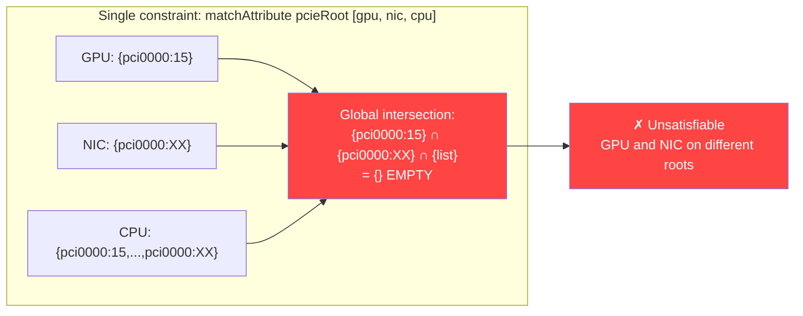

The `matchAttribute` non-empty intersection is computed across ALL devices simultaneously. Since GPU and NIC never share a root on multi-root hardware, the global intersection is always empty. Two separate constraints with the CPU as pivot are required.

### How pcieRoot-as-list handles NPS4/SNC

Under NPS4, the CPU driver groups by NUMA node (16 cores per group). Each NUMA group publishes the PCIe roots that are local to the entire socket — because `local_cpulist` on each PCI bridge includes all cores on the socket. The pcieRoot list is identical for all 4 NUMA groups on the same socket, so matching works correctly regardless of which NUMA group is selected:

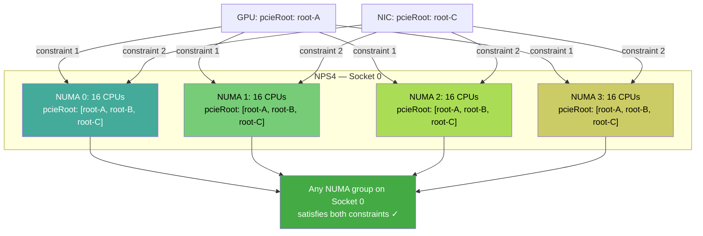

**Limitation:** Memory has no pcieRoot — it can't participate in pcieRoot constraints. A separate mechanism (numaNode or CEL selector) is needed for memory alignment.

---

## Solution B: numaNode (One Constraint, All Drivers)

All drivers publish a common `dra.net/numaNode` attribute. One constraint aligns everything.

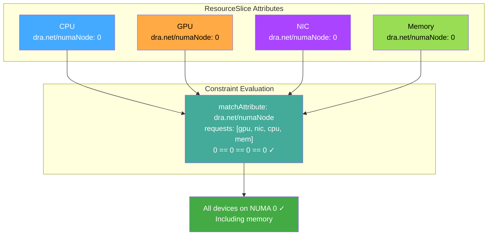

**Simple, covers all resource types.** But breaks on NPS4/SNC hardware as shown above.

---

## Solution C: Topology Coordinator (Abstracts Over Both)

The coordinator uses ConfigMap rules to map whatever attributes each driver publishes into a common topology concept. It handles the attribute fragmentation and generates the correct constraints for the deployed hardware.

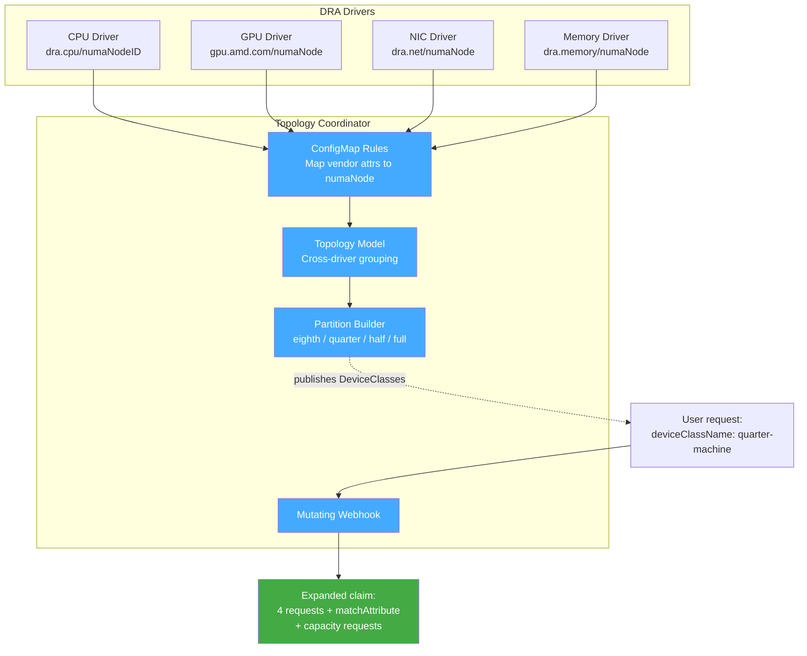

### How the coordinator handles NPS4/SNC

The ConfigMap rules can be configured per-hardware:

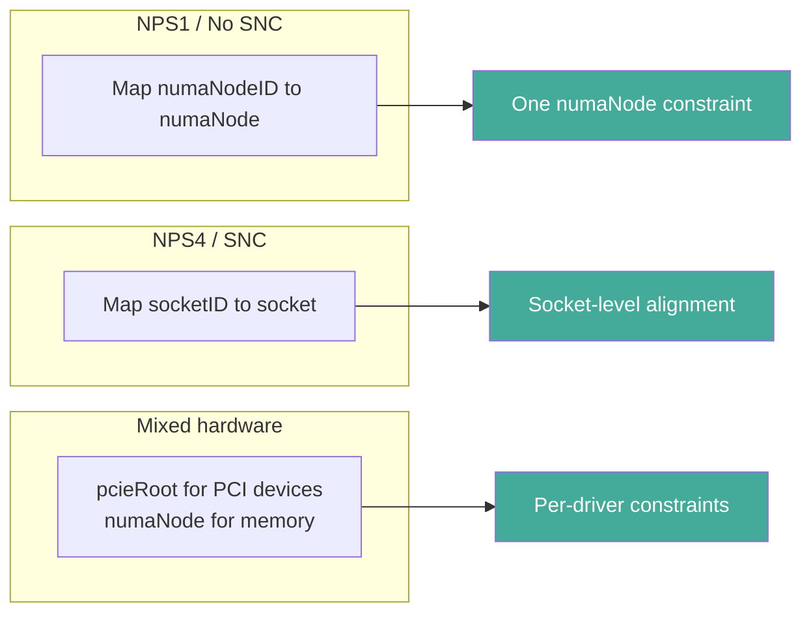

The coordinator insulates users from the ongoing upstream debate about which attribute to standardize. If the community standardizes `numaNode`, the rules simplify. If they go with pcieRoot-as-list, the rules adapt. The user's claim doesn't change.

---

## Decision Matrix

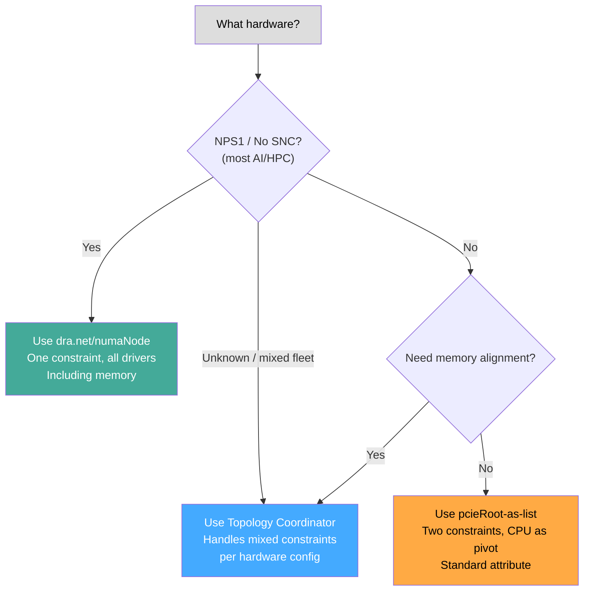

| Approach | Standard Attr | Memory | NPS4/SNC | Complexity | Status |
|---|---|---|---|---|---|
| `dra.net/numaNode` | No (informal) | Yes | Breaks | 1 constraint | Works today (with GPU driver patch) |
| `pcieRoot` as list | Yes | No | Correct | 2+ constraints | WIP ([k/k#138297](https://github.com/kubernetes/kubernetes/pull/138297), [dra-driver-cpu#68](https://github.com/kubernetes-sigs/dra-driver-cpu/pull/68)) |
| Topology Coordinator | N/A (abstracts) | Yes | Configurable | User writes 1 request | POC ([k8s-dra-topology-coordinator](https://github.com/fabiendupont/k8s-dra-topology-coordinator)) |

---

## Summary

There is no single topology attribute that works perfectly across all hardware configurations:

- **`numaNode`** is simple and covers all resource types, but sysfs NUMA indices don't reflect real hardware topology under SNC/NPS sub-NUMA partitioning
- **`pcieRoot`** is physically accurate and uses a standard attribute, but can't cover non-PCI resources (memory, hugepages) and requires the CPU driver to publish lists
- **`cpuSocketNumber`** is under discussion upstream but faces similar objections — too coarse for intra-socket topology, doesn't reflect real bandwidth distances

The topology coordinator resolves this by abstracting over attribute differences via ConfigMap rules, generating hardware-appropriate constraints regardless of which upstream standard eventually emerges.

---

## References

### Upstream KEPs and Standards

- [KEP-4381: DRA Structured Parameters](https://github.com/kubernetes/enhancements/blob/master/keps/sig-node/4381-dra-structured-parameters/README.md) — defines `resource.kubernetes.io/pcieRoot` and `resource.kubernetes.io/pciBusID` as the only two standard device attributes
- [KEP-4381 PR #5316: Define standard device attributes](https://github.com/kubernetes/enhancements/pull/5316) — the PR that standardized `pcieRoot`. Originally proposed `numaNode` too, but it was removed after objections about SNC/NPS accuracy. Key discussion threads:
  - [kad's objection to numaNode](https://github.com/kubernetes/enhancements/pull/5316#discussion_r2095270564) — "NUMA in sysfs does not represent real hardware topology in case of SNC or NPS active"
  - [fromani on numaNode vs cpuSocketNumber tradeoff](https://github.com/kubernetes/enhancements/pull/5316#discussion_r2095270564) — "swapping a problem set with another problem set"
  - [gauravkghildiyal's cpuSocketNumber proposal](https://github.com/kubernetes/enhancements/pull/5316#discussion_r2095270564) — multi-socket CPU+NIC alignment use case
- [KEP-5491: DRA List Types for Attributes](https://github.com/kubernetes/enhancements/issues/5491) — alpha in v1.36, enables list-typed attributes and set-based `matchAttribute` semantics
- [KEP-5491 implementation PR](https://github.com/kubernetes/kubernetes/pull/137190) — merged 2026-03-21, feature gate `DRAListTypeAttributes`
- [KEP-5942: Shared Consumable Capacity](https://github.com/kubernetes/enhancements/pull/5942) — proposed enhancement that may be needed for correct capacity representation when grouping CPUs by PCIe root

### pcieRoot-as-list Implementation

- [WIP: `GetPCIeRootAttributeMapFromCPUId` helper (kubernetes/kubernetes#138297)](https://github.com/kubernetes/kubernetes/pull/138297) — everpeace's upstream helper that scans sysfs to build CPU-to-PCIe-root mapping
- [WIP: Group CPUs by PCIe root (dra-driver-cpu#68)](https://github.com/kubernetes-sigs/dra-driver-cpu/pull/68) — fromani's CPU driver implementation with sysfs scanning, on hold pending k8s 1.36 rebase
- [NIC/CPU alignment by pcieRoot list (dra-driver-cpu#114)](https://github.com/kubernetes-sigs/dra-driver-cpu/issues/114) — everpeace's issue with example ResourceClaim YAML showing the approach
- [Original pcieRoot helper discussion (kubernetes/kubernetes#132296)](https://github.com/kubernetes/kubernetes/pull/132296#discussion_r2154600716) — where johnbelamaric proposed changing matchAttribute semantics to non-empty intersection of lists

### Cross-Driver Interoperability

- [DRA driver interoperability tracking (dra-driver-cpu#56)](https://github.com/kubernetes-sigs/dra-driver-cpu/issues/56) — fromani's issue tracking cross-driver attribute coordination
- [CPU driver compatibility with dra-driver-sriov (dra-driver-cpu#65)](https://github.com/kubernetes-sigs/dra-driver-cpu/pull/65) — adds `dra.net/numaNode` to CPU driver for NIC alignment
- [DraNet GPU/NIC alignment (google/dranet#92)](https://github.com/google/dranet/issues/92) — discussion of CPU/NIC alignment via DraNet
- [DraNet pcieRoot standard attribute (google/dranet#114)](https://github.com/google/dranet/pull/114) — DraNet adopting `resource.kubernetes.io/pcieRoot`

### Performance Validation

- [The Kubernetes Network Driver Model (arXiv:2506.23628)](https://arxiv.org/abs/2506.23628) — Ojea 2025, benchmarks showing 58% throughput improvement with topological GPU+NIC alignment on NVIDIA B200 GPUs
- [kad's KubeCon presentation on PCIe topology](https://sched.co/1i7ke) — explains why PCIe roots have different distances to particular cores depending on vendor and generation

### Topology Coordinator and Drivers

- [Node Partition Topology Coordinator](https://github.com/fabiendupont/k8s-dra-topology-coordinator) — POC by Fabien Dupont
- [CPU DRA Driver](https://github.com/kubernetes-sigs/dra-driver-cpu) — kubernetes-sigs
- [Memory DRA Driver](https://github.com/kad/dra-driver-memory) — early development
- [AMD GPU DRA Driver](https://github.com/ROCm/k8s-gpu-dra-driver)
- [NVIDIA GPU DRA Driver](https://github.com/NVIDIA/k8s-dra-driver-gpu)
- [SR-IOV NIC DRA Driver](https://github.com/k8snetworkplumbingwg/dra-driver-sriov)
- [DraNet](https://github.com/google/dranet)
