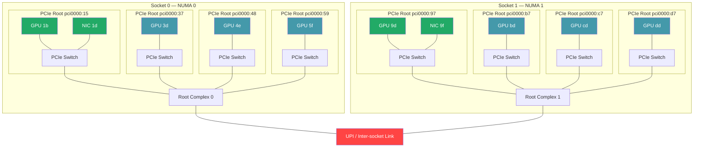
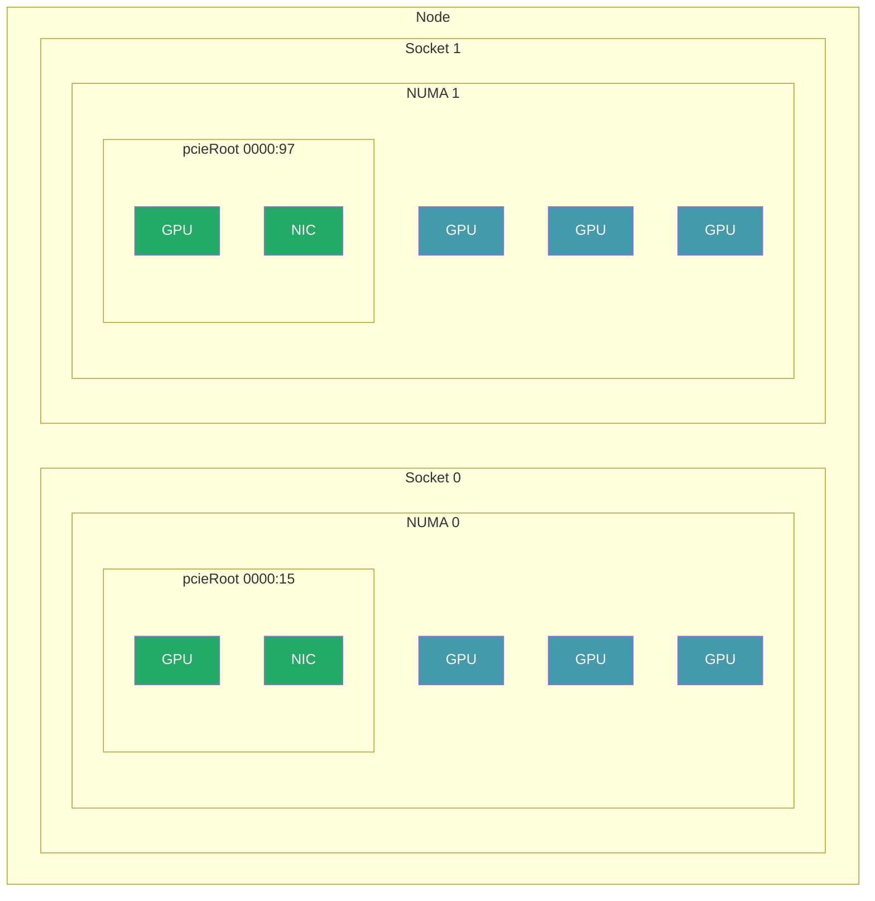
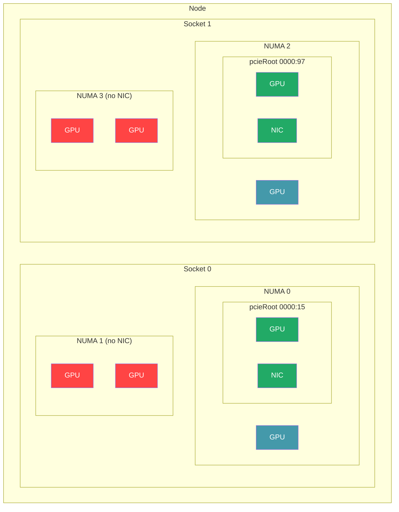
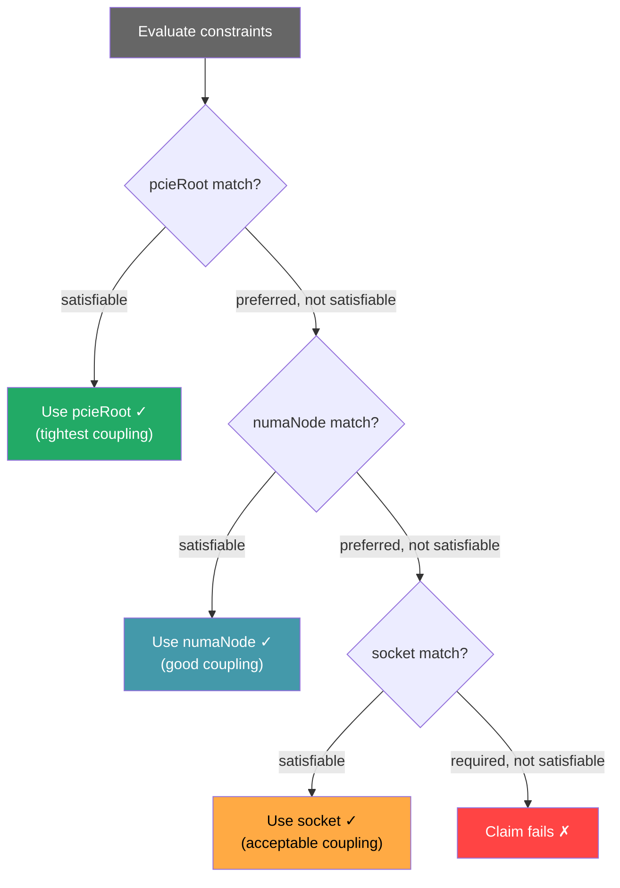

# Topology Distance Hierarchy — Diagrams

## 1. PCIe Tree with DMA Paths

Shows the physical hardware topology and DMA path for each coupling level.

### SNC off (2 NUMA nodes)

### SNC on (4 NUMA nodes)

Same physical PCIe tree — SNC only changes which memory controller services each root complex.

```mermaid
graph TD
    subgraph "Socket 0"
        subgraph "NUMA 0"
            subgraph "PCIe Root pci0000:15"
                S_GPU0["GPU 1b"]
                S_NIC0["NIC 1d"]
                S_SW0["PCIe Switch"]
                S_GPU0 --- S_SW0
                S_NIC0 --- S_SW0
            end
            subgraph "PCIe Root pci0000:59"
                S_GPU3["GPU 5f"]
                S_SW3["PCIe Switch"]
                S_GPU3 --- S_SW3
            end
        end
        subgraph "NUMA 1 (no NIC)"
            subgraph "PCIe Root pci0000:37"
                S_GPU1["GPU 3d"]
                S_SW1["PCIe Switch"]
                S_GPU1 --- S_SW1
            end
            subgraph "PCIe Root pci0000:48"
                S_GPU2["GPU 4e"]
                S_SW2["PCIe Switch"]
                S_GPU2 --- S_SW2
            end
        end
        S_RC0["Root Complex 0"]
        S_SW0 --- S_RC0
        S_SW3 --- S_RC0
        S_SW1 --- S_RC0
        S_SW2 --- S_RC0
    end

    subgraph "Socket 1"
        subgraph "NUMA 2"
            subgraph "PCIe Root pci0000:97"
                S_GPU4["GPU 9d"]
                S_NIC1["NIC 9f"]
                S_SW4["PCIe Switch"]
                S_GPU4 --- S_SW4
                S_NIC1 --- S_SW4
            end
            subgraph "PCIe Root pci0000:d7"
                S_GPU7["GPU dd"]
                S_SW7["PCIe Switch"]
                S_GPU7 --- S_SW7
            end
        end
        subgraph "NUMA 3 (no NIC)"
            subgraph "PCIe Root pci0000:b7"
                S_GPU5["GPU bd"]
                S_SW5["PCIe Switch"]
                S_GPU5 --- S_SW5
            end
            subgraph "PCIe Root pci0000:c7"
                S_GPU6["GPU cd"]
                S_SW6["PCIe Switch"]
                S_GPU6 --- S_SW6
            end
        end
        S_RC1["Root Complex 1"]
        S_SW4 --- S_RC1
        S_SW7 --- S_RC1
        S_SW5 --- S_RC1
        S_SW6 --- S_RC1
    end

    S_UPI["UPI / Inter-socket Link"]
    S_RC0 --- S_UPI
    S_RC1 --- S_UPI

    style S_GPU0 fill:#2a6,color:#fff
    style S_NIC0 fill:#2a6,color:#fff
    style S_GPU3 fill:#49a,color:#fff
    style S_GPU1 fill:#f44,color:#fff
    style S_GPU2 fill:#f44,color:#fff
    style S_GPU4 fill:#2a6,color:#fff
    style S_NIC1 fill:#2a6,color:#fff
    style S_GPU7 fill:#49a,color:#fff
    style S_GPU5 fill:#f44,color:#fff
    style S_GPU6 fill:#f44,color:#fff
    style S_UPI fill:#f44,color:#fff
```

**DMA paths:**
- **Tight (pcieRoot):** GPU 1b ↔ Switch ↔ NIC 1d — no root complex hop
- **Local (numaNode):** GPU 5f ↔ Switch ↔ Root Complex ↔ Switch ↔ NIC 1d — one hop, local memory
- **Near (socket):** GPU 3d ↔ Switch ↔ Root Complex ↔ Switch ↔ NIC 1d — same socket, crosses sub-NUMA boundary
- **Cross-socket:** GPU 3d ↔ Root Complex 0 ↔ UPI ↔ Root Complex 1 ↔ Switch ↔ NIC 9f — inter-socket penalty

**SNC impact on match coverage:**

| Attribute | SNC off | SNC on |
|-----------|---------|--------|
| pcieRoot | 2 of 8 (25%) | 2 of 8 (25%) |
| numaNode | 8 of 8 (100%) | 4 of 8 (50%) — NUMA 1,3 have no NIC |
| socket | 8 of 8 (100%) | 8 of 8 (100%) |

Green = tight (same switch as NIC). Blue = local (same NUMA, different switch). Red = no NIC on this NUMA — needs near (same socket) fallback.

---

## 2. Distance Rings

### SNC off (2 NUMA nodes)

### SNC on (4 NUMA nodes)

| Ring | Attribute | SNC off | SNC on |
|------|-----------|---------|--------|
| Innermost | `pcieRoot` | 2 of 8 | 2 of 8 |
| Middle | `numaNode` | 8 of 8 | 4 of 8 |
| Outer | `socket` | 8 of 8 | 8 of 8 |

Green = tight. Blue = local. Red = no NIC on this NUMA (needs near/socket fallback).

---

## 3. Scheduler Decision Flowchart

