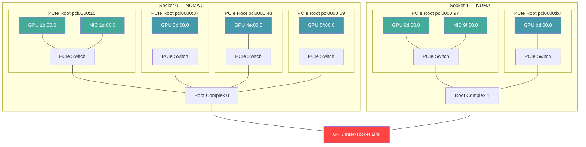
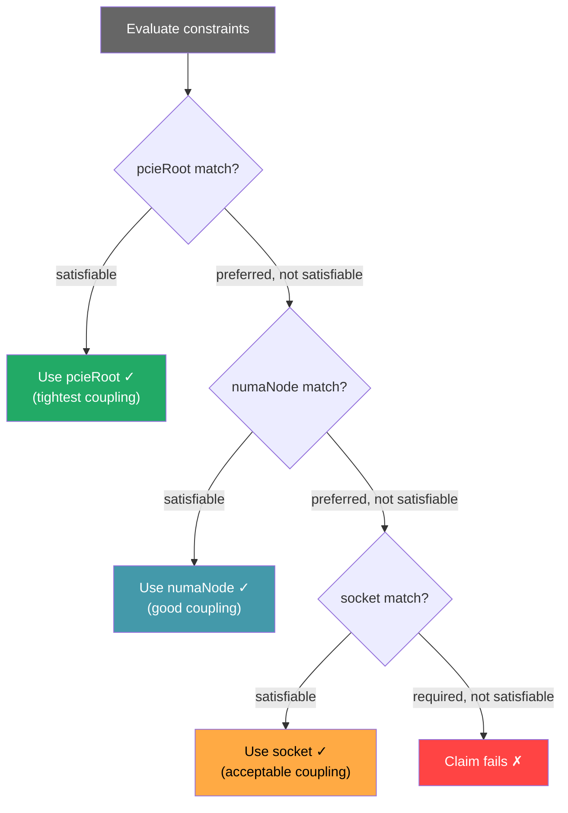

# Topology Distance Hierarchy — Diagrams

## 1. PCIe Tree with DMA Paths (XE9680, SNC off)

Shows the physical hardware topology and DMA path for each coupling level.

**DMA paths:**
- **Tight (pcieRoot):** GPU 1b ↔ Switch ↔ NIC 1d — no root complex hop
- **Loose (numaNode):** GPU 3d ↔ Switch ↔ Root Complex 0 ↔ Switch ↔ NIC 1d — one hop, local memory
- **Cross-socket:** GPU 3d ↔ Root Complex 0 ↔ UPI ↔ Root Complex 1 ↔ Switch ↔ NIC 9f — inter-socket penalty

---

## 2. Distance Rings

| Ring | Attribute | GPU+NIC pairs matched | Performance |
|------|-----------|----------------------|-------------|
| Innermost | `pcieRoot` | 2 of 8 | Best — within switch |
| Middle | `numaNode` | 8 of 8 | Good — local memory |
| Outer | `socket` | 8 of 8 | Acceptable — within socket |
| Outside | none | 8 of 8 | Bad — may cross socket |

---

## 3. Scheduler Decision Flowchart

