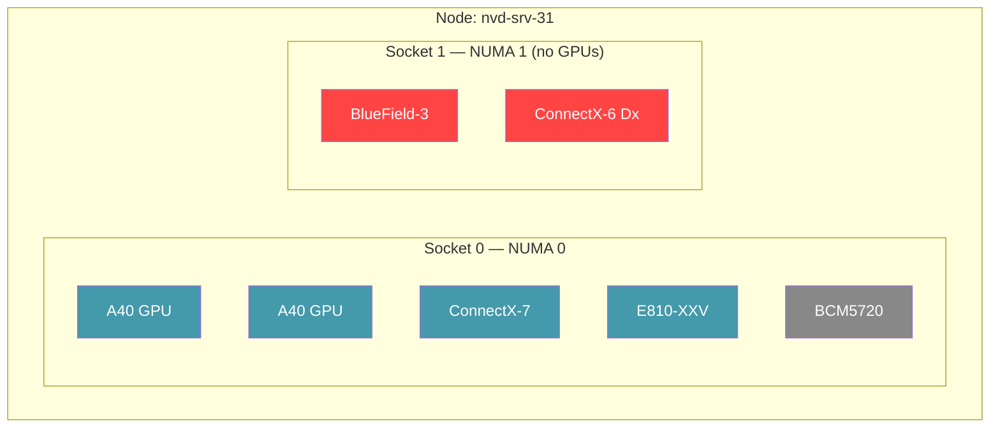
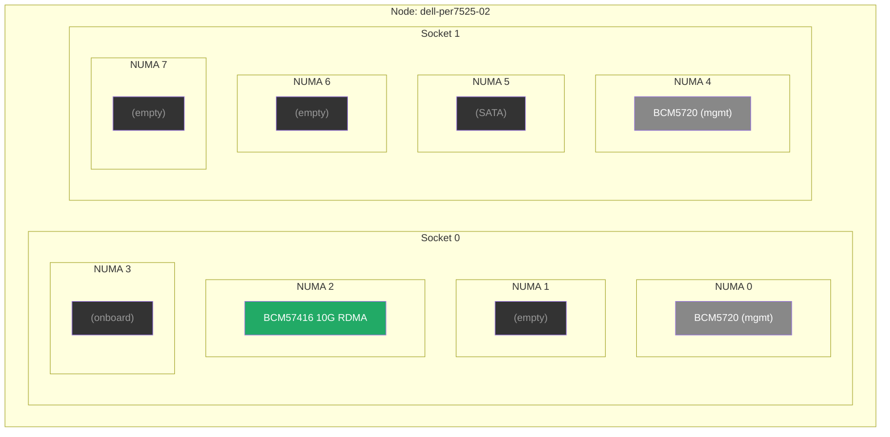

# Topology Diagrams — Dell PowerEdge R760xa & R7525

## 1. Dell PowerEdge R760xa (nvd-srv-31) — PCIe Tree with DMA Paths

**System:** Dell PowerEdge R760xa, 2× Intel Xeon Gold 6548Y+ (32 cores each), 2× NVIDIA A40 GPU
**SNC mode:** Off (2 NUMA nodes, one per socket)
**Hostname:** nvd-srv-31.nvidia.eng.rdu2.dc.redhat.com

### PCIe Tree — SNC off (2 NUMA nodes)

Every device has its own PCIe root port — no PCIe switches group devices together.
Both GPUs are on Socket 0; Socket 1 has no GPUs (asymmetric topology).

```mermaid
graph TD
    subgraph "Socket 0 — NUMA 0"
        subgraph "PCIe Root pci0000:00"
            BCM0["BCM5720 02 (1G mgmt)"]
        end
        subgraph "PCIe Root pci0000:21"
            E810_0["E810-XXV 22:0 (25G)"]
            E810_1["E810-XXV 22:1 (25G)"]
        end
        subgraph "PCIe Root pci0000:36"
            CX7["ConnectX-7 37 (400G)"]
        end
        subgraph "PCIe Root pci0000:49"
            GPU0["A40 GPU 4a"]
        end
        subgraph "PCIe Root pci0000:60"
            GPU1["A40 GPU 61"]
        end
        RC0["Root Complex 0"]
        BCM0 --- RC0
        E810_0 --- RC0
        E810_1 --- RC0
        CX7 --- RC0
        GPU0 --- RC0
        GPU1 --- RC0
    end

    subgraph "Socket 1 — NUMA 1 (no GPUs)"
        subgraph "PCIe Root pci0000:9f"
            BF3_0["BlueField-3 a0:0 (400G)"]
            BF3_1["BlueField-3 a0:1 (400G)"]
        end
        subgraph "PCIe Root pci0000:b4"
            CX6_0["ConnectX-6 Dx b5:0 (100G)"]
            CX6_1["ConnectX-6 Dx b5:1 (100G)"]
        end
        RC1["Root Complex 1"]
        BF3_0 --- RC1
        BF3_1 --- RC1
        CX6_0 --- RC1
        CX6_1 --- RC1
    end

    UPI["UPI / Inter-socket Link"]
    RC0 --- UPI
    RC1 --- UPI

    style GPU0 fill:#49a,color:#fff
    style GPU1 fill:#49a,color:#fff
    style CX7 fill:#49a,color:#fff
    style E810_0 fill:#49a,color:#fff
    style E810_1 fill:#49a,color:#fff
    style BCM0 fill:#888,color:#fff
    style BF3_0 fill:#f44,color:#fff
    style BF3_1 fill:#f44,color:#fff
    style CX6_0 fill:#f44,color:#fff
    style CX6_1 fill:#f44,color:#fff
    style UPI fill:#f44,color:#fff
```

**DMA paths:**
- **Tight (pcieRoot):** Not possible — every PCIe slot has its own dedicated root port. No two devices share a root, so `matchAttribute: pcieRoot` is unsatisfiable for any GPU+NIC pair. This is a common topology on Dell PowerEdge servers where each slot gets its own root complex.
- **Local (numaNode):** GPU 4a ↔ Root Complex 0 ↔ ConnectX-7 37 — same NUMA, different root ports. This is the tightest coupling available on this system.
- **Cross-socket:** GPU 4a ↔ Root Complex 0 ↔ UPI ↔ Root Complex 1 ↔ BlueField-3 a0 — inter-socket penalty

**Why `enforcement: Preferred` matters on this system:** A hard `matchAttribute: pcieRoot` constraint for GPU+NIC would be unsatisfiable — the claim would fail. With `enforcement: Preferred`, the scheduler relaxes `pcieRoot` and falls through to `numaNode`, which correctly pairs both GPUs with the ConnectX-7 on NUMA 0. Without the distance hierarchy, users would need to know their hardware topology to avoid writing unsatisfiable constraints.

Blue = same NUMA as GPUs (local). Red = cross-socket from GPUs. Grey = management NIC.

| Attribute | Match coverage |
|-----------|---------------|
| pcieRoot | 0 pairs (each device has its own root port) |
| numaNode | GPU ↔ CX-7, E810 (both on NUMA 0) |
| cpuSocketID | GPU ↔ CX-7, E810 on Socket 0; GPU ↔ BF3, CX6 fails (cross-socket) |

**Physical slots:** 5 total, 5 populated, 0 empty.

---

## 2. Dell PowerEdge R760xa — Distance Rings

### SNC off (2 NUMA nodes)

| Ring | Attribute | GPU pairing coverage |
|------|-----------|---------------------|
| Innermost | `pcieRoot` | 0 — no shared root ports |
| Middle | `numaNode` | GPU ↔ CX-7, E810, BCM5720 (all NUMA 0) |
| Outer | `cpuSocketID` | Same as numaNode (SNC off = 1 NUMA per socket) |

Blue = same NUMA as GPUs. Red = cross-socket. Grey = management only.

---

## 3. Dell PowerEdge R7525 (dell-per7525-02) — PCIe Tree

**System:** Dell PowerEdge R7525, 2× AMD EPYC 7542 32-Core, no discrete GPUs
**NPS mode:** NPS4 (8 NUMA nodes, 4 per socket)
**Hostname:** dell-per7525-02.khw.eng.rdu2.dc.redhat.com

### PCIe Tree — NPS4 (8 NUMA nodes)

No discrete GPUs installed. Different NICs sit on 3 of the 8 NUMA nodes (0, 2, and 4).
NUMA distance: 12 within socket, 32 cross-socket.

```mermaid
graph TD
    subgraph "Socket 0 (NUMA 0–3)"
        subgraph "NUMA 0 — RC pci0000:60"
            VGA["Matrox VGA 62"]
            BCM_63_0["BCM5720 63:0 (mgmt)"]
            BCM_63_1["BCM5720 63:1 (mgmt)"]
            BCM_64_0["BCM5720 64:0 (mgmt)"]
            BCM_64_1["BCM5720 64:1 (mgmt)"]
        end
        subgraph "NUMA 1 — RC pci0000:40"
            N1["(no user devices)"]
        end
        subgraph "NUMA 2 — RC pci0000:20"
            BCM57_0["BCM57416 25:0 (10G RDMA)"]
            BCM57_1["BCM57416 25:1 (10G RDMA)"]
        end
        subgraph "NUMA 3 — RC pci0000:00"
            N3["(onboard controllers)"]
        end
        S0_RC["Root Complexes 0x00/0x20/0x40/0x60"]
        BCM_63_0 --- S0_RC
        BCM57_0 --- S0_RC
    end

    subgraph "Socket 1 (NUMA 4–7)"
        subgraph "NUMA 4 — RC pci0000:e0"
            BCM_E1_0["BCM5720 e1:0 (mgmt)"]
            BCM_E1_1["BCM5720 e1:1 (mgmt)"]
        end
        subgraph "NUMA 5 — RC pci0000:c0"
            N5["(SATA controller)"]
        end
        subgraph "NUMA 6 — RC pci0000:a0"
            N6["(no user devices)"]
        end
        subgraph "NUMA 7 — RC pci0000:80"
            N7["(no user devices)"]
        end
        S1_RC["Root Complexes 0x80/0xa0/0xc0/0xe0"]
        BCM_E1_0 --- S1_RC
    end

    IF["Infinity Fabric / Inter-socket Link"]
    S0_RC --- IF
    S1_RC --- IF

    style BCM57_0 fill:#2a6,color:#fff
    style BCM57_1 fill:#2a6,color:#fff
    style BCM_63_0 fill:#888,color:#fff
    style BCM_63_1 fill:#888,color:#fff
    style BCM_64_0 fill:#888,color:#fff
    style BCM_64_1 fill:#888,color:#fff
    style BCM_E1_0 fill:#888,color:#fff
    style BCM_E1_1 fill:#888,color:#fff
    style VGA fill:#888,color:#fff
    style N1 fill:#333,color:#999
    style N3 fill:#333,color:#999
    style N5 fill:#333,color:#999
    style N6 fill:#333,color:#999
    style N7 fill:#333,color:#999
    style IF fill:#f44,color:#fff
```

**NUMA distance matrix (NPS4):**

|  | N0 | N1 | N2 | N3 | N4 | N5 | N6 | N7 |
|--|----|----|----|----|----|----|----|----|
| **N0** | 10 | 12 | 12 | 12 | 32 | 32 | 32 | 32 |
| **N1** | 12 | 10 | 12 | 12 | 32 | 32 | 32 | 32 |
| **N2** | 12 | 12 | 10 | 12 | 32 | 32 | 32 | 32 |
| **N3** | 12 | 12 | 12 | 10 | 32 | 32 | 32 | 32 |
| **N4** | 32 | 32 | 32 | 32 | 10 | 12 | 12 | 12 |
| **N5** | 32 | 32 | 32 | 32 | 12 | 10 | 12 | 12 |
| **N6** | 32 | 32 | 32 | 32 | 12 | 12 | 10 | 12 |
| **N7** | 32 | 32 | 32 | 32 | 12 | 12 | 12 | 10 |

Root complex → NUMA mapping (NPS4 reverses the expected order):

| Root Complex | NUMA | Socket | Key Devices |
|-------------|------|--------|-------------|
| pci0000:60 | 0 | 0 | Matrox VGA, BCM5720 (mgmt) |
| pci0000:40 | 1 | 0 | (none) |
| pci0000:20 | 2 | 0 | BCM57416 10G RDMA |
| pci0000:00 | 3 | 0 | Onboard controllers |
| pci0000:e0 | 4 | 1 | BCM5720 (mgmt) |
| pci0000:c0 | 5 | 1 | SATA |
| pci0000:a0 | 6 | 1 | (none) |
| pci0000:80 | 7 | 1 | (none) |

---

## 4. Dell PowerEdge R7525 — Distance Rings

### NPS4 (8 NUMA nodes)

| Ring | Attribute | Notes |
|------|-----------|-------|
| Innermost | `pcieRoot` | Only pairs ports on same root complex (e.g., BCM5720 63:0 + 63:1) |
| Middle | `numaNode` | Groups devices on same NUMA node (distance 10) |
| Near | `cpuSocketID` | All 4 NUMA nodes in a socket (distance 10–12) |
| Outer | Cross-socket | Infinity Fabric penalty (distance 32) |

Green = data NIC (10G RDMA). Grey = management / onboard. Dark = empty NUMA node.

**Key observations:**
- No discrete GPUs installed — topology is NIC-only
- NPS4 creates 4 NUMA domains per socket, but most are empty (no PCIe devices)
- The 10G RDMA NIC (BCM57416) is on NUMA 2, isolated from the management NICs on NUMA 0
- 5 of 8 NUMA nodes have no user-facing I/O devices
