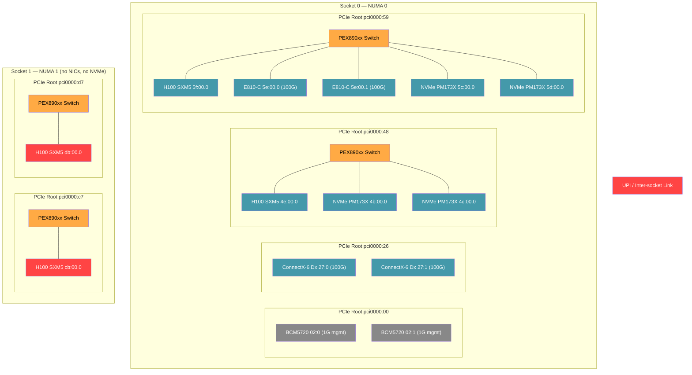
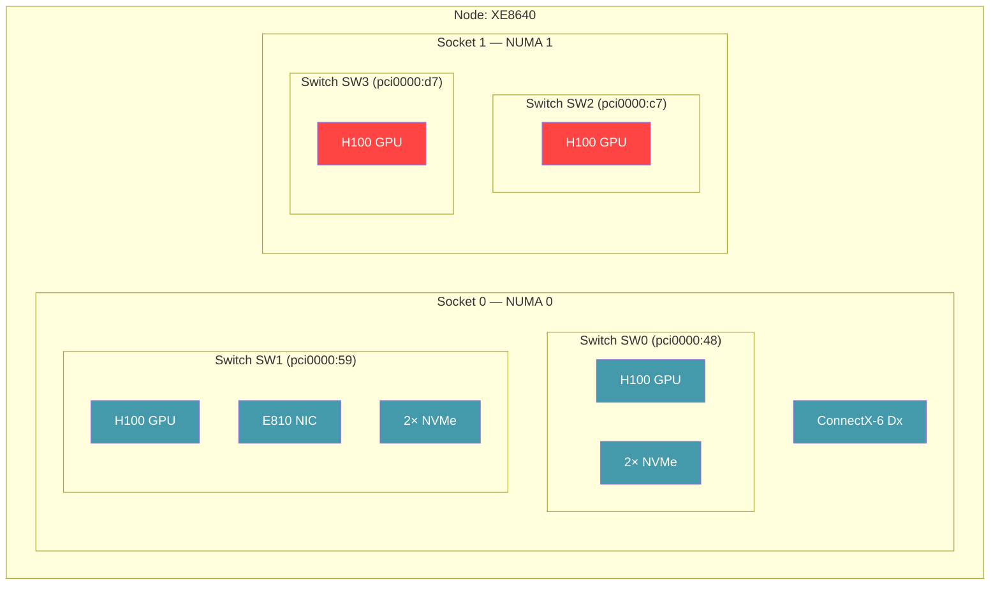

# Topology Diagram — Dell PowerEdge XE8640

**System:** Dell PowerEdge XE8640, 2× Intel Xeon Gold 6448Y (32 cores each, 128 threads), 4× NVIDIA H100 SXM5 80GB
**SNC mode:** Off (2 NUMA nodes, one per socket)
**Hostname:** l42-h06-000-xe8640.rdu3.labs.perfscale.redhat.com

## PCIe Tree — SNC off (2 NUMA nodes)

Each GPU root has a Broadcom PEX890xx Gen5 PCIe switch that groups the GPU with NVMe drives and (on one switch) a NIC. This is different from the R760xa where every device has its own root — here, devices behind the same switch share a `pcieRoot` and can use `matchAttribute: pcieRoot` for tight coupling.

**DMA paths:**
- **Tight (pcieRoot):** GPU 5f + E810 NIC + NVMe 5c/5d all share switch SW1 on root `pci0000:59`. GPU 4e + NVMe 4b/4c share switch SW0 on root `pci0000:48`. `matchAttribute: pcieRoot` works for these groupings.
- **Local (numaNode):** All Socket 0 devices (GPUs 4e/5f + CX6 + E810 + all NVMe) share NUMA 0. `matchAttribute: numaNode` covers any combination within Socket 0.
- **Cross-socket:** GPUs cb/db on NUMA 1 have no NICs and no NVMe. Any GPU↔NIC or GPU↔NVMe pairing with these GPUs crosses the UPI link (NUMA distance 21).

**Key observations:**
- PCIe switches make `pcieRoot` useful on this system (unlike the R760xa where every slot has its own root)
- GPU 5f shares a switch with the E810 NIC AND 2 NVMe drives — a `pcieRoot` constraint co-locates GPU + NIC + storage
- GPU 4e shares a switch with 2 NVMe drives but no NIC — `pcieRoot` gives GPU + NVMe, `numaNode` adds the CX6 NIC
- Socket 1 has only GPUs — asymmetric. Any pod needing GPU + NIC must use Socket 0 GPUs
- 4 NVMe drives, all on Socket 0, split across the two switches (2 per switch)
- NUMA distance 21 cross-socket (vs 32 on the AMD R7525 — Intel UPI is lower latency than AMD Infinity Fabric)

Blue = same NUMA as all I/O (Socket 0). Red = GPUs only, no I/O (Socket 1). Orange = PCIe switches. Grey = management NIC.

---

## Distance Rings

| Ring | Attribute | GPU pairing coverage |
|------|-----------|---------------------|
| Innermost | `pcieRoot` | GPU 5f ↔ E810 NIC + 2 NVMe (same switch). GPU 4e ↔ 2 NVMe (same switch, no NIC) |
| Middle | `numaNode` | GPU 4e/5f ↔ CX6 + E810 + all 4 NVMe (all NUMA 0) |
| Outer | `cpuSocketID` | Same as numaNode (SNC off = 1 NUMA per socket) |
| Cross-socket | (none) | GPU cb/db ↔ any NIC or NVMe (NUMA distance 21) |

---

## Device-to-Topology Mapping

| Device | BDF | NUMA | Socket | PCIe Root | Switch | Type |
|--------|-----|------|--------|-----------|--------|------|
| H100 SXM5 | 4e:00.0 | 0 | 0 | pci0000:48 | SW0 | GPU |
| H100 SXM5 | 5f:00.0 | 0 | 0 | pci0000:59 | SW1 | GPU |
| H100 SXM5 | cb:00.0 | 1 | 1 | pci0000:c7 | SW2 | GPU |
| H100 SXM5 | db:00.0 | 1 | 1 | pci0000:d7 | SW3 | GPU |
| ConnectX-6 Dx | 27:00.0 | 0 | 0 | pci0000:26 | — | NIC |
| ConnectX-6 Dx | 27:00.1 | 0 | 0 | pci0000:26 | — | NIC |
| E810-C QSFP | 5e:00.0 | 0 | 0 | pci0000:59 | SW1 | NIC |
| E810-C QSFP | 5e:00.1 | 0 | 0 | pci0000:59 | SW1 | NIC |
| NVMe PM173X | 4b:00.0 | 0 | 0 | pci0000:48 | SW0 | Storage |
| NVMe PM173X | 4c:00.0 | 0 | 0 | pci0000:48 | SW0 | Storage |
| NVMe PM173X | 5c:00.0 | 0 | 0 | pci0000:59 | SW1 | Storage |
| NVMe PM173X | 5d:00.0 | 0 | 0 | pci0000:59 | SW1 | Storage |
| BCM5720 | 02:00.0 | 0 | 0 | pci0000:00 | — | Mgmt NIC |
| BCM5720 | 02:00.1 | 0 | 0 | pci0000:00 | — | Mgmt NIC |

---

## Comparison with Other Systems

| Feature | XE8640 (H100) | R760xa (A40) | XE9680 (MI300X) |
|---------|---------------|--------------|-----------------|
| GPUs | 4× H100 SXM5 | 2× A40 | 8× MI300X |
| GPU distribution | 2 per socket | 2 on socket 0 only | 4 per socket |
| PCIe switches | Yes (PEX890xx Gen5) | No | Yes (some roots) |
| `pcieRoot` useful for GPU+NIC | Yes (GPU 5f + E810) | No (each slot has own root) | Yes (2 of 8 GPUs) |
| NVMe drives | 4× (behind switches) | 0 | 0 |
| GPU+NIC+NVMe on same switch | Yes (GPU 5f + E810 + 2 NVMe) | N/A | N/A |
| Asymmetric sockets | Yes (Socket 1: GPUs only) | Yes (Socket 1: no GPUs) | No (symmetric) |
| NUMA distance cross-socket | 21 | 21 | 21 |
