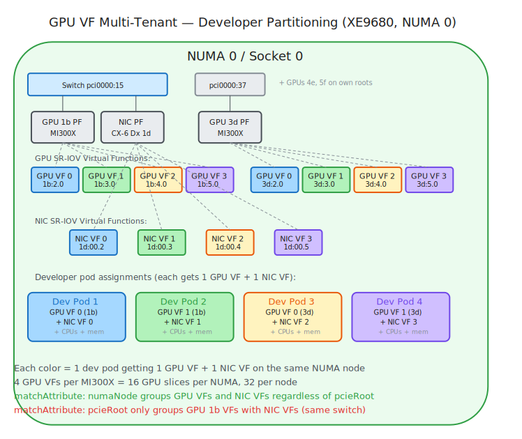

# Use Case Hardware Diagrams (v2)

Visual illustrations of topology use cases on real test hardware. Each diagram shows which devices are selected and how they relate to PCIe topology (bus) and NUMA topology (memory controller). These are orthogonal physical properties — `pcieRoot` identifies which devices share a PCIe switch, `numaNode` identifies which devices share a memory controller. Some use cases need bus proximity (UC1), others need memory proximity (UC2-UC4), and KubeVirt VMs need numaNode to reconstruct guest NUMA boundaries (UC5-UC6).

---

## 1. pcieRoot — NCCL Proxy (XE8640, 4x H100 SXM5)

**Bus topology signal in action.** GPU `5f` and E810 NIC share PCIe switch SW1 on `pci0000:59` — `pcieRoot` correctly identifies this bus-level proximity. NCCL selects GPU `5f` as the inter-node RDMA proxy. The other 3 GPUs relay data to the proxy over NVLink. This is the use case pcieRoot was designed for.

---

## 2. pcieRoot Unsatisfiable (R760xa, 2x A40)

**Bus topology has no shared roots, but memory topology groups everything.** Every PCIe slot has its own root port — no two devices share a root. `matchAttribute: pcieRoot` fails for any GPU+NIC pair. But all Socket 0 devices share a memory controller — `matchAttribute: numaNode` co-locates them. Demonstrates that bus and memory topology are orthogonal: devices can be on separate PCIe trees while sharing a memory controller.

---

## 3. numaNode — Training Pod (XE9680, 8x MI300X)

**Memory topology signal for cross-driver co-placement.** 4 GPUs + NIC + CPU + memory co-located on each NUMA node — all share the same memory controller. GPU `1b` also shares a PCIe switch with the NIC (bus proximity), so RCCL selects it as the inter-node RDMA proxy. The other 3 GPUs are on different PCIe roots but the same NUMA — pcieRoot can't group them with the NIC, numaNode can.

---

## 4. numaNode — Multi-Tenant Inference (XE9680)

**Different PCIe roots, same memory controller.** 4 independent inference pods on one NUMA node, each with its own GPU and NIC VF for multi-tenancy. The NIC PF sits behind a shared PCIe switch with GPU 1b (`pci0000:15`), while GPUs 3d, 4e, 5f are on their own root ports — different bus topology, same memory topology. SR-IOV splits the NIC into 4 VFs — one per pod. `matchAttribute: numaNode` pairs all 4 GPUs with VFs because they share a memory controller. `matchAttribute: pcieRoot` would only pair GPU 1b because it's the only one sharing a PCIe switch with the NIC.

---

## 5. KubeVirt Single-NUMA VM (R760xa)

**numaNode required for guest topology.** 1 A40 GPU + 1 ConnectX-7 VF on NUMA 0 passed through via VFIO. KEP-5304 metadata carries PCI addresses and NUMA nodes to virt-launcher. VEP 115 builds a single pxb-pcie bus on guest NUMA 0. pcieRoot can't be used here — the GPU and NIC are on different root ports. numaNode is the only signal that groups them into the same guest NUMA cell.

---

## 6. KubeVirt Multi-NUMA VM (XE9680, 8x MI300X)

**numaNode reconstructs NUMA boundaries that pcieRoot cannot.** Full-node training VM with all 8 GPUs spanning both sockets. Host devices are bound to `vfio-pci` and passed through to the guest. KEP-5304 metadata carries each device's PCI address and NUMA node to virt-launcher, which builds the guest topology using VEP 115 `pxb-pcie` expander buses. The 8 GPUs are on 8 different pcieRoot values — pcieRoot cannot reconstruct which 4 belong to NUMA 0 vs NUMA 1. numaNode directly encodes this grouping. The guest sees 2 NUMA nodes matching the host layout — 4 GPUs + 1 NIC per guest NUMA. NCCL inside the VM reads guest `numa_node` and selects a proxy GPU per NUMA for inter-node RDMA.

---

## 7. GPU VF Multi-Tenant — Developer Partitioning (XE9680)

**Memory topology groups VFs across PCIe boundaries.** GPU SR-IOV slicing for developer multi-tenancy. Each MI300X is split into 4 VFs via SR-IOV, giving 16 GPU slices per NUMA node (32 per node). Each developer pod gets 1 GPU VF + 1 NIC VF + CPUs, all on the same NUMA. Shows 2 of 4 physical GPUs — GPU 1b (shares a PCIe switch with the NIC) and GPU 3d (own root port). `matchAttribute: numaNode` groups all GPU VFs and NIC VFs that share a memory controller, regardless of which PCIe root they're behind. `matchAttribute: pcieRoot` would only group GPU 1b's VFs with the NIC VFs — the others are on different PCIe trees.

