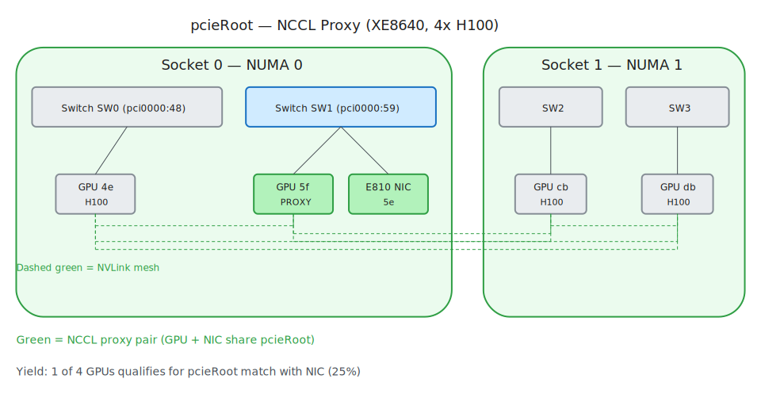
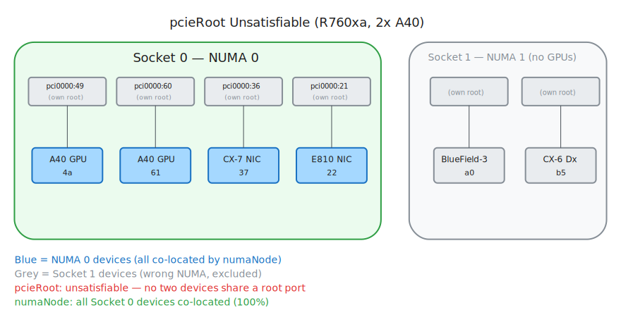
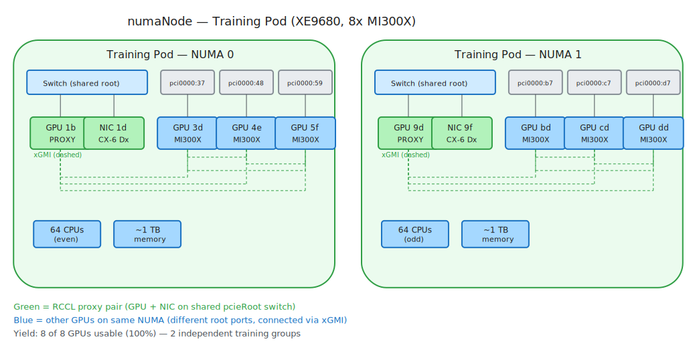
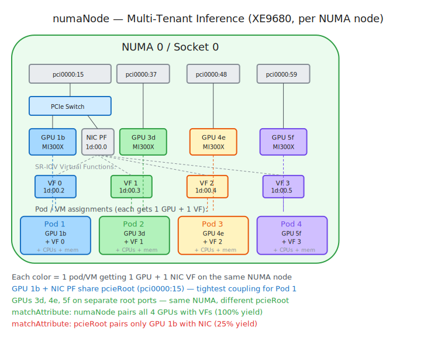
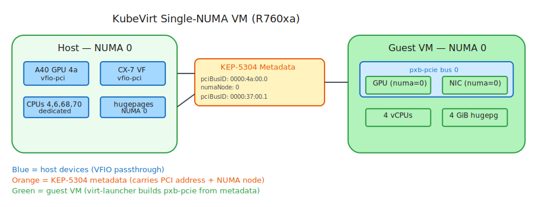
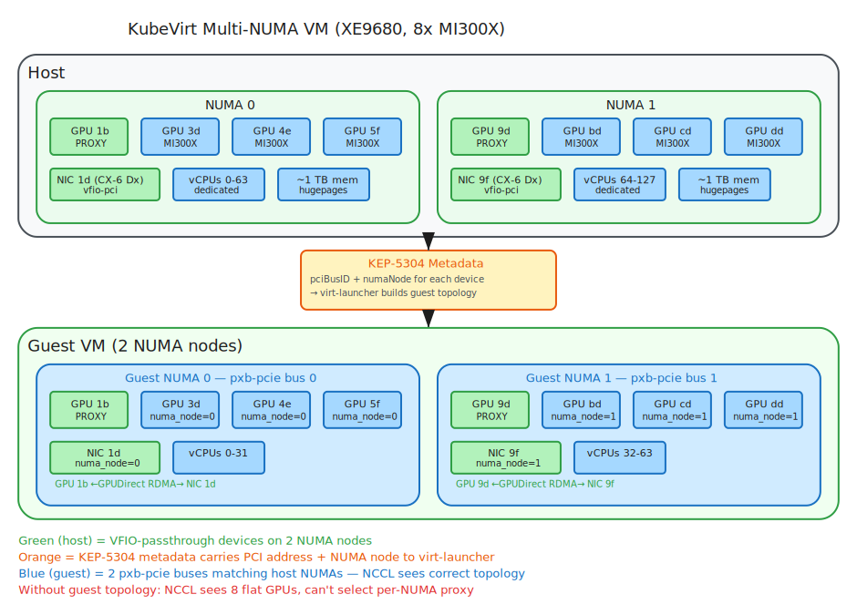

# Use Case Hardware Diagrams (v2)

Visual illustrations of topology use cases on real test hardware. Each diagram shows which devices are selected and how they relate to the PCIe and NUMA topology.

---

## 1. pcieRoot — NCCL Proxy (XE8640, 4x H100 SXM5)

GPU `5f` and E810 NIC share PCIe switch SW1 on `pci0000:59`. NCCL selects GPU `5f` as the inter-node RDMA proxy. The other 3 GPUs relay data to the proxy over NVLink.

---

## 2. pcieRoot Unsatisfiable (R760xa, 2x A40)

Every PCIe slot has its own root port — no two devices share a root. `matchAttribute: pcieRoot` fails for any GPU+NIC pair. All Socket 0 devices are co-located by `numaNode`.

---

## 3. numaNode — Training Pod (XE9680, 8x MI300X)

4 GPUs + NIC + CPU + memory co-located on each NUMA node. GPU sharing a switch with the NIC acts as the NCCL proxy for inter-node RDMA. Other GPUs communicate via xGMI.

---

## 4. numaNode — Multi-Tenant Inference (XE9680)

4 independent inference pods on NUMA 0, each with its own GPU and NIC VF. No inter-pod GPU communication — each pod is isolated. VFs share physical NIC bandwidth but have independent IPs.

---

## 5. KubeVirt Single-NUMA VM (R760xa)

1 A40 GPU + 1 ConnectX-7 VF on NUMA 0 passed through via VFIO. KEP-5304 metadata carries PCI addresses and NUMA nodes to virt-launcher. VEP 115 builds a single pxb-pcie bus on guest NUMA 0.

---

## 6. KubeVirt Multi-NUMA VM (XE9680, 8x MI300X)

Full-node VM with all 8 GPUs spanning both sockets. Guest sees 2 NUMA nodes with 4 GPUs + 1 NIC each. NCCL inside the VM reads guest `numa_node` to select a proxy GPU per NUMA for inter-node RDMA.

