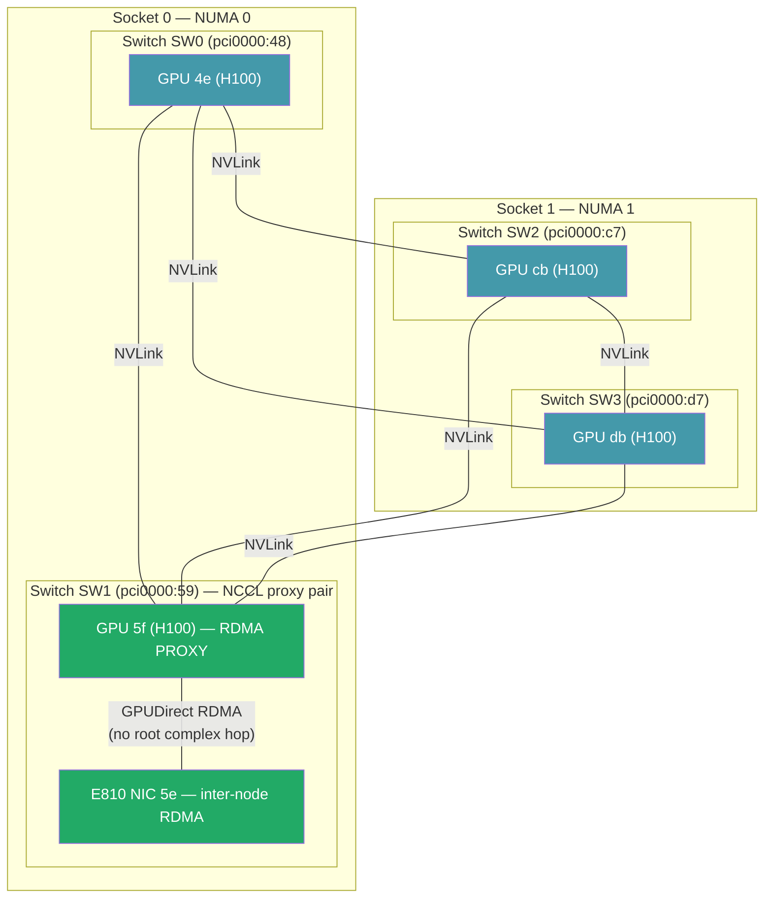
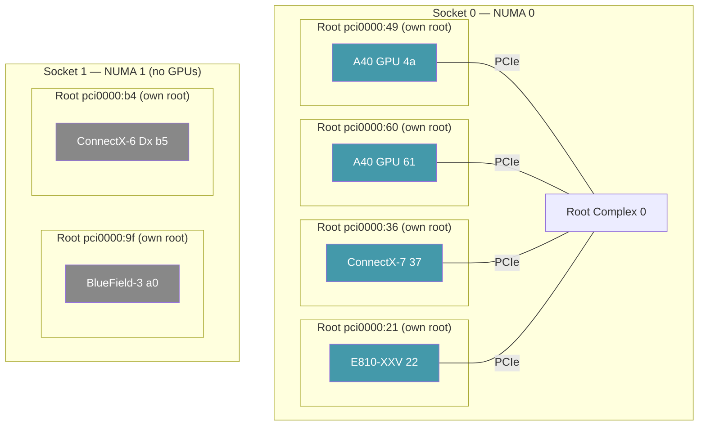
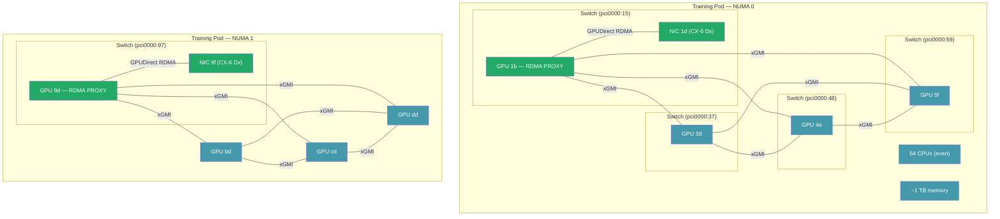
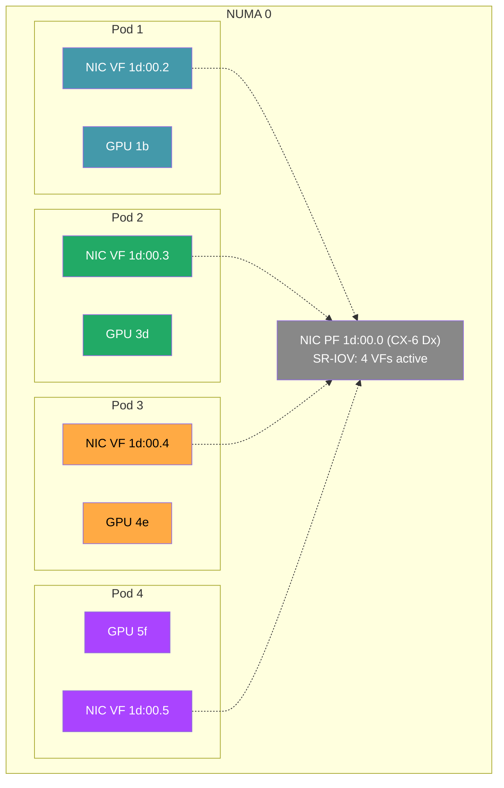
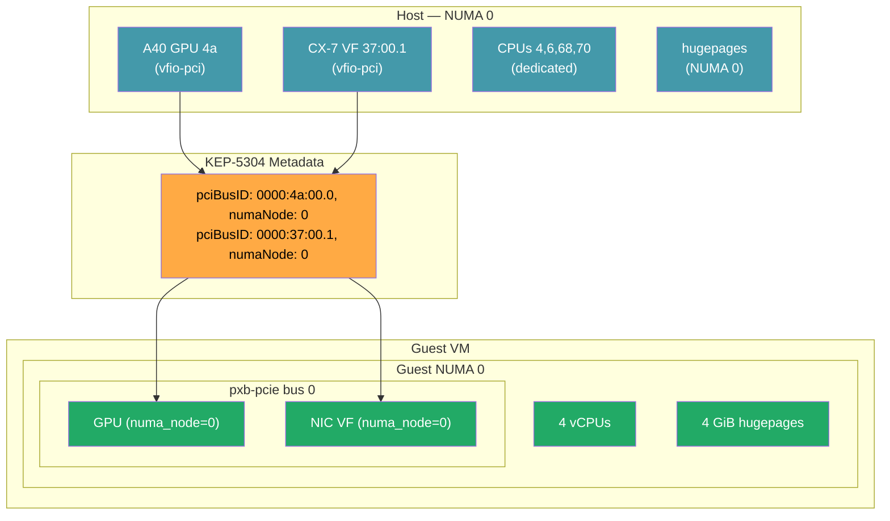
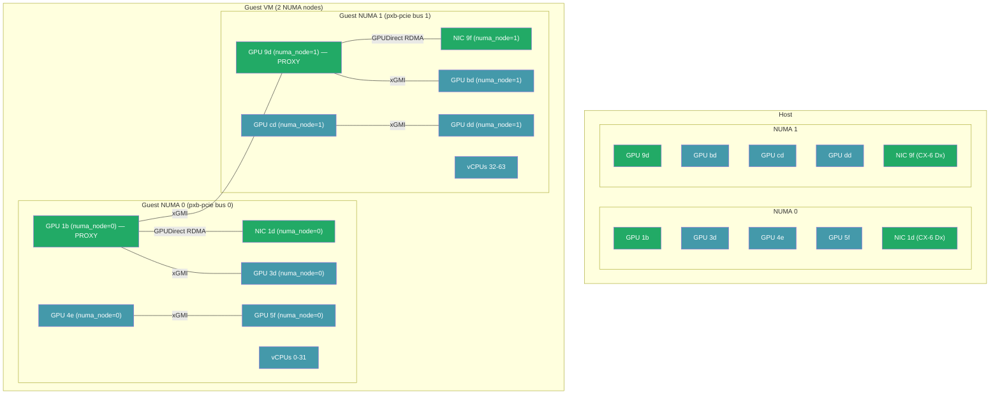

# Use Case Hardware Diagrams

Visual illustrations of topology use cases on real test hardware. Each diagram shows which devices are selected, the DMA paths used, and the NVLink/xGMI interconnects between GPUs.

Blue = selected/co-located devices. Grey = not selected. Green = NVLink/xGMI path. Red = cross-NUMA path (avoided).

---

## 1. pcieRoot — NCCL Proxy (XE8640, 4x H100 SXM5)

GPU `5f` and E810 NIC share PEX890xx switch SW1 on `pci0000:59`. NCCL selects GPU `5f` as the inter-node RDMA proxy. The other 3 GPUs relay data to the proxy over NVLink (900 GB/s bidirectional), and the proxy sends it out the NIC via GPUDirect RDMA with no root complex hop.

**Key:** GPU `5f` is the only GPU that qualifies for `pcieRoot` matching with the NIC. The other GPUs don't need direct NIC access — NVLink to the proxy is faster than each GPU going to the NIC independently over PCIe.

---

## 2. pcieRoot Unsatisfiable (R760xa, 2x A40)

Every PCIe slot has its own root port — no two devices share a root. `matchAttribute: pcieRoot` fails for any GPU+NIC pair. `enforcement: preferred` relaxes pcieRoot and falls through to `numaNode`, which correctly pairs both GPUs with the ConnectX-7 on NUMA 0.

**Key:** No shared switches. `pcieRoot` → unsatisfiable. `numaNode` → all Socket 0 devices co-located (blue). Socket 1 NICs (grey) excluded — wrong NUMA.

---

## 3. numaNode — Training Pod (XE9680, 8x MI300X)

4 GPUs + NIC + CPU + memory co-located on NUMA 0. GPUs communicate over xGMI (Infinity Fabric). GPU `1b` shares a switch with the NIC and acts as the NCCL proxy for inter-node RDMA. NUMA 1 is an independent second training group.

**Key:** All 8 GPUs usable (100% yield). Each NUMA group has its own proxy GPU + NIC pair. xGMI links handle GPU-to-GPU communication. The one root complex hop for non-proxy GPUs to reach the NIC is negligible.

---

## 4. numaNode — Multi-Tenant Inference (XE9680)

4 independent inference pods on NUMA 0, each with its own GPU and NIC VF. No NVLink between pods — each GPU is isolated. Each pod gets its own SR-IOV VF from the physical NIC for network isolation.

**Key:** Each pod has its own color — isolated GPU + VF pairs. All on NUMA 0 via `matchAttribute: numaNode`. VFs share physical NIC bandwidth but have independent IPs for routing/monitoring. No NVLink used — pods don't cooperate.

---

## 5. KubeVirt Single-NUMA VM (R760xa)

1 A40 GPU + 1 ConnectX-7 VF on NUMA 0 passed through via VFIO. KEP-5304 metadata carries PCI addresses and NUMA nodes to virt-launcher. VEP 115 builds a single pxb-pcie bus on guest NUMA 0.

**Key:** Host devices (blue) → KEP-5304 metadata (orange) → guest devices (green). Guest sees `numa_node=0` on both devices. vLLM inside the VM correctly pins to NUMA 0.

---

## 6. KubeVirt Multi-NUMA VM (XE9680, 8x MI300X)

Full-node training VM with all 8 GPUs spanning both sockets. Guest sees 2 NUMA nodes with 4 GPUs + 1 NIC each. NCCL inside the VM reads guest `numa_node` and selects a proxy GPU per NUMA (GPU `1b` on guest NUMA 0, GPU `9d` on guest NUMA 1) for inter-node RDMA. xGMI handles GPU-to-GPU communication within and across guest NUMA nodes.

**Key:** Guest sees 2 NUMA nodes matching host placement. Each guest NUMA has 4 GPUs + 1 NIC — NCCL selects a proxy per NUMA for inter-node RDMA. xGMI connects GPUs within and across guest NUMA nodes. Without guest topology, NCCL sees all 8 GPUs as flat and can't optimize per-NUMA proxy selection.
