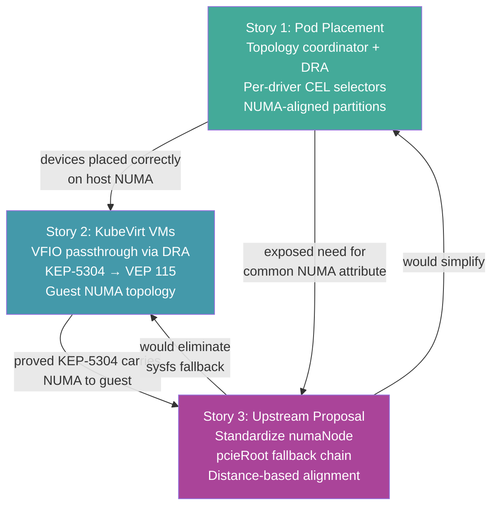

# DRA Topology-Aware Co-Placement: Project Narrative

**Date:** 2026-04-16

This project demonstrates end-to-end topology-aware device placement using Kubernetes DRA, from plain pods through KubeVirt VMs, and proposes upstream enhancements based on what we learned.

---

## Story 1: Topology-Aware Pod Placement with DRA

### Problem

Kubernetes DRA allocates each device type independently — GPU, NIC, CPU, memory. Without coordination, a pod can get a GPU from NUMA 0 and a NIC from NUMA 1. Every cross-NUMA memory access adds latency. On AI/HPC workloads, this is a significant performance penalty.

There is no standard NUMA attribute. Each DRA driver uses its own: `gpu.amd.com/numaNode`, `dra.cpu/numaNodeID`, `dra.net/numaNode`, `dra.memory/numaNode`. The K8s `matchAttribute` constraint requires a single common name across all drivers — which doesn't exist.

### Solution: Topology Coordinator

The topology coordinator watches ResourceSlices from all DRA drivers, discovers the hardware topology, and creates machine partitions at multiple granularities (eighth, quarter, half, full). A mutating webhook expands simple one-line claims into multi-driver sub-requests with NUMA alignment.

Each driver keeps its own attribute namespace. The coordinator translates between them using ConfigMap-based topology rules:

```yaml
# GPU rule: maps gpu.amd.com/numaNode → numaNode concept
data:
  attribute: numaNode           # what the driver publishes
  driver: gpu.amd.com           # which driver
  mapsTo: numaNode              # standard topology concept
```

The coordinator generates per-driver CEL selectors:

```yaml
# GPU sub-request
selectors:
- cel: 'device.attributes["gpu.amd.com"].numaNode == 0'

# NIC sub-request
selectors:
- cel: 'device.attributes["dra.net"].numaNode == 0'

# CPU sub-request
selectors:
- cel: 'device.attributes["dra.cpu"].numaNodeID == 0'
```

No `matchAttribute`, no common attribute name, no driver patches.

### What We Proved

On a Dell XE9680 (2-socket, 8x MI300X GPU, ConnectX-6 NIC, 128 CPUs, 2 TB memory):

- **8 pods**, each with 1 GPU + 2 NICs + 8 CPU cores + memory, all NUMA-aligned
- **Half-machine pod** consuming all of NUMA 1 (4 GPUs + 8 NICs + CPU + memory)
- **Mixed sizes**: half on NUMA 1 + 2 quarters on NUMA 0
- **DRAConsumableCapacity** for shared CPU/memory (multiple pods sharing the same device with divided capacity)
- **Per-NUMA DeviceClasses**: eighth-numa0, quarter-numa1, half-numa0, etc.
- Zero cross-NUMA contamination in any test

### Key Design Decisions

| Decision | Why |
|----------|-----|
| Per-driver CEL selectors instead of `matchAttribute` | Drivers don't agree on a common NUMA attribute name |
| Per-NUMA DeviceClasses | Each partition is pre-pinned to a specific NUMA — deterministic allocation |
| Topology rules via ConfigMap | New drivers supported without code changes — add a ConfigMap |
| Half partitions from byNUMA fallback | Drivers don't publish socket attribute — fall back to NUMA grouping |
| Proportional partitions | Shared devices (CPU, memory) get divided capacity via DRAConsumableCapacity |

### Components

- [Topology Coordinator](topology-coordinator.md) — partition builder, webhook, per-driver CEL
- Fork: [`johnahull/k8s-dra-topology-coordinator`](https://github.com/johnahull/k8s-dra-topology-coordinator), branch `test/all-fixes-combined`

---

## Story 2: KubeVirt VMs with Guest NUMA Topology

### Problem

Story 1 solves pod placement. But KubeVirt VMs are different — QEMU creates a virtual machine with its own NUMA topology. The guest OS has its own `/sys/bus/pci/devices/*/numa_node`. For the guest to see devices on the correct NUMA node, QEMU needs explicit configuration via VEP 115 (PCI NUMA-Aware Topology with `pxb-pcie` expander buses).

KubeVirt's `guestMappingPassthrough` creates guest NUMA nodes based on the kubelet's CPU placement — not DRA device placement. DRA devices on a NUMA node without vCPUs show `numa_node=-1` in the guest.

### Solution: DRA-Aware Guest NUMA Cells

We patched KubeVirt to read device NUMA from KEP-5304 metadata and create guest NUMA cells for device-only NUMA nodes:

1. **Read KEP-5304 metadata** — `numaNode` attribute for each DRA host device (with sysfs fallback for drivers that don't publish it)
2. **Create device-only guest NUMA cells** — guest NUMA nodes for host NUMA nodes that have DRA devices but no vCPUs
3. **Place pxb-pcie buses** on correct guest NUMA nodes using the DRA NUMA overrides
4. **Transform host→guest NUMA IDs** — map host NUMA node numbers to guest cell IDs

Additional patches for VFIO passthrough:
- Force root mode for VFIO host device pods (capability propagation)
- Add SYS_RESOURCE, IPC_LOCK capabilities for memlock
- Unconfined seccomp for file capability execution
- Skip permittedHostDevices check for DRA devices
- Fix container-disk-binary cp for root mode

### What We Proved

Fedora 43 VM on the XE9680 with:
- GPU from NUMA 0 → `numa_node=0` in guest
- GPU from NUMA 1 → `numa_node=1` in guest
- NIC from NUMA 0 → `numa_node=0` in guest
- NIC from NUMA 1 → `numa_node=1` in guest

```
Guest PCI NUMA mapping:
  0000:ff:00.0: numa=0  GPU  (MI300X VF, host NUMA 0)
  0000:fe:00.0: numa=0  NIC  (ConnectX-6 VF, host NUMA 0)
  0000:fc:00.0: numa=1  GPU  (MI300X VF, host NUMA 1)
  0000:fb:00.0: numa=1  NIC  (ConnectX-6 VF, host NUMA 1)
```

The full chain: topology coordinator → DRA CEL selectors → device allocation → VFIO binding → KEP-5304 metadata → VEP 115 pxb-pcie → guest NUMA topology.

### Additional Work Required

| Item | Status |
|------|--------|
| GIM kernel module patched for kernel 6.17 | Done |
| AMD GPU DRA driver VFIO bind/unbind | Done |
| SR-IOV NIC VFs pre-bound to vfio-pci | Manual (driver doesn't have VFIO mode) |
| Multi-driver KEP-5304 metadata per claim | Kubelet bug — workaround: separate claims per driver |
| Kubelet CPU/memory pinning to match DRA | Gap — DRA and topology manager don't coordinate |

### Components

- KubeVirt patches: `virt-controller` (root mode, capabilities, seccomp, launcher override) + `virt-launcher` (DRA NUMA cells, KEP-5304 reading)
- GPU VFIO: GIM patched for kernel 6.17, DRA driver VF binding fix
- [Full documentation](kubevirt-integration.md)

---

## Story 3: Why `numaNode` Should Be Standardized

### What Testing Revealed

The testing exposed a fundamental asymmetry in topology attribute coverage:

| Attribute | GPU-NIC coverage (SNC off) | GPU-NIC coverage (SNC on) | Includes CPU/memory |
|-----------|--------------------------|--------------------------|-------------------|
| `pcieRoot` | 2/8 GPUs (25%) | 2/8 GPUs (25%) | No |
| `numaNode` | 8/8 GPUs (100%) | 4/8 GPUs (50%) | Yes |

`pcieRoot` only matches devices that share a PCIe switch. On the XE9680, only 1 of 4 GPUs per socket shares a switch with the NIC. The other 3 work fine with the NIC — they're on the same NUMA, just a different switch — but `pcieRoot` excludes them.

### The SNC/NPS Objection — Addressed

The upstream community removed `numaNode` from KEP-4381 because SNC/NPS changes what NUMA IDs mean. Our testing with SNC on/off on real hardware shows:

- The sysfs value is **always correct** — it reports the memory controller that services the device
- SNC makes `numaNode` **finer-grained**, not incorrect
- The 50% coverage reduction with SNC on is a **hardware constraint** (NUMA 1/3 have no NIC), not an attribute problem
- `pcieRoot` has the **same coverage** regardless of SNC — 25% in both modes

### The Proposal

Standardize `resource.kubernetes.io/numaNode` as a companion to `pcieRoot`:

- `pcieRoot` for **tight coupling** (same PCIe switch) — GPU-GPU peer DMA, GPU-NIC RDMA on same switch
- `numaNode` for **loose coupling** (same memory controller) — cross-driver co-placement including CPU and memory

With a distance-based fallback: try `pcieRoot` first (preferred), fall back to `numaNode` (required). The topology coordinator implements this via the `fallbackAttribute` field on topology rules.

Without a standard `numaNode`:
- Every consumer must know every driver's vendor-specific NUMA attribute name
- `matchAttribute` can't be used — each driver publishes NUMA differently
- The topology coordinator is required as middleware for basic NUMA alignment

With a standard `numaNode`:
- One `matchAttribute` constraint aligns all device types
- The kubelet can auto-populate it from sysfs in KEP-5304 metadata
- No driver coordination needed — `numaNode` is the same concept everywhere

### Components

- [Standardization proposal](upstream-proposals/standardize-numanode-with-pcieroot-fallback.md) — with XE9680 hardware topology diagrams
- [NUMA/SNC/NPS gap analysis](upstream-proposals/numa-snc-nps-topology-gap.md)
- [KEP-5304 auto-populate proposal](upstream-proposals/kep5304-auto-populate-metadata.md)
- [Topology attribute debate](topology-attribute-debate.md) — full analysis of pcieRoot vs numaNode

---

## How the Stories Connect



Story 1 proves the topology coordinator works for pods. Story 2 proves it extends to VMs via KEP-5304 and VEP 115. Story 3 argues that the middleware (coordinator) shouldn't be required for basic NUMA alignment — a standard attribute would make it native.

Each story stands alone but they build on each other. The testing data from Stories 1 and 2 provides the evidence for Story 3's upstream proposal.
