# Topology Coordinator Design

**Date:** 2026-04-16

---

## Overview

The topology coordinator automatically discovers devices from 4 DRA drivers (CPU, GPU, NIC, memory), computes proportional partitions at multiple granularities, and exposes them as DeviceClasses. A mutating webhook expands simple one-line claims into multi-driver sub-requests with NUMA alignment constraints and `DRAConsumableCapacity` capacity sharing.

**Platform:** Fedora 43 + K8s 1.36.0-rc.0, Dell XE9680

The upstream community is developing an alternative alignment mode: CPUs publish `resource.kubernetes.io/pcieRoot` as a list via [KEP-5491](https://github.com/kubernetes/enhancements/issues/5491) list-typed attributes, enabling alignment through the existing standard attribute instead of the informal `dra.net/numaNode` convention. This document covers both modes and the changes needed to support them.

---

## Architecture

### Current Coordinator Architecture

After the fixes in the existing fork branches, the coordinator works as follows:

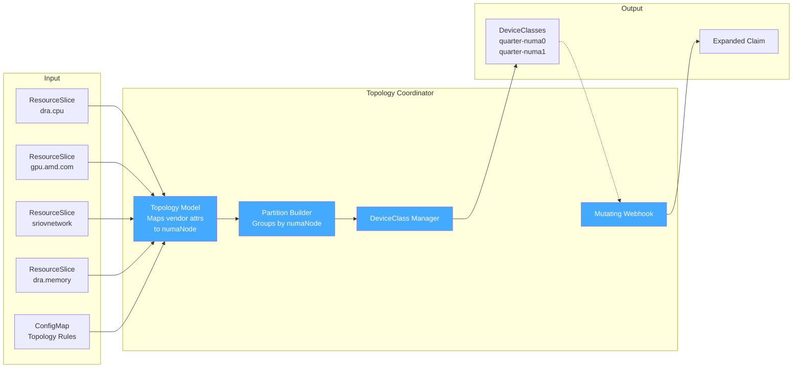

### Component Architecture

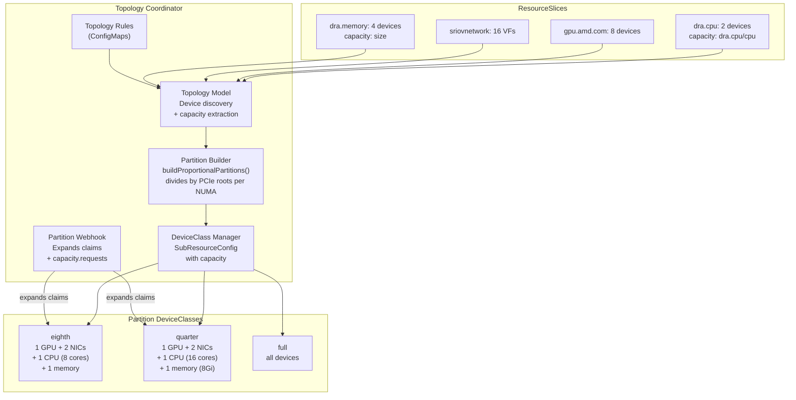

### Claim Expansion Flow

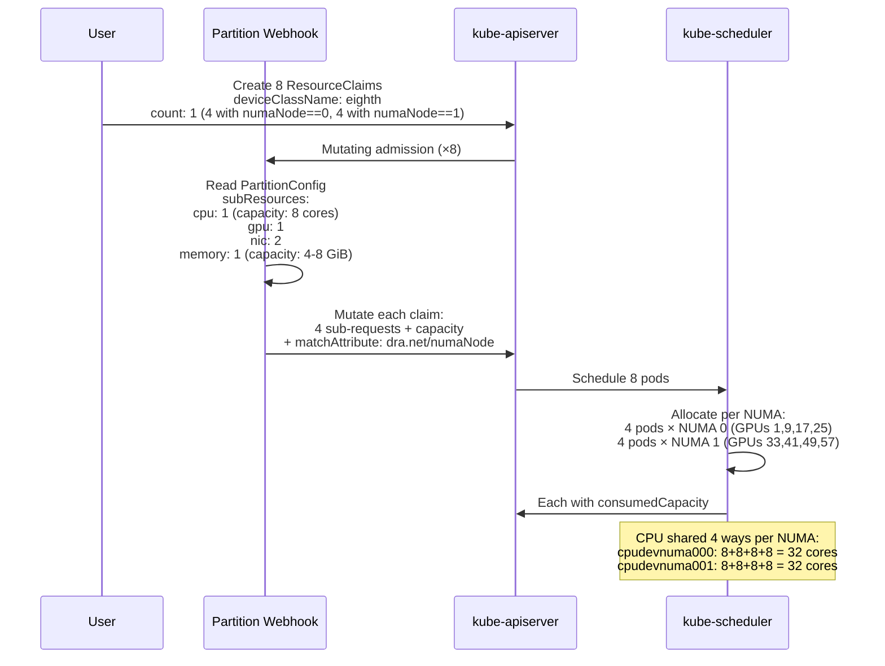

### NUMA Layout

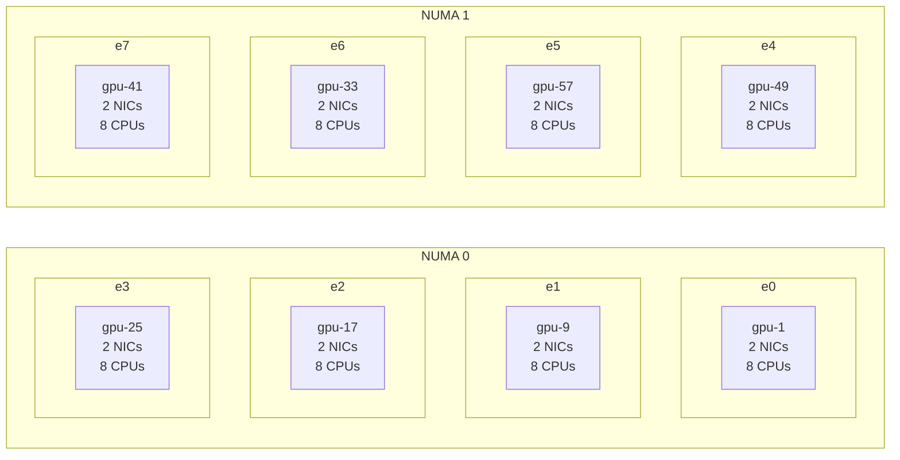

---

## Partition Abstraction

The coordinator computes three partition granularities plus full:

| Level | GPU | NICs | CPU | Memory | Partitions per Machine |
|-------|-----|------|-----|--------|----------------------|
| **Eighth** | 1 | 2 | 1 (8 cores) | 1 (4-8 GiB) | 8 (4 per NUMA) |
| **Quarter** | 1 | 2 | 1 (16 cores) | 1 (8 GiB) | 8 (4 per NUMA)* |
| **Full** | 8 | 16 | 2 | 4 | 1 |

*On this hardware, eighth and quarter produce the same subdivision factor (4 PCIe roots per NUMA). They differ on systems where PCIe roots group multiple devices.

Both eighth and quarter use `buildProportionalPartitions()` which:
1. Counts unique PCIe roots per NUMA node
2. Divides all device types proportionally by that count
3. For shared devices (count=1 per NUMA), uses `DRAConsumableCapacity` to divide capacity

---

## Test Results

### Full Machine Divided into 8 Slices

8 pods, each receiving 1/8th of the machine — 1 GPU + 2 NICs + 8 CPU cores + memory — all NUMA-aligned, all allocated via the topology coordinator:

| Pod | NUMA | GPU | NICs | CPU (8 cores) | Memory |
|-----|------|-----|------|---------------|--------|
| e0 | 0 | gpu-1 | 1d:00.5, 1d:00.6 | cpudevnuma000 | memory-vwcmvh |
| e1 | 0 | gpu-9 | 1d:00.4, 1d:00.7 | cpudevnuma000 | memory-vwcmvh |
| e2 | 0 | gpu-17 | 1d:00.2, 1d:01.0 | cpudevnuma000 | memory-vwcmvh |
| e3 | 0 | gpu-25 | 1d:00.3, 1d:01.1 | cpudevnuma000 | memory-vwcmvh |
| e4 | 1 | gpu-49 | 9f:00.6, 9f:01.1 | cpudevnuma001 | memory-2tsgwk |
| e5 | 1 | gpu-57 | 9f:00.3, 9f:00.5 | cpudevnuma001 | memory-2tsgwk |
| e6 | 1 | gpu-33 | 9f:00.7, 9f:01.0 | cpudevnuma001 | memory-2tsgwk |
| e7 | 1 | gpu-41 | 9f:00.2, 9f:00.4 | cpudevnuma001 | memory-2tsgwk |

- All 8 GPUs allocated (exclusive, 1 per pod)
- All 16 NIC VFs allocated (exclusive, 2 per pod)
- CPU shared 4 ways per NUMA via `DRAConsumableCapacity` (8 exclusive cores each)
- Memory shared 4 ways per NUMA via `DRAConsumableCapacity`
- 4 pods on NUMA 0, 4 pods on NUMA 1
- Zero cross-NUMA contamination

### 4 Quarter-Machine Pods

| Pod | NUMA | GPU | NICs | CPU (16 cores) | Memory (8 GiB) |
|-----|------|-----|------|----------------|----------------|
| q0 | 1 | gpu-49 | 9f:00.6, 9f:01.1 | cpudevnuma001 | memory-2tsgwk |
| q1 | 0 | gpu-1 | 1d:00.5, 1d:00.6 | cpudevnuma000 | memory-vwcmvh |
| q2 | 0 | gpu-9 | 1d:00.4, 1d:00.7 | cpudevnuma000 | memory-vwcmvh |
| q3 | 1 | gpu-57 | 9f:00.3, 9f:00.5 | cpudevnuma001 | memory-2tsgwk |

### What the User Creates

```yaml
apiVersion: resource.k8s.io/v1
kind: ResourceClaim
metadata:
  name: e0
spec:
  devices:
    requests:
    - name: e
      exactly:
        deviceClassName: <eighth-class-name>
        count: 1
        selectors:
        - cel:
            expression: 'device.attributes["dra.net"].numaNode == 0'
```

### What the Webhook Expands It To

```yaml
requests:
- name: e-dra-cpu
  exactly: {deviceClassName: dra.cpu, count: 1, capacity: {requests: {dra.cpu/cpu: "8"}}}
- name: e-gpu-amd-com
  exactly: {deviceClassName: gpu.amd.com, count: 1}
- name: e-sriovnetwork-k8snetworkplumbingwg-io
  exactly: {deviceClassName: sriovnetwork.k8snetworkplumbingwg.io, count: 2}
- name: e-dra-memory
  exactly: {deviceClassName: dra.memory, count: 1, capacity: {requests: {size: "8Gi"}}}
constraints:
- matchAttribute: dra.net/numaNode
  requests: [e-dra-cpu, e-gpu-amd-com, e-sriovnetwork-k8snetworkplumbingwg-io, e-dra-memory]
```

---

## Patches

### Coordinator Patches (6 patches on top of PR #1)

| # | File | Change |
|---|------|--------|
| 1 | `topology_model.go` | `AttrNUMANode` to `dra.net/numaNode` (bug #2 fix) |
| 2 | `topology_model.go` | Extract device capacity from ResourceSlice into `TopologyDevice.Capacity` |
| 3 | `deviceclass_manager.go` | `SubResourceConfig.Capacity` field; `truncateLabel()` for >63 char profiles (bug #3); removed cross-driver pcieRoot constraint |
| 4 | `partition_builder.go` | `buildProportionalPartitions()` -- proportional subdivision of NUMA nodes by PCIe root count for both eighth and quarter levels |
| 5 | `partition_builder.go` | Shared devices (count=1) get proportional capacity via `divideQuantity()` + `DeviceCapacity` on `PartitionDevice` |
| 6 | `webhook.go` | Emit `capacity.requests` on `ExactDeviceRequest` when `SubResourceConfig.Capacity` is set |

---

## Fork Branches

All branches on [`johnahull/k8s-dra-topology-coordinator`](https://github.com/johnahull/k8s-dra-topology-coordinator):

| Branch | Commit | What It Does | Issues Closed |
|---|---|---|---|
| [`fix/pcieroot-constraint-non-pci-drivers`](https://github.com/johnahull/k8s-dra-topology-coordinator/tree/fix/pcieroot-constraint-non-pci-drivers) | `657d247` | pcieRoot constraint was applied to ALL drivers including CPU/memory which don't publish pcieRoot -- made claims unsatisfiable. Fix: only include drivers with non-nil pcieRoot. | [#1](../all-issues.md) |
| [`fix/numanode-attribute-namespace`](https://github.com/johnahull/k8s-dra-topology-coordinator/tree/fix/numanode-attribute-namespace) | `655ec5b` | Coordinator used `nodepartition.dra.k8s.io/numaNode` which no driver publishes. Fix: use `dra.net/numaNode`. Also adds DRAConsumableCapacity support. | [#2](../all-issues.md) |
| [`fix/per-driver-cel-selectors`](https://github.com/johnahull/k8s-dra-topology-coordinator/tree/fix/per-driver-cel-selectors) | `d90e6ae` | Replaces cross-driver `matchAttribute` with per-driver CEL selectors. Each driver keeps its own NUMA attribute namespace. Coordinator translates between them. | [#2](../all-issues.md) (alternative approach) |
| [`fix/webhook-forward-cel-selectors`](https://github.com/johnahull/k8s-dra-topology-coordinator/tree/fix/webhook-forward-cel-selectors) | `b6de0ce` | Forwards user CEL selectors from the partition request to expanded sub-requests. Without this, user selectors are silently dropped. | [#7](../all-issues.md) |
| [`test/all-fixes-combined`](https://github.com/johnahull/k8s-dra-topology-coordinator/tree/test/all-fixes-combined) | `83ec774` | Merge of all fixes into one testable branch. Includes NUMA label dash fix (`39b2ae1`). | All above |

### Branch Dependency Order

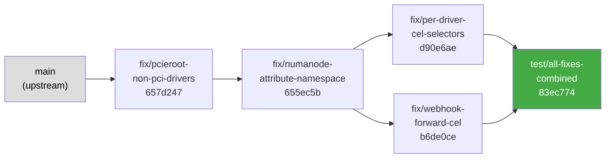

---

## Constraint Modes

### Current Constraint Generation

The webhook expands a partition claim into multi-driver sub-requests with a single `matchAttribute` constraint:

```yaml
# What the webhook currently generates (fix/numanode-attribute-namespace branch)
constraints:
- matchAttribute: dra.net/numaNode
  requests: [partition-gpu, partition-nic, partition-cpu, partition-mem]
```

Or with per-driver CEL selectors (`fix/per-driver-cel-selectors` branch):

```yaml
# Alternative: per-driver CEL with hardcoded NUMA IDs
requests:
- name: partition-gpu
  selectors:
  - cel:
      expression: 'device.attributes["gpu.amd.com"].numaNode == 0'
- name: partition-nic
  selectors:
  - cel:
      expression: 'device.attributes["dra.net"].numaNode == 0'
- name: partition-cpu
  selectors:
  - cel:
      expression: 'device.attributes["dra.cpu"].numaNodeID == 0'
```

### Design Evolution

The NUMA alignment approach evolved during testing:

1. **Initial:** Coordinator hardcoded `matchAttribute: nodepartition.dra.k8s.io/numaNode` — no driver publishes this. Broken.
2. **Fix #1 (numaNode branch):** Changed to `matchAttribute: dra.net/numaNode`. Works, but requires ALL drivers to publish the same `dra.net/numaNode` attribute. Patched the AMD GPU driver to add it (patch #9 in all-issues.md).
3. **Fix #2 (per-driver CEL branch):** Replaced `matchAttribute` with per-driver CEL selectors. Each driver keeps its own attribute namespace. The GPU driver patch for `dra.net/numaNode` was **removed** — no longer needed. The coordinator reads each driver's attribute name from topology rule ConfigMaps and generates the correct CEL expression.

The `test/all-fixes-combined` branch uses the per-driver CEL approach (fix #2). The `dra.net/numaNode` patch on the GPU driver is NOT required. References to `matchAttribute: dra.net/numaNode` in the sequence diagrams above reflect the earlier approach (fix #1) which is still available as a fallback but not the default.

### Mode Comparison

| | numaNode mode | CEL-selectors mode | pcieRoot-pivot mode |
|---|---|---|---|
| **Branch** | `fix/numanode-attribute-namespace` | `fix/per-driver-cel-selectors` | NEW (to be built) |
| **Constraints** | 1 `matchAttribute` | Per-driver CEL selectors | 2+ `matchAttribute` + 1 numaNode |
| **Hardcoded NUMA IDs** | No | Yes (in CEL expressions) | No |
| **Standard attributes** | No (`dra.net/numaNode`) | No (vendor-specific) | Yes (`resource.kubernetes.io/pcieRoot`) |
| **Memory alignment** | Included | Included | Separate numaNode constraint |
| **NPS4/SNC correct** | No | Depends on selector | Yes |
| **GPU driver change** | Publish `dra.net/numaNode` | None | None (already publishes pcieRoot) |
| **CPU driver change** | None | None | Publish pcieRoot as list (WIP) |
| **Feature gate needed** | None | None | `DRAListTypeAttributes` |
| **When to use** | NPS1, simple hardware | Any hardware, per-NUMA DeviceClasses | NPS4/SNC, standard attribute compliance |

### Feature Detection and Mode Selection

The coordinator should auto-detect which mode to use based on the cluster state:

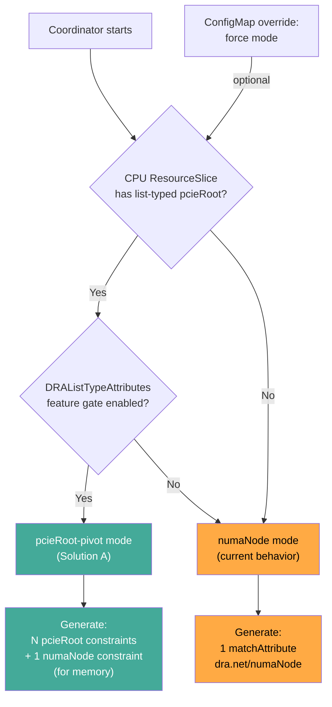

The coordinator can also be explicitly configured via a global ConfigMap:

```yaml
apiVersion: v1
kind: ConfigMap
metadata:
  name: coordinator-config
data:
  # auto | numaNode | pcieRoot-pivot | cel-selectors
  alignmentMode: auto
```

---

## Solution A: pcieRoot-as-list (Pivot Mode)

Solution A uses `resource.kubernetes.io/pcieRoot` (list-typed on CPUs, scalar on PCI devices) for alignment, with the CPU as a pivot device. Three components need changes:

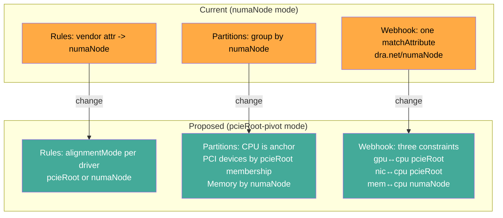

### 1. Topology Rules (ConfigMap Changes)

**Current format:** Each rule maps a vendor attribute to a topology concept.

```yaml
# Current rule -- maps vendor NUMA attr name to standard concept
apiVersion: v1
kind: ConfigMap
metadata:
  name: gpu-numa-rule
  labels:
    nodepartition.dra.k8s.io/topologyRule: "true"
data:
  driverName: gpu.amd.com
  attributeName: numaNode
  topologyConcept: numaNode
```

**Proposed format:** Add `alignmentMode` to specify which constraint mechanism to use per driver.

```yaml
# GPU rule -- PCI device, align via pcieRoot
apiVersion: v1
kind: ConfigMap
metadata:
  name: gpu-topology-rule
  labels:
    nodepartition.dra.k8s.io/topologyRule: "true"
data:
  driverName: gpu.amd.com
  alignmentMode: pcieRoot           # NEW -- use pcieRoot for this driver
  numaAttribute: numaNode           # fallback for numaNode-only mode
  # pcieRoot is always resource.kubernetes.io/pcieRoot (standard)
---
# NIC rule -- PCI device, align via pcieRoot
apiVersion: v1
kind: ConfigMap
metadata:
  name: nic-topology-rule
  labels:
    nodepartition.dra.k8s.io/topologyRule: "true"
data:
  driverName: sriovnetwork.k8snetworkplumbingwg.io
  alignmentMode: pcieRoot
  numaAttribute: numaNode
---
# CPU rule -- publishes pcieRoot as LIST (pivot device)
apiVersion: v1
kind: ConfigMap
metadata:
  name: cpu-topology-rule
  labels:
    nodepartition.dra.k8s.io/topologyRule: "true"
data:
  driverName: dra.cpu
  alignmentMode: pcieRoot-pivot      # NEW -- this driver is the pivot
  numaAttribute: numaNodeID
---
# Memory rule -- NOT a PCI device, align via numaNode only
apiVersion: v1
kind: ConfigMap
metadata:
  name: memory-topology-rule
  labels:
    nodepartition.dra.k8s.io/topologyRule: "true"
data:
  driverName: dra.memory
  alignmentMode: numaNode            # NEW -- memory can only use numaNode
  numaAttribute: numaNode
```

### 2. Partition Builder

**Current:** Groups all devices by numaNode value. Devices with `numaNode == 0` go into the same partition.

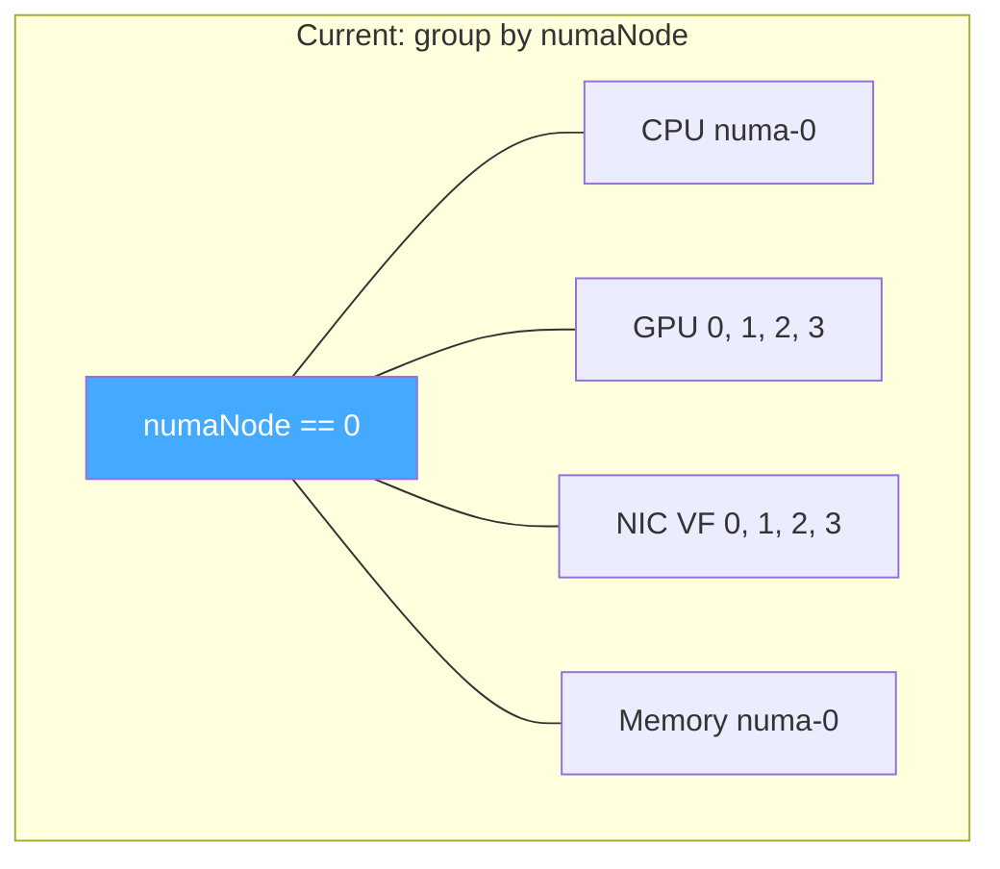

**Proposed:** The CPU group is the partition anchor. PCI devices are included if their scalar pcieRoot is in the CPU group's pcieRoot list. Non-PCI devices (memory) are included if their numaNode matches.

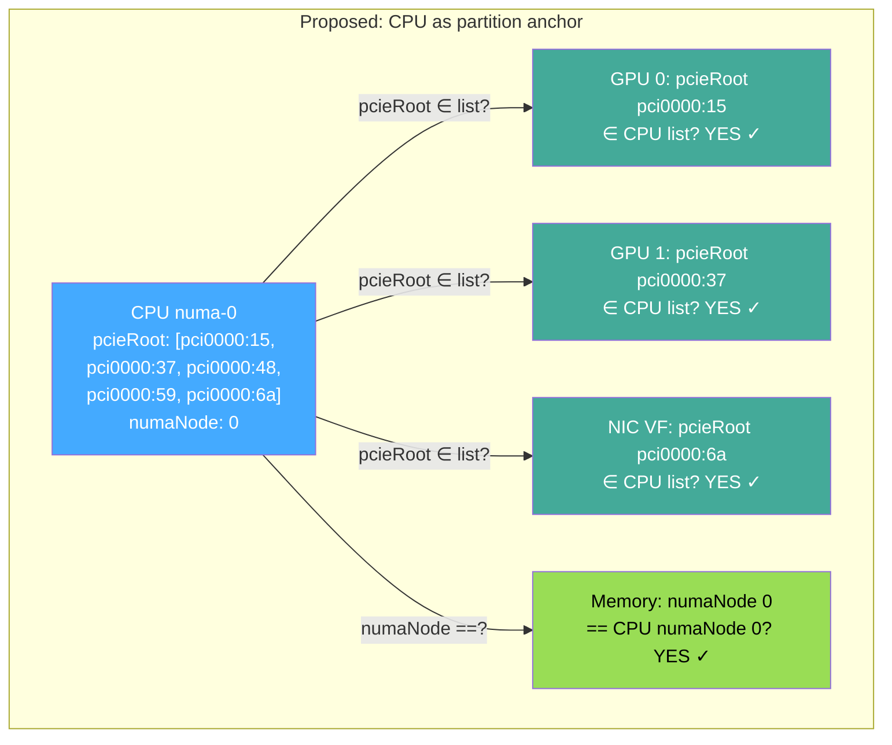

**Key change in `partition_builder.go`:**

```go
// Current: all devices grouped by numaNode
func buildPartitions(devices []TopologyDevice) map[int]Partition {
    partitions := map[int]Partition{}
    for _, dev := range devices {
        numa := dev.Attributes["numaNode"]
        partitions[numa].Devices = append(partitions[numa].Devices, dev)
    }
    return partitions
}

// Proposed: CPU is anchor, PCI devices by pcieRoot membership, memory by numaNode
func buildPartitions(devices []TopologyDevice, rules []TopologyRule) map[int]Partition {
    partitions := map[int]Partition{}
    
    // Step 1: Find CPU groups (pivot devices) -- they define partitions
    for _, dev := range devices {
        if rules[dev.Driver].AlignmentMode == "pcieRoot-pivot" {
            numa := dev.Attributes["numaNodeID"]
            partitions[numa].Anchor = dev
            partitions[numa].PCIeRoots = dev.ListAttributes["pcieRoot"] // list type
        }
    }
    
    // Step 2: Assign PCI devices by pcieRoot membership
    for _, dev := range devices {
        if rules[dev.Driver].AlignmentMode == "pcieRoot" {
            devRoot := dev.Attributes["pcieRoot"] // scalar
            for numa, part := range partitions {
                if part.PCIeRoots.Contains(devRoot) {
                    partitions[numa].Devices = append(partitions[numa].Devices, dev)
                    break
                }
            }
        }
    }
    
    // Step 3: Assign non-PCI devices by numaNode
    for _, dev := range devices {
        if rules[dev.Driver].AlignmentMode == "numaNode" {
            numa := dev.Attributes["numaNode"]
            partitions[numa].Devices = append(partitions[numa].Devices, dev)
        }
    }
    
    return partitions
}
```

### 3. Webhook Constraint Generation

The biggest visible change -- the webhook generates different constraints depending on the mode.

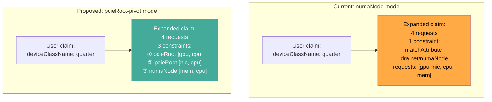

**Current webhook output** (`fix/numanode-attribute-namespace`):

```yaml
# Webhook expands "quarter" into:
apiVersion: resource.k8s.io/v1
kind: ResourceClaim
spec:
  devices:
    requests:
    - name: partition-gpu
      exactly:
        deviceClassName: gpu.amd.com
        count: 2
    - name: partition-nic
      exactly:
        deviceClassName: sriovnetwork.k8snetworkplumbingwg.io
        count: 2
    - name: partition-cpu
      exactly:
        deviceClassName: dra.cpu
        count: 1
        capacity:
          requests:
            dra.cpu/cpu: "32"
    - name: partition-mem
      exactly:
        deviceClassName: dra.memory
        count: 1
        capacity:
          requests:
            size: "128Gi"
    constraints:
    # One constraint -- all four drivers must share dra.net/numaNode
    - matchAttribute: dra.net/numaNode
      requests: [partition-gpu, partition-nic, partition-cpu, partition-mem]
```

**Proposed webhook output** (pcieRoot-pivot mode):

```yaml
# Webhook expands "quarter" into:
apiVersion: resource.k8s.io/v1
kind: ResourceClaim
spec:
  devices:
    requests:
    - name: partition-gpu
      exactly:
        deviceClassName: gpu.amd.com
        count: 2
    - name: partition-nic
      exactly:
        deviceClassName: sriovnetwork.k8snetworkplumbingwg.io
        count: 2
    - name: partition-cpu
      exactly:
        deviceClassName: dra.cpu
        count: 1
        capacity:
          requests:
            dra.cpu/cpu: "32"
    - name: partition-mem
      exactly:
        deviceClassName: dra.memory
        count: 1
        capacity:
          requests:
            size: "128Gi"
    constraints:
    # Constraint 1: GPU and CPU share a pcieRoot (set intersection)
    - matchAttribute: resource.kubernetes.io/pcieRoot
      requests: [partition-gpu, partition-cpu]
    # Constraint 2: NIC and CPU share a pcieRoot (set intersection)
    - matchAttribute: resource.kubernetes.io/pcieRoot
      requests: [partition-nic, partition-cpu]
    # Constraint 3: Memory on same NUMA as CPU (memory has no pcieRoot)
    - matchAttribute: dra.net/numaNode
      requests: [partition-mem, partition-cpu]
```

**Key change in `webhook.go`:**

```go
// Current: one constraint across all requests
func (w *Webhook) buildConstraints(config PartitionConfig) []resourceapi.DeviceConstraint {
    attr := resourceapi.FullyQualifiedName("dra.net/numaNode")
    return []resourceapi.DeviceConstraint{
        {MatchAttribute: &attr, Requests: allRequestNames(config)},
    }
}

// Proposed: per-alignment-mode constraints with CPU as pivot
func (w *Webhook) buildConstraints(config PartitionConfig) []resourceapi.DeviceConstraint {
    var constraints []resourceapi.DeviceConstraint
    pcieRootAttr := resourceapi.FullyQualifiedName("resource.kubernetes.io/pcieRoot")
    numaAttr := resourceapi.FullyQualifiedName("dra.net/numaNode")
    
    cpuRequest := config.PivotRequest() // the pcieRoot-pivot driver's request name
    
    // One pcieRoot constraint per PCI driver, paired with CPU
    for _, req := range config.PCIeRootRequests() {
        constraints = append(constraints, resourceapi.DeviceConstraint{
            MatchAttribute: &pcieRootAttr,
            Requests: []string{req, cpuRequest},
        })
    }
    
    // One numaNode constraint per non-PCI driver, paired with CPU
    for _, req := range config.NUMANodeRequests() {
        constraints = append(constraints, resourceapi.DeviceConstraint{
            MatchAttribute: &numaAttr,
            Requests: []string{req, cpuRequest},
        })
    }
    
    return constraints
}
```

### Implementation Plan

Starting from the `test/all-fixes-combined` branch:

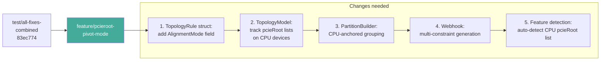

### Files to Modify

| File | Change |
|---|---|
| `internal/controller/topology_model.go` | Add `AlignmentMode` to `TopologyRule`; track list-typed pcieRoot on CPU devices; add `PCIeRoots` field to `TopologyDevice` |
| `internal/controller/partition_builder.go` | CPU-anchored partition building; pcieRoot set membership for PCI devices; numaNode fallback for non-PCI devices |
| `internal/controller/deviceclass_manager.go` | Store `AlignmentMode` per sub-resource in partition config |
| `internal/controller/webhook.go` | Multi-constraint generation: pcieRoot per PCI driver + numaNode for memory; mode selection logic |
| `internal/controller/topology_model_test.go` | Tests for list-typed pcieRoot parsing and partition grouping |
| `internal/controller/webhook_test.go` | Tests for multi-constraint expansion |

### Prerequisites

- Kubernetes 1.36+ with `DRAListTypeAttributes` feature gate enabled
- CPU DRA driver publishing `resource.kubernetes.io/pcieRoot` as list (from [dra-driver-cpu#68](https://github.com/kubernetes-sigs/dra-driver-cpu/pull/68) or [kubernetes/kubernetes#138297](https://github.com/kubernetes/kubernetes/pull/138297))
- GPU and NIC drivers publishing `resource.kubernetes.io/pcieRoot` as scalar (already done)

---

## Issues

| Issue | Impact | Status |
|-------|--------|--------|
| Webhook down during coordinator restart | Claims created without expansion, pods stuck | Retry after controller pod is running |
| No anti-affinity across NUMA | All pods may land on same NUMA without CEL selector | Add `numaNode==0/1` selectors to spread |
| No hugepages in partitions | Coordinator doesn't distinguish regular memory from hugepages | Need DeviceClass-aware sub-resources |
| GPU DRA driver instability | Driver restarts during heavy allocation | Remove liveness probe |
| `dra.net/numaNode` required on all drivers | GPU driver needed patching to add this attribute | Patch #9 on AMD GPU driver |
| Partition naming unintuitive | "eighth" = 1/8 of machine, "quarter" = also 1/8 on this hardware | Document or make configurable |
| Eighth and quarter identical on this hardware | 4 PCIe roots per NUMA = same subdivision for both | Different on systems with PCIe switches |

---

## YAML Examples

### Eighth-Machine Claims (8 pods, full machine)

```yaml
# eighth-machine-coordinator.yaml
# Find current DeviceClass name:
#   kubectl get deviceclass -l nodepartition.dra.k8s.io/partitionType=eighth

# NUMA 0 pods (e0-e3)
apiVersion: resource.k8s.io/v1
kind: ResourceClaim
metadata: {name: e0, namespace: test}
spec:
  devices:
    requests:
    - name: e
      exactly:
        deviceClassName: <EIGHTH_CLASS>
        count: 1
        selectors:
        - cel:
            expression: 'device.attributes["dra.net"].numaNode == 0'
---
# Repeat for e1, e2, e3 (same, numaNode == 0)
# Repeat for e4, e5, e6, e7 (same, numaNode == 1)
---
apiVersion: v1
kind: Pod
metadata: {name: e0, namespace: test}
spec:
  containers:
  - name: w
    image: registry.access.redhat.com/ubi9/ubi-minimal:latest
    command: ["/bin/sleep", "infinity"]
  resourceClaims:
  - name: d
    resourceClaimName: e0
# Repeat for e1-e7
```

See `testing/manifests/claims/quarter-machine-coordinator.yaml` for the full 4-pod quarter-machine version.

### Topology Rules

See `testing/manifests/coordinator/topology-rules.yaml`.

---

## References

### Fork branches
- [`johnahull/k8s-dra-topology-coordinator`](https://github.com/johnahull/k8s-dra-topology-coordinator) -- all branches
- [`fix/pcieroot-constraint-non-pci-drivers`](https://github.com/johnahull/k8s-dra-topology-coordinator/tree/fix/pcieroot-constraint-non-pci-drivers) -- `657d247`
- [`fix/numanode-attribute-namespace`](https://github.com/johnahull/k8s-dra-topology-coordinator/tree/fix/numanode-attribute-namespace) -- `655ec5b`
- [`fix/per-driver-cel-selectors`](https://github.com/johnahull/k8s-dra-topology-coordinator/tree/fix/per-driver-cel-selectors) -- `d90e6ae`
- [`fix/webhook-forward-cel-selectors`](https://github.com/johnahull/k8s-dra-topology-coordinator/tree/fix/webhook-forward-cel-selectors) -- `b6de0ce`
- [`test/all-fixes-combined`](https://github.com/johnahull/k8s-dra-topology-coordinator/tree/test/all-fixes-combined) -- `83ec774`

### Upstream coordinator
- [fabiendupont/k8s-dra-topology-coordinator](https://github.com/fabiendupont/k8s-dra-topology-coordinator) -- original POC

### pcieRoot-as-list implementation
- [WIP: `GetPCIeRootAttributeMapFromCPUId` (kubernetes/kubernetes#138297)](https://github.com/kubernetes/kubernetes/pull/138297) -- everpeace's upstream helper
- [WIP: Group CPUs by PCIe root (dra-driver-cpu#68)](https://github.com/kubernetes-sigs/dra-driver-cpu/pull/68) -- fromani's CPU driver implementation
- [NIC/CPU alignment by pcieRoot list (dra-driver-cpu#114)](https://github.com/kubernetes-sigs/dra-driver-cpu/issues/114) -- everpeace's issue with example YAML

### KEPs
- [KEP-5491: DRA List Types for Attributes](https://github.com/kubernetes/enhancements/issues/5491) -- alpha in v1.36, feature gate `DRAListTypeAttributes`
- [KEP-4381 PR #5316: Standard attributes](https://github.com/kubernetes/enhancements/pull/5316) -- where numaNode was proposed and removed
- [KEP-5942: Shared Consumable Capacity](https://github.com/kubernetes/enhancements/pull/5942) -- may be needed for correct capacity representation

### Testing issues
- [all-issues.md](../testing/all-issues.md) -- coordinator issues #1-6 and unfixed issues #1-2
