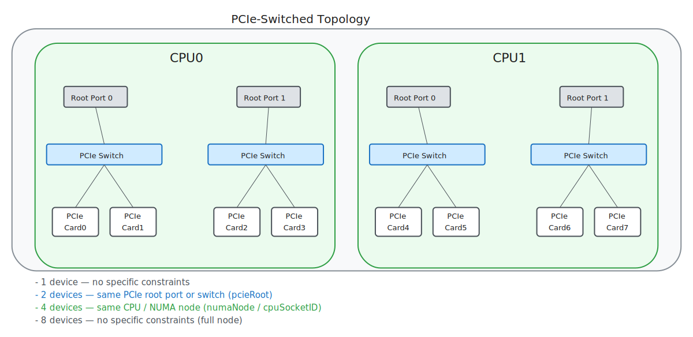
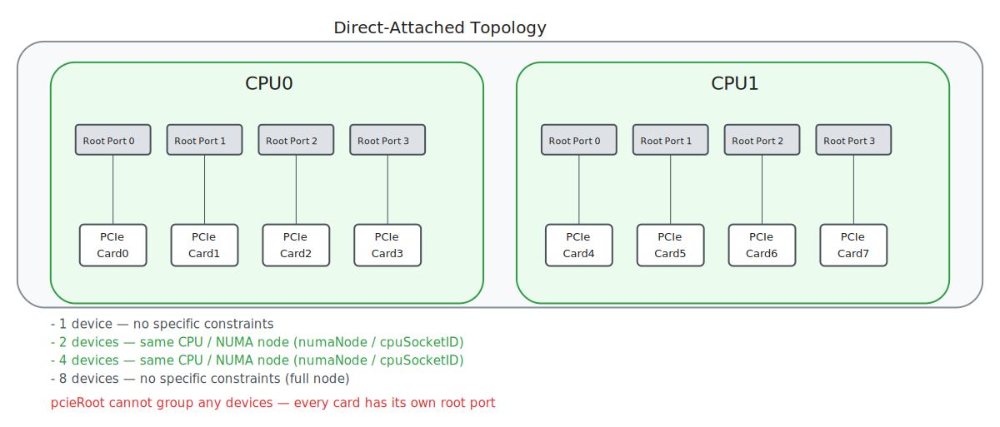
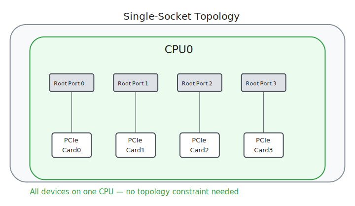

# Proposal: User-Facing Topology Constraints for DRA

> **TL;DR:** Users moving from device plugins to DRA lose the topology manager's automatic NUMA coordination. `numaNode` isn't just restoring what device plugins had — it's the topology anchor that KEPs 5491 (list types), 5075 (consumable capacity), and 5941 (shared capacity) need to work across driver boundaries. These KEPs give the scheduler capacity awareness; `numaNode` gives it topology awareness. Standardize `resource.kubernetes.io/numaNode` to enable cross-driver topology alignment on the hardware configurations where `pcieRoot` can't reach.

---

## Three Users, Three Intents

### ML Engineer: "Put my GPU and NIC close together"

An ML engineer deploys a vLLM inference pod with 1 GPU, 1 NIC, and CPU cores. They need RDMA between the GPU and NIC to stay within one memory controller — crossing the inter-socket link costs 58% throughput ([Ojea 2025](https://arxiv.org/abs/2506.23628)).

**What they want to write:**

```yaml
constraints:
- matchAttribute: resource.kubernetes.io/numaNode
  requests: [gpu, nic, cpu]
```

**What they can write today:** nothing that works portably. `matchAttribute: pcieRoot` fails on most rack servers because GPU and NIC are on separate root ports (see [hardware diagrams](#where-pcieroot-breaks) below). CPU isn't a PCI device and has no `pcieRoot` at all. The user is left with no cross-driver proximity constraint.

### Platform Admin: "Give tenants isolated NUMA-local slices"

A platform admin partitions a multi-GPU node for 4 independent inference pods. Each pod gets 1 GPU + 1 SR-IOV NIC VF + CPUs, all on the same NUMA node, with no cross-tenant device sharing.

**What they want to write:** a DeviceClass with `matchAttribute: numaNode` that works on any server — Dell, HPE, Supermicro — without knowing the PCIe topology of each model.

**What they can do today:** write per-node CEL selectors that hardcode NUMA node IDs and PCI bus addresses. This is fragile, non-portable, and requires the admin to know every server's sysfs topology. A standard attribute would make this a one-line constraint.

### VM Operator: "Guest sees correct topology"

A KubeVirt operator passes GPUs through to a VM via VFIO. The VM's AI framework (NCCL, vLLM) reads `numa_node` inside the guest to make topology-aware decisions. KubeVirt's virt-launcher builds guest NUMA topology from KEP-5304 device metadata ([VEP 115](https://github.com/kubevirt/community/pull/338)).

**What they want:** `resource.kubernetes.io/numaNode` in device metadata — one attribute name, one lookup, every driver.

**What they deal with today:** 5 drivers, 5 different attribute names for the same sysfs value:

| Driver | Attribute name | Source |
|--------|---------------|--------|
| NVIDIA GPU | `gpu.nvidia.com/numa` | `/sys/bus/pci/devices/<BDF>/numa_node` |
| AMD GPU | `gpu.amd.com/numaNode` | `/sys/bus/pci/devices/<BDF>/numa_node` |
| CPU | `dra.cpu/numaNodeID` | `/sys/devices/system/node/` |
| Memory | `dra.memory/numaNode` | NUMA zone |
| dranet | `dra.net/numaNode` | `/sys/class/net/<iface>/device/numa_node` |

The virt-launcher must try each name in sequence or fall back to mounting host sysfs — a security concern in multi-tenant environments.

---

## Where `pcieRoot` Breaks

`pcieRoot` is the only standardized topology attribute today. It identifies which PCIe switch or root port a device sits behind. This works when devices share a switch, but server hardware varies widely.

### PCIe-switched topology

Servers like the Dell XE8640 use PCIe switches that group 2+ devices. `pcieRoot` groups Card0+Card1 (same switch). But a GPU on Card0 and a NIC on Card2 are on the same CPU but different switches — `pcieRoot` can't express this.



### Direct-attached topology

Servers like the Dell R760xa connect each device to its own root port — no switches. **`pcieRoot` fails for ANY multi-device pairing.** Every device has its own root port. A GPU+NIC pair on the same CPU, one PCIe hop apart, can't be co-located with `pcieRoot`.



### Single-socket topology

Single-CPU servers — all devices are local. No topology constraint needed.



### Summary

| Topology | pcieRoot | numaNode | cpuSocketID |
|----------|----------|----------|-------------|
| Switched (devices share switches) | Groups devices on same switch | Groups all devices on same CPU | Groups all devices on same CPU |
| Direct-attached (1 device per root port) | **Fails — no shared roots** | Groups all devices on same CPU | Groups all devices on same CPU |
| Single-socket | Not needed | Not needed | Not needed |

On switched hardware, `pcieRoot` groups 2 of N devices per CPU. On direct-attached hardware, it groups 0. `numaNode` and `cpuSocketID` group all devices on the same CPU in both cases.

**Note on KEP-5491 (list types):** KEP-5491 (alpha in K8s 1.36) partially addresses the CPU alignment gap — CPUs can publish a list of local PCIe roots, enabling CPU-as-pivot matching via set intersection. However, this cannot bridge GPU-NIC pairs on different PCIe roots within the same NUMA (their pcieRoot sets have zero intersection), and memory devices have no pcieRoot to publish. See [Topology Attribute Debate](../topology-attribute-debate.md) for the full XE8640 worked example.

---

## The Regression: What Device Plugins Had

With device plugins, the kubelet's topology manager coordinated CPU, memory, and device NUMA placement — when configured with a topology-aware policy (`single-numa-node`, `restricted`, or `best-effort`) and for Guaranteed QoS pods. A pod requesting a GPU and CPU cores got them on the same NUMA node without any topology constraint in the pod spec — the topology manager handled it through topology hints from each resource manager.

DRA moved device allocation from the kubelet to the scheduler. The topology manager has no awareness of DRA devices. **There is no mechanism to co-place devices from different DRA drivers on the same NUMA node** unless all drivers publish the same attribute name.

Every driver already reads NUMA from sysfs and publishes it. The data exists. The problem is purely naming — 5 drivers chose 5 different names for the same value. Standardizing `resource.kubernetes.io/numaNode` isn't adding new functionality. It's asking drivers to agree on a spelling so that `matchAttribute` can work cross-driver, restoring the coordination that the topology manager provided.

---

## What to Standardize

### `resource.kubernetes.io/numaNode` (int)

**Source:** `/sys/bus/pci/devices/<BDF>/numa_node` for PCI devices; `/sys/devices/system/node/node<N>/cpulist` for CPU devices.

**Meaning:** Which memory controller services this device. Devices sharing a `numaNode` share a memory controller — local DMA, no inter-controller hop.

**When to use:** Most workloads. Training, inference, multi-tenant partitioning. The memory controller boundary is where the 58% throughput cliff occurs ([Ojea 2025](https://arxiv.org/abs/2506.23628)).

### `resource.kubernetes.io/cpuSocketID` (int)

**Source:** `numa_node` → `cpulist` → `/sys/devices/system/cpu/cpu<N>/topology/physical_package_id`

**Meaning:** Which physical CPU package (socket). All NUMA nodes on the same socket share the socket's interconnect.

**When to use:** SNC/NPS hardware where sub-NUMA clustering splits a socket into multiple NUMA nodes. `cpuSocketID` groups all sub-NUMA nodes on the same physical socket.

### Implementation

Both helpers belong in the shared `k8s.io/dynamic-resource-allocation/deviceattribute` package alongside the existing `GetPCIBusIDAttribute()` and `GetPCIeRootAttributeByPCIBusID()`:

```go
func GetNUMANodeByPCIBusID(pciBusID string) (int, error)
func GetCPUSocketIDByNUMANode(numaNode int) (int, error)
```

Every DRA driver that calls `GetPCIeRootAttributeByPCIBusID()` today would add one or two more calls. The sysfs reads are cheap (single file reads).

---

## Composing Independent Constraints

`pcieRoot` and `numaNode` measure different physical properties (bus topology and memory topology). They are genuinely orthogonal — a GPU and NIC can be connected to different PCIe switches but the same memory controller. Users compose independent constraints from both based on what their workload requires:

**Standard hardware (SNC/NPS off — majority of GPU deployments):**

```yaml
constraints:
- matchAttribute: resource.kubernetes.io/numaNode
  requests: [gpu, nic, cpu]
```

One constraint. All devices on the same memory controller. This is what most users need.

**SNC/NPS hardware (sub-NUMA clustering enabled):**

```yaml
constraints:
- matchAttribute: resource.kubernetes.io/numaNode
  requests: [gpu, nic, cpu]
  enforcement: preferred        # try same memory controller
- matchAttribute: resource.kubernetes.io/cpuSocketID
  requests: [gpu, nic, cpu]
  enforcement: required         # must be same physical socket
```

On SNC-2 hardware, some sub-NUMA nodes have GPUs but no NICs. `numaNode` as preferred means the scheduler tries memory controller alignment but doesn't fail if unsatisfiable. `cpuSocketID` as required ensures everything stays on the same physical package. These are independent constraints about different physical properties — `cpuSocketID` isn't a fallback from `numaNode`, it's a separate assertion about package topology.

**Combining bus and memory topology constraints:**

```yaml
constraints:
- matchAttribute: resource.kubernetes.io/pcieRoot
  requests: [gpu, nic]
  enforcement: preferred        # bus topology: same PCIe switch
- matchAttribute: resource.kubernetes.io/numaNode
  requests: [gpu, nic, cpu]
  enforcement: preferred        # memory topology: same memory controller
- matchAttribute: resource.kubernetes.io/cpuSocketID
  requests: [gpu, nic, cpu]
  enforcement: required         # package topology: same physical CPU
```

Each constraint is an independent check on a different physical property. The scheduler evaluates all of them. On switched hardware (XE8640), the pcieRoot constraint finds GPU+NIC pairs sharing a switch. On direct-attached hardware (R760xa), no GPU+NIC pair shares a pcieRoot, so that preferred constraint has no effect. The numaNode and cpuSocketID constraints operate independently regardless.

### Comparison with pcieRoot-as-list

The alternative approach ([KEP-5491](https://github.com/kubernetes/enhancements/issues/5491), WIP [k/k#138297](https://github.com/kubernetes/kubernetes/pull/138297)) has CPUs publish a list of local PCIe roots, then uses set intersection to match:

```yaml
# pcieRoot-as-list: 2+ constraints, CPU as pivot, alpha feature gate
constraints:
- matchAttribute: resource.kubernetes.io/pcieRoot
  requests: [gpu, cpu]    # GPU shares a root with CPU
- matchAttribute: resource.kubernetes.io/pcieRoot
  requests: [nic, cpu]    # NIC shares a root with CPU
```

This works for GPU+NIC+CPU but requires the `DRAListTypeAttributes` feature gate (alpha in v1.36), transitive reasoning through a CPU pivot device, and multiple constraints where one would suffice. See [topology-attribute-debate.md](../topology-attribute-debate.md) for detailed comparison.

Both approaches are complementary, not competing. `pcieRoot` identifies bus-level coupling (same switch). `numaNode` provides memory-topology alignment that `pcieRoot` structurally cannot cover — they measure different physical properties. `cpuSocketID` is a separate follow-up for SNC edge cases (see note at end).

---

## Addressing the SNC/NPS Objection

> "NUMA in sysfs does not represent real hardware topology in case of SNC (Intel) or NPS (AMD) active. NUMA represents only memory zone/mode of operation of Memory controller, and it has nothing to do with PCIe bandwidth or CPU core to device alignment." — [kad, PR #5316](https://github.com/kubernetes/enhancements/pull/5316#discussion_r2095270564)

### The memory controller boundary IS the performance boundary

The 58% throughput loss measured by [Ojea 2025](https://arxiv.org/abs/2506.23628) is between NUMA-aligned and cross-NUMA placement — not between same-switch and same-NUMA. When a GPU does RDMA to a NIC on a different memory controller, the DMA crosses the inter-socket link. That's the performance cliff. `numaNode` identifies exactly this boundary.

### SNC makes numaNode finer-grained, not incorrect

The sysfs value is always correct — it reports which memory controller actually services the device. SNC-2 splits a socket into 2 sub-NUMA nodes, changing the NUMA ID assignment. This doesn't make `numaNode` wrong — it makes it more specific than the user may need. A device on sub-NUMA 0 correctly reports `numaNode=0`.

### Independent constraints resolve this

Unlike `pcieRoot` and `numaNode`, which are genuinely orthogonal, `cpuSocketID` is correlated with `numaNode` — it's a coarser grouping of the same underlying physical proximity. On non-SNC hardware, they're equivalent. On SNC hardware, `cpuSocketID` groups multiple NUMA nodes. You'd use `cpuSocketID` because `numaNode` is too restrictive — making it a coarser variant, not an independent signal.

On SNC hardware, a user can combine them:

- `numaNode` as preferred: the scheduler tries memory controller alignment but doesn't fail if a sub-NUMA node lacks certain device types.
- `cpuSocketID` as required: everything must be on the same physical package — a coarser grouping for when `numaNode` is too restrictive.

The user chooses which physical properties matter. The driver reports facts from sysfs. Policy is the user's decision, not the attribute's.

### pcieRoot has the same problem

`pcieRoot` is already standardized despite being too restrictive on most hardware:
- On the Dell R760xa: **0%** of GPU+NIC pairs share a root — `pcieRoot` is unsatisfiable
- On the Dell XE9680: **25%** of GPU+NIC pairs share a root — `pcieRoot` excludes 75% of usable GPUs

Nobody objected to standardizing `pcieRoot` because it's understood as a specific-coupling attribute, not a universal one. The same tolerance applies to `numaNode` — it's the right level for most workloads, and `cpuSocketID` covers the edge cases.

---

## Relationship to DRA KEP Ecosystem

The DRA KEP ecosystem is building toward native scheduler support for the topology patterns this proposal describes. `numaNode` is the enabling infrastructure these KEPs need to work across driver boundaries.

**`numaNode` as the topology anchor for capacity KEPs:**
- **KEP-5491 (List Types, alpha in 1.36):** Enables CPU-as-pivot pcieRoot matching via set intersection. But GPU and NIC on different PCIe roots within the same NUMA have zero pcieRoot intersection — KEP-5491 can't bridge bus topology to memory topology. `numaNode` is the orthogonal signal that pcieRoot, even with list types, structurally cannot express.
- **KEP-5075 (Consumable Capacity, beta in 1.36):** Tracks how much capacity remains on shared devices (NIC bandwidth, CPU cores). Without `numaNode`, the scheduler can't scope consumption to a topology domain — it might allocate bandwidth from a NIC on the wrong NUMA. `numaNode` tells the scheduler not just how much is available, but where to consume from.
- **KEP-5941 (Shared Consumable Capacity, proposed for 1.37):** Lets parent devices declare capacity consumed by children across device boundaries. For cross-driver shared capacity (NUMA node's memory bandwidth consumed by GPUs and NICs), the parent-child grouping needs a common topology anchor. `numaNode` is that anchor.

These KEPs give the scheduler **capacity awareness**. `numaNode` gives it **topology awareness**. Without both, the scheduler can track what's available but not where it should be consumed.

**Simplifying the topology coordinator:**
- **KEP-4815 (Partitionable Devices, alpha):** Enables dynamic GPU partitioning (MIG profiles, AMD CPX mode) with shared counter sets. Within-driver partitioning becomes scheduler-native, though cross-driver bundling remains the coordinator's role.

**Enabling cross-pod topology:**
- **KEP-5729 (ResourceClaim for Workloads, alpha in 1.37):** Per-PodGroup ResourceClaimTemplates enable cross-pod topology constraints for distributed training scenarios.

**Reducing the driver footprint:**
- **KEP-5517 (Native Resource Requests):** If CPU and memory become native DRA resources, the separate dra-driver-cpu and dra-driver-memory forks become unnecessary.
- **KEP-5004 (Extended Resources via DRA, P0):** Users write `nvidia.com/gpu: 1` without knowing whether device-plugin or DRA is behind it, easing adoption.

**Critical gap:** No single KEP addresses cross-driver resource bundling with topology constraints — "take 1 GPU + 2 NICs + 16 CPUs + 8 GiB memory from the same NUMA node." Standardized `resource.kubernetes.io/numaNode` with `matchAttribute` handles the co-placement, but over-subscription prevention across drivers still requires the topology coordinator or a future KEP.

For the full KEP landscape analysis, see [DRA KEP Ecosystem Overview](kep-ecosystem-overview.md).

---

## Evidence

Tested end-to-end on three server platforms with 5 independent DRA drivers (GPU, NIC, NVMe, CPU, memory) using `resource.kubernetes.io/numaNode`:

| System | GPUs | Topology | pcieRoot GPU+NIC | numaNode GPU+NIC |
|--------|------|----------|------------------|------------------|
| Dell XE8640 (H100 SXM5) | 4 | PCIe switches + NVLink | 1 of 4 (25%) | 4 of 4 (100%) |
| Dell R760xa (A40) | 2 | Direct-attached | 0 of 2 (0%) | 2 of 2 (100%) |
| Dell XE9680 (MI300X) | 8 | PCIe switches + xGMI | 2 of 8 (25%) | 8 of 8 (100%) |

Full test results: [testing/results/results-summary.md](../../testing/results/results-summary.md)
Detailed use cases: [topology-use-cases.md](../topology-use-cases.md)

---

## Community Support

Several participants in the [PR #5316 discussion](https://github.com/kubernetes/enhancements/pull/5316) expressed support for attributes beyond `pcieRoot`:

- **johnbelamaric** (reviewer): *"If we don't standardize a CPU socket attribute, we may need to have a way for the DRANET and CPU drivers to be configured to publish one under a private name (e.g., gke.google.com)"*
- **gauravkghildiyal** (PR author): *"I still believe we need cpuSocketNumber as one of the initial standard attributes"*
- **bg-chun**: Demonstrated with [dual-root and direct-attached diagrams](https://github.com/kubernetes/enhancements/pull/5316#discussion_r2095270564) that `pcieRoot` can't group devices on the same socket
- **ffromani** (CPU driver maintainer): *"numaNode as aligning attribute has surely its share of issues, but using cpuSocket also has its share of issues, so we are swapping a problem set with another problem set"* — this is why `cpuSocketID` is not part of the core proposal; `numaNode` and `pcieRoot` are genuinely orthogonal, while `cpuSocketID` is correlated with `numaNode`

The PR merged with only `pcieRoot` to unblock DRA GA — not as a technical rejection of other attributes. The conversation was explicitly deferred.

---

## What's Needed

1. **Standardize `resource.kubernetes.io/numaNode` (int)** — add to the `deviceattribute` library with a `GetNUMANodeByPCIBusID()` helper
2. **Add `enforcement: preferred` to `matchAttribute`** — allows the scheduler to try a constraint and relax if unsatisfiable (separable from item 1; `numaNode` is valuable even without `preferred`)
3. **Drivers publish the attribute** — one function call alongside existing `pcieRoot`

Item 1 is the critical change. Item 2 is an independent optimization that makes `pcieRoot` composable with `numaNode` via `enforcement: preferred`. Item 3 is mechanical — every driver already reads the same sysfs values.

---

## References

- [KEP-4381 PR #5316](https://github.com/kubernetes/enhancements/pull/5316) — where `numaNode` was proposed, discussed, and deferred
- [Ojea 2025](https://arxiv.org/abs/2506.23628) — 58% throughput improvement with NUMA-aligned GPU+NIC placement
- [KEP-5491: DRA List Types](https://github.com/kubernetes/enhancements/issues/5491) — pcieRoot-as-list approach (complementary)
- [WIP: pcieRoot helper for CPUs](https://github.com/kubernetes/kubernetes/pull/138297) — pcieRoot-as-list implementation
- [Topology Attribute Debate](../topology-attribute-debate.md) — full pcieRoot vs numaNode analysis
- [Topology Use Cases](../topology-use-cases.md) — AI workload scenarios mapped to topology levels
- [Standardize numaNode (technical reference)](upstream-proposal-standardize-numanode.md) — detailed technical proposal

---

**Note on `cpuSocketID`:**
`cpuSocketID` could serve as an independent package-topology constraint on SNC/NPS hardware where sub-NUMA clustering creates NUMA nodes without NICs. However:

- GPU servers typically run SNC/NPS off — the recommended approach is to disable SNC for GPU workloads.
- Leading with both `numaNode` and `cpuSocketID` increases scope and re-engages the debate that caused `numaNode` to be removed from KEP-4381 in the first place.
- The [PR #5316 discussion](https://github.com/kubernetes/enhancements/pull/5316) showed that `cpuSocketID` faces similar objections to `numaNode` — ffromani noted it is "swapping a problem set with another problem set."

`cpuSocketID` is not part of the initial proposal. It should be proposed separately if a strong use case emerges where SNC is required and cannot be disabled. Drivers can publish it independently as a vendor-specific attribute for specific deployments. The recommended strategy is to establish `numaNode` first, then build on that foundation.
