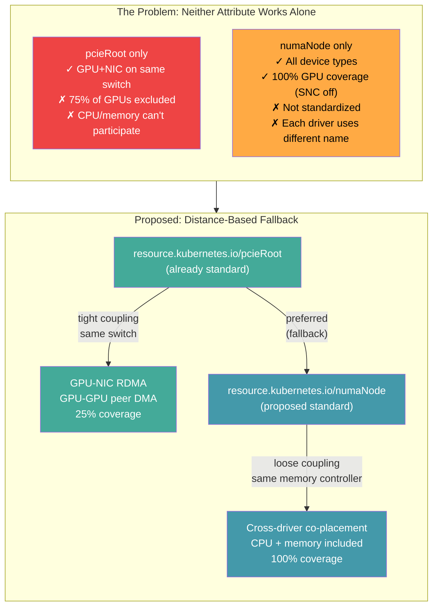
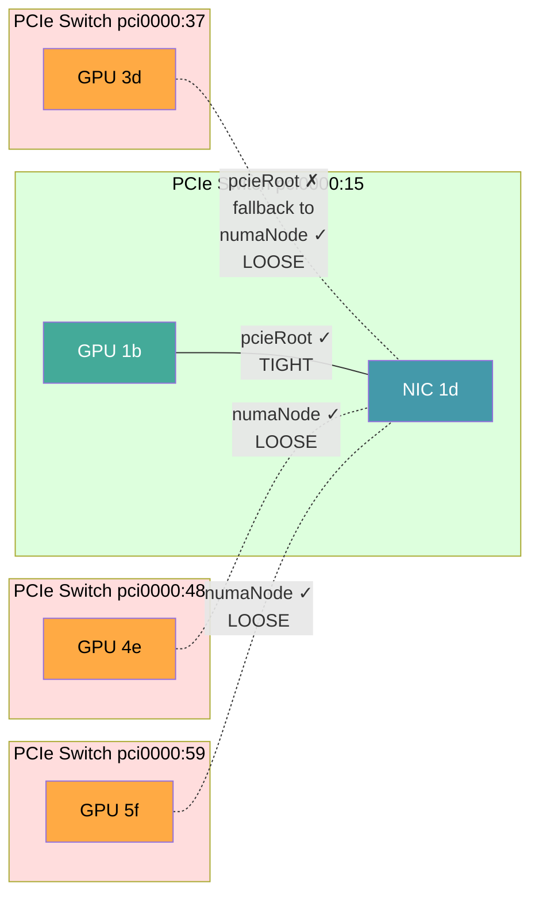
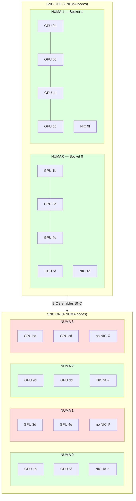
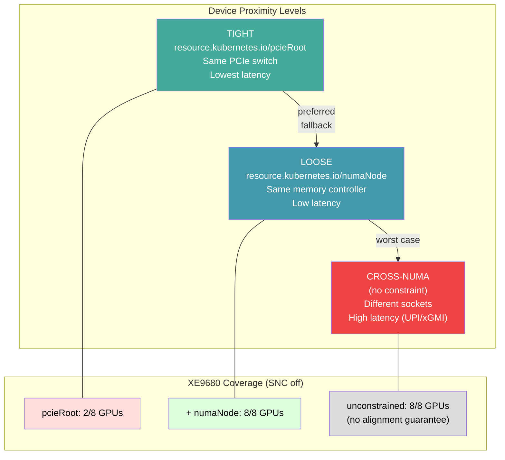

# Proposal: Standardize `resource.kubernetes.io/numaNode` as pcieRoot Fallback

## Summary

Standardize `resource.kubernetes.io/numaNode` as a companion to the existing `resource.kubernetes.io/pcieRoot`. Together they form a distance-based alignment system: `pcieRoot` for tight coupling (same PCIe switch), `numaNode` for loose coupling (same memory controller). Neither attribute alone covers all hardware configurations. Both are needed for reliable cross-driver device co-placement.

## Overview Diagram



## The Problem

### pcieRoot alone excludes most devices on real hardware

On a Dell XE9680 (8x MI300X GPU, 4x ConnectX-6 NIC ports, 2-socket):

- Each GPU has its own PCIe switch (PEX890xx)
- Only 1 of 4 GPUs per socket shares a switch with the NIC
- `matchAttribute: resource.kubernetes.io/pcieRoot` for GPU+NIC is satisfiable for **2 of 8 GPUs** (25%)
- The other 6 GPUs are excluded despite being on the same NUMA node with minimal latency penalty

```
Socket 0 (NUMA 0):
  Switch pci0000:15 → GPU 1b + NIC 1d     ← pcieRoot matches (1 GPU)
  Switch pci0000:37 → GPU 3d              ← no NIC, pcieRoot fails
  Switch pci0000:48 → GPU 4e              ← no NIC, pcieRoot fails
  Switch pci0000:59 → GPU 5f              ← no NIC, pcieRoot fails
```

With `numaNode`, all 4 GPUs on NUMA 0 match the NIC on NUMA 0. 100% coverage.

### numaNode alone is questioned for SNC/NPS

The community removed `numaNode` from KEP-4381 because SNC/NPS changes what NUMA node IDs mean. With Intel SNC enabled on the XE9680:

- 2 NUMA nodes become 4
- NUMA 0 (4 GPUs + 2 NICs) splits into NUMA 0 (2 GPUs + 2 NICs) and NUMA 1 (2 GPUs, no NIC)
- `numaNode` matching on NUMA 1 finds no NIC — the constraint is unsatisfiable for those GPUs

But this is the **same problem** as pcieRoot: hardware topology limits which devices can be co-located. SNC doesn't make `numaNode` wrong — it makes it finer-grained. The sysfs value is always correct for the current BIOS configuration.

### Side-by-side: pcieRoot vs numaNode on real hardware

**By pcieRoot** — which GPUs can match a NIC? (same answer SNC on or off):

| pcieRoot | GPU | NIC | Match? |
|----------|-----|-----|--------|
| `pci0000:15` | 1b | 1d:00.0, 1d:00.1 | **YES** |
| `pci0000:37` | 3d | — | no |
| `pci0000:48` | 4e | — | no |
| `pci0000:59` | 5f | — | no |
| `pci0000:97` | 9d | 9f:00.0, 9f:00.1 | **YES** |
| `pci0000:b7` | bd | — | no |
| `pci0000:c7` | cd | — | no |
| `pci0000:d7` | dd | — | no |

**Result: 2 of 8 GPUs (25%)**

**By numaNode (SNC off)** — which GPUs can match a NIC?

| numaNode | GPUs | NICs | Match? |
|----------|------|------|--------|
| 0 | 1b, 3d, 4e, 5f | 1d:00.0, 1d:00.1 | **YES — 4 GPUs** |
| 1 | 9d, bd, cd, dd | 9f:00.0, 9f:00.1 | **YES — 4 GPUs** |

**Result: 8 of 8 GPUs (100%)**

**By numaNode (SNC on)** — which GPUs can match a NIC?

| numaNode | GPUs | NICs | Match? |
|----------|------|------|--------|
| 0 | 1b, 5f | 1d:00.0, 1d:00.1 | **YES — 2 GPUs** |
| 1 | 3d, 4e | — | no (no NIC on this sub-NUMA) |
| 2 | 9d, dd | 9f:00.0, 9f:00.1 | **YES — 2 GPUs** |
| 3 | bd, cd | — | no (no NIC on this sub-NUMA) |

**Result: 4 of 8 GPUs (50%)** — the 4 excluded GPUs are on sub-NUMAs that physically have no NIC. No attribute can fix missing hardware.

### Neither attribute works alone on all hardware

| Attribute | Coverage on XE9680 (SNC off) | Coverage on XE9680 (SNC on) | Works for CPU/memory |
|-----------|------------------------------|-----------------------------|--------------------|
| `pcieRoot` only | 2 of 8 GPUs (25%) | 2 of 8 GPUs (25%) | No (not PCI devices) |
| `numaNode` only | 8 of 8 GPUs (100%) | 6 of 8 GPUs (75%)* | Yes |
| Both (fallback) | 8 of 8 GPUs (100%) | 8 of 8 GPUs (100%) | Yes |

*NUMA 1 and 3 have GPUs but no NICs with SNC on — the constraint is unsatisfiable on those sub-NUMAs regardless of attribute choice.

## Proposal

### Add `resource.kubernetes.io/numaNode` as a standard attribute

All DRA drivers that publish devices with NUMA affinity should publish:

```
resource.kubernetes.io/numaNode: <int>   # from /sys/bus/pci/devices/{addr}/numa_node
```

This is a one-line addition per driver. The value comes from the kernel's sysfs, which is always correct for the current SNC/NPS configuration.

Drivers that already publish NUMA under vendor-specific names:
- GPU: `gpu.amd.com/numaNode` → also publish `resource.kubernetes.io/numaNode`
- NIC: `dra.net/numaNode` → also publish `resource.kubernetes.io/numaNode`
- CPU: `dra.cpu/numaNodeID` → also publish `resource.kubernetes.io/numaNode`
- Memory: `dra.memory/numaNode` → also publish `resource.kubernetes.io/numaNode`

### Define the relationship with pcieRoot

`pcieRoot` and `numaNode` represent different levels of hardware proximity:

| Level | Attribute | Meaning | When to Use |
|-------|-----------|---------|-------------|
| Tight | `pcieRoot` | Same PCIe switch, minimum hop count | GPU-GPU peer DMA, GPU-NIC RDMA on same switch |
| Loose | `numaNode` | Same memory controller, same CPU socket sub-domain | Cross-driver co-placement, all device types including CPU/memory |

Users choose the level based on their performance requirements:

```yaml
# Tight coupling: GPU and NIC on the same PCIe switch
constraints:
- matchAttribute: resource.kubernetes.io/pcieRoot
  requests: [gpu, nic]

# Loose coupling: GPU, NIC, CPU, memory on the same NUMA node
constraints:
- matchAttribute: resource.kubernetes.io/numaNode
  requests: [gpu, nic, cpu, memory]
```

### Scope: what this proposal asks for vs. future work

**This proposal asks for one thing:** Add `resource.kubernetes.io/numaNode` as a standard attribute in the upstream `deviceattribute` library, alongside the existing `pcieRoot` and `pciBusID`. This is a small, additive change — one attribute definition, zero scheduler changes.

**Future work (NOT part of this proposal):**

- **Preferred/soft constraints** (`enforcement: preferred`) — A fallback mechanism where the scheduler tries tight coupling (pcieRoot) but accepts loose coupling (numaNode) if the tighter constraint is unsatisfiable. This requires scheduler changes and is a separate KEP-level effort. Example of what this would enable:

  ```yaml
  # FUTURE: try tight, accept loose (does NOT exist today)
  constraints:
  - matchAttribute: resource.kubernetes.io/pcieRoot
    requests: [gpu, nic]
    enforcement: preferred    # skip if unsatisfiable
  - matchAttribute: resource.kubernetes.io/numaNode
    requests: [gpu, nic, cpu, memory]
    enforcement: required     # always enforce NUMA alignment
  ```

- **Cross-claim constraints** — Matching attributes across separate ResourceClaims (different drivers). Requires scheduler changes.
- **GPU interconnect topology** — Advertising xGMI (AMD) or NVLink (NVIDIA) distances between GPUs within a node. This is a different topology layer (device-to-device interconnect, not device-to-memory-controller) and out of scope for the numaNode/pcieRoot attribute pair. NVIDIA's ComputeDomain CRD addresses this for multi-node NVLink; intra-node GPU-to-GPU topology is not yet exposed by either vendor's DRA driver.
- **Continuous distance metrics** — Exposing ACPI SLIT or HMAT values (actual latency in nanoseconds, bandwidth in MB/s) for fine-grained scheduling. The two discrete tiers proposed here (pcieRoot / numaNode) are sufficient for the co-placement use case. HMAT-based scheduling could be a future extension if workloads need finer granularity than "same NUMA node."

### Kubelet auto-population (no driver changes needed)

As an alternative to per-driver changes, the kubelet can auto-populate `numaNode` in KEP-5304 metadata. The kubelet is on the host where sysfs is available:

1. Driver provides `resource.kubernetes.io/pciBusID` in PrepareResult
2. Kubelet reads `/sys/bus/pci/devices/{pciBusID}/numa_node`
3. Kubelet writes `resource.kubernetes.io/numaNode` into the metadata file

This requires zero driver changes and provides the standard attribute to all consumers.

## Dell XE9680 Hardware Topology

### SNC OFF (2 NUMA nodes, 2 sockets)

```
╔══════════════════════════════════════════════════════════════╗
║  NUMA 0 — Socket 0                                          ║
║  64 CPUs (even: 0,2,4,...,126) — 1 TB memory                ║
╠══════════════════════════════════════════════════════════════╣
║                                                              ║
║  PCIe Switch 0000:15 (PEX890xx Gen5)                         ║
║  ├── GPU 1b:00.0  MI300X (Gen5 x16)                         ║
║  ├── NIC 1d:00.0  ConnectX-6 Dx (Gen4 x16) ← GPU+NIC pair  ║
║  ├── NIC 1d:00.1  ConnectX-6 Dx (Gen4 x16)                  ║
║  ├── NVMe 18:00.0 Samsung PM1735a (Gen4 x4)                 ║
║  └── SAS 1e:00.0  Broadcom (Gen5 x16)                       ║
║                                                              ║
║  PCIe Switch 0000:37 (PEX890xx Gen5)                         ║
║  ├── GPU 3d:00.0  MI300X (Gen5 x16)                         ║
║  ├── NVMe 3a:00.0 Samsung PM1735a (Gen4 x4)                 ║
║  └── SAS 3f:00.0  Broadcom (Gen5 x16)                       ║
║                                                              ║
║  PCIe Switch 0000:48 (PEX890xx Gen5)                         ║
║  ├── GPU 4e:00.0  MI300X (Gen5 x16)                         ║
║  ├── NVMe 4b:00.0 Samsung PM1735a (Gen4 x4)                 ║
║  └── SAS 50:00.0  Broadcom (Gen5 x16)                       ║
║                                                              ║
║  PCIe Switch 0000:59 (PEX890xx Gen5)                         ║
║  ├── GPU 5f:00.0  MI300X (Gen5 x16)                         ║
║  ├── NVMe 5c:00.0 Samsung PM1735a (Gen4 x4)                 ║
║  └── SAS 61:00.0  Broadcom (Gen5 x16)                       ║
╚══════════════════════════════════════════════════════════════╝

╔══════════════════════════════════════════════════════════════╗
║  NUMA 1 — Socket 1                                          ║
║  64 CPUs (odd: 1,3,5,...,127) — 1 TB memory                 ║
╠══════════════════════════════════════════════════════════════╣
║                                                              ║
║  PCIe Switch 0000:97 (PEX890xx Gen5)                         ║
║  ├── GPU 9d:00.0  MI300X (Gen5 x16)                         ║
║  ├── NIC 9f:00.0  ConnectX-6 Dx (Gen4 x16) ← GPU+NIC pair  ║
║  ├── NIC 9f:00.1  ConnectX-6 Dx (Gen4 x16)                  ║
║  ├── [empty NVMe slot]                                       ║
║  └── SAS a0:00.0  Broadcom (Gen5 x16)                       ║
║                                                              ║
║  PCIe Switch 0000:b7 (PEX890xx Gen5)                         ║
║  ├── GPU bd:00.0  MI300X (Gen5 x16)                         ║
║  ├── [empty NVMe slot]                                       ║
║  └── SAS bf:00.0  Broadcom (Gen5 x16)                       ║
║                                                              ║
║  PCIe Switch 0000:c7 (PEX890xx Gen5)                         ║
║  ├── GPU cd:00.0  MI300X (Gen5 x16)                         ║
║  ├── [empty NVMe slot]                                       ║
║  └── SAS cf:00.0  Broadcom (Gen5 x16)                       ║
║                                                              ║
║  PCIe Switch 0000:d7 (PEX890xx Gen5)                         ║
║  ├── GPU dd:00.0  MI300X (Gen5 x16)                         ║
║  ├── [empty NVMe slot]                                       ║
║  └── SAS df:00.0  Broadcom (Gen5 x16)                       ║
╚══════════════════════════════════════════════════════════════╝
```

**pcieRoot matching for GPU+NIC:**
- GPU `1b` + NIC `1d`: pcieRoot = `pci0000:15` → **MATCH** (same switch)
- GPU `9d` + NIC `9f`: pcieRoot = `pci0000:97` → **MATCH** (same switch)
- GPUs `3d`, `4e`, `5f`, `bd`, `cd`, `dd`: each on own switch → **NO MATCH** (no NIC on switch)
- **Result: 2 of 8 GPUs (25%) can be co-located with a NIC via pcieRoot**

**numaNode matching for GPU+NIC:**
- All 4 GPUs on NUMA 0 + NICs on NUMA 0 → **MATCH**
- All 4 GPUs on NUMA 1 + NICs on NUMA 1 → **MATCH**
- **Result: 8 of 8 GPUs (100%) can be co-located with a NIC via numaNode**

### SNC ON (4 NUMA nodes, 2 sockets × 2 sub-NUMA)

SNC splits each socket into 2 sub-NUMA nodes. The PCIe tree is physically identical — SNC only changes which CPU/memory controller services each root complex:

```
╔══════════════════════════════════════════════════════════════╗
║  NUMA 0 — Socket 0, first half                              ║
║  32 CPUs (0,4,8,...,124) — 503 GB memory                    ║
╠══════════════════════════════════════════════════════════════╣
║  PCIe Switch 0000:15 → GPU 1b + NIC 1d (GPU+NIC pair)       ║
║  PCIe Switch 0000:59 → GPU 5f                                ║
║  Devices: 2 GPUs + 2 NICs ← full partition possible          ║
╚══════════════════════════════════════════════════════════════╝

╔══════════════════════════════════════════════════════════════╗
║  NUMA 1 — Socket 0, second half                             ║
║  32 CPUs (2,6,10,...,126) — 504 GB memory                   ║
╠══════════════════════════════════════════════════════════════╣
║  PCIe Switch 0000:37 → GPU 3d                                ║
║  PCIe Switch 0000:48 → GPU 4e                                ║
║  Devices: 2 GPUs + 0 NICs ← GPU-only partition              ║
╚══════════════════════════════════════════════════════════════╝

╔══════════════════════════════════════════════════════════════╗
║  NUMA 2 — Socket 1, first half                              ║
║  32 CPUs (1,5,9,...,125) — 504 GB memory                    ║
╠══════════════════════════════════════════════════════════════╣
║  PCIe Switch 0000:97 → GPU 9d + NIC 9f (GPU+NIC pair)       ║
║  PCIe Switch 0000:d7 → GPU dd                                ║
║  Devices: 2 GPUs + 2 NICs ← full partition possible          ║
╚══════════════════════════════════════════════════════════════╝

╔══════════════════════════════════════════════════════════════╗
║  NUMA 3 — Socket 1, second half                             ║
║  32 CPUs (3,7,11,...,127) — 504 GB memory                   ║
╠══════════════════════════════════════════════════════════════╣
║  PCIe Switch 0000:b7 → GPU bd                                ║
║  PCIe Switch 0000:c7 → GPU cd                                ║
║  Devices: 2 GPUs + 0 NICs ← GPU-only partition              ║
╚══════════════════════════════════════════════════════════════╝
```

**pcieRoot matching for GPU+NIC (SNC on):** Same as SNC off — 2 of 8 GPUs (25%). SNC doesn't change PCIe switch membership.

**numaNode matching for GPU+NIC (SNC on):**
- NUMA 0: 2 GPUs + 2 NICs → **MATCH** (2 GPUs)
- NUMA 1: 2 GPUs + 0 NICs → **NO MATCH** (correct — no NIC on this sub-NUMA)
- NUMA 2: 2 GPUs + 2 NICs → **MATCH** (2 GPUs)
- NUMA 3: 2 GPUs + 0 NICs → **NO MATCH** (correct — no NIC on this sub-NUMA)
- **Result: 4 of 8 GPUs (50%) can be co-located with a NIC via numaNode**

### Coverage Comparison

| Mode | pcieRoot coverage | numaNode coverage | Both (fallback) |
|------|-------------------|-------------------|-----------------|
| SNC off (2 NUMA) | 2/8 GPUs (25%) | 8/8 GPUs (100%) | 8/8 (100%) |
| SNC on (4 NUMA) | 2/8 GPUs (25%) | 4/8 GPUs (50%) | 4/8* (50%) |

*With SNC on, NUMA 1 and 3 physically have no NIC — no attribute can match what doesn't exist. The 50% limit is hardware, not software.

### Fallback Chain in Action (SNC off)



**Without numaNode:** Only GPU 1b can be co-located with NIC 1d. GPUs 3d, 4e, 5f are excluded.
**With numaNode fallback:** All 4 GPUs on NUMA 0 can be co-located with NIC 1d. GPU 1b gets tight coupling, the rest get loose coupling.

### SNC Impact Diagram



**SNC off:** numaNode matches 8/8 GPUs with NICs (100%).
**SNC on:** numaNode matches 4/8 GPUs with NICs (50%). NUMA 1/3 have no NIC — this is a hardware limitation, not an attribute problem.

### Distance Hierarchy

This proposal defines two **discrete proximity tiers**, not continuous distance values. The kernel exposes continuous NUMA distances via ACPI SLIT (e.g., 10 for local, 21 for one hop, 31 for two hops) and newer systems provide actual latency/bandwidth via ACPI HMAT. However, for DRA scheduling, continuous distances are unnecessary — workloads care about which hardware boundary they cross, not the exact nanosecond cost. Two tiers (same PCIe switch, same NUMA node) capture the boundaries that matter for device co-placement.



## Addressing the SNC/NPS Objection

### The objection

> "NUMA in sysfs does not represent real hardware topology in case of SNC or NPS active."

### The response

1. **The value is always correct.** sysfs `numa_node` reports the memory controller that services the device's PCIe root complex. This is the correct NUMA domain for memory allocation and CPU cache locality, which is exactly what workloads care about.

2. **pcieRoot has the same problem.** With SNC, a PCIe root complex that was on NUMA 0 moves to NUMA 1. The pcieRoot value doesn't change, but its NUMA affinity does. A `pcieRoot` match between GPU and NIC doesn't guarantee they share a memory controller with SNC — only that they share a PCIe switch.

3. **Finer granularity is not wrong.** SNC/NPS makes `numaNode` finer-grained, not incorrect. With NPS4, matching on `numaNode` ensures devices share a memory controller quarter — which is the tightest memory coupling available. Matching on socket would be looser. The user should choose the level they need.

4. **The alternative is worse.** Without standard `numaNode`, every consumer must know every driver's vendor-specific attribute name. The topology coordinator bridges this gap today, but it's unnecessary middleware if the attribute were standard. `matchAttribute` — the native K8s mechanism — can't be used across drivers without a common attribute name.

### Real SNC data from XE9680

| Mode | NUMA nodes | GPU-NIC pairs with same numaNode | Notes |
|------|-----------|----------------------------------|-------|
| SNC off | 2 | 8 of 8 (100%) | All GPUs share NUMA with NICs |
| SNC on | 4 | 4 of 8 (50%) | NUMA 1,3 have GPUs but no NICs |

With SNC on, `numaNode` correctly identifies that NUMA 1 and 3 have no NICs. A `matchAttribute: numaNode` constraint for GPU+NIC is unsatisfiable on those sub-NUMAs — which is correct behavior, not a bug. The hardware physically doesn't have a NIC on those sub-NUMAs.

## Evidence from Testing

This proposal is based on end-to-end testing on a Dell XE9680 with:
- K8s 1.36.0-rc.0
- 4 DRA drivers (CPU, GPU, NIC, memory)
- Topology coordinator with per-driver CEL selectors
- KubeVirt 1.8.1 with VEP 115 guest NUMA mapping

### What was tested

| Test | Result |
|------|--------|
| 8 pods, each with 1 GPU + 2 NICs + CPU + memory, all NUMA-aligned | Working (topology coordinator, per-driver CEL) |
| KubeVirt VM with GPU + NIC VFIO passthrough on correct guest NUMA nodes | Working (KEP-5304 metadata + VEP 115 pxb-pcie) |
| `matchAttribute: dra.net/numaNode` across all 4 drivers | Working (but requires driver patches to publish common name) |
| `matchAttribute: resource.kubernetes.io/pcieRoot` for GPU+NIC | Fails for 6 of 8 GPUs (different PCIe switches) |
| Per-driver CEL selectors (no common attribute) | Working (but requires topology coordinator middleware) |

### What a standard numaNode would simplify

| Without standard numaNode | With standard numaNode |
|---------------------------|----------------------|
| Topology coordinator required for cross-driver NUMA alignment | `matchAttribute: resource.kubernetes.io/numaNode` works directly |
| Each consumer must know every driver's NUMA attribute name | One attribute name for all drivers |
| KubeVirt sysfs fallback for NUMA when metadata doesn't have it | KEP-5304 metadata has it (kubelet auto-populates or driver publishes) |
| Can't use `matchAttribute` — must use CEL selectors per driver | Native K8s constraint mechanism works |

## Summary

`pcieRoot` is the right attribute for tight coupling. `numaNode` is the right attribute for loose coupling. Both are needed. The SNC/NPS objection applies equally to both attributes — hardware topology limits what can be co-located regardless of which attribute you use.

This proposal asks for a single, small change: add `resource.kubernetes.io/numaNode` to the upstream `deviceattribute` library. No scheduler changes. No new constraint types. Just a standard attribute name so that `matchAttribute` — the existing, stable mechanism — works across drivers for NUMA alignment.

Without it, basic NUMA alignment — the most common cross-driver topology need — requires either middleware (topology coordinator) or per-driver knowledge in every consumer. With it, the two discrete proximity tiers (pcieRoot for same-switch, numaNode for same-memory-controller) give DRA users a complete device co-placement model that covers all device types on real hardware.

## References

- [KEP-4381 PR #5316](https://github.com/kubernetes/enhancements/pull/5316) — where numaNode was proposed and removed
- [Dell XE9680 PCIe topology analysis](../topology-attribute-debate.md) — SNC on/off comparison with real hardware data
- [Topology coordinator distance-based fallback](../topology-coordinator.md) — pcieRoot → numaNode fallback chain design
- [KEP-5304 auto-populate metadata](kep5304-auto-populate-metadata.md) — kubelet sysfs auto-population proposal
- [NUMA/SNC/NPS topology gap](numa-snc-nps-topology-gap.md) — DRA + kubelet coordination gap
- [Testing results](../kubevirt-integration.md) — end-to-end GPU + NIC VFIO with guest NUMA
