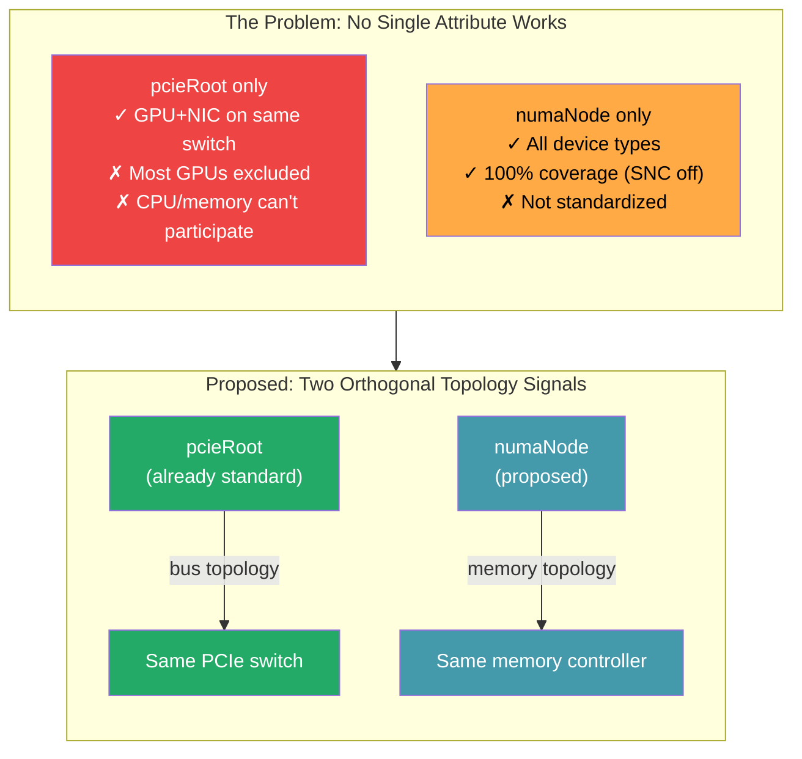

# Proposal: Standardize `numaNode` as a DRA Device Attribute

> **TL;DR:** Standardize `resource.kubernetes.io/numaNode` alongside the existing `pcieRoot`. They measure different physical properties: `pcieRoot` identifies which devices share a PCIe switch (bus topology), `numaNode` identifies which devices share a memory controller (memory topology). These are orthogonal signals — a GPU and NIC can be on different PCIe switches but the same memory controller. `numaNode` is also the missing topology anchor that KEPs 5491, 5075, and 5941 need to work across driver boundaries. Users compose independent constraints from both attributes based on what their workload requires.

## Overview



## Problem

DRA has one standardized topology attribute: `resource.kubernetes.io/pcieRoot`. This is insufficient for cross-driver device co-placement because:

1. **CPUs and memory are not PCI devices.** They have no `pcieRoot`. A `matchAttribute: pcieRoot` constraint that includes CPU or memory requests is unsatisfiable.

2. **pcieRoot is too restrictive for cross-device alignment.** On a Dell XE9680, only 2 of 8 GPUs share a PCIe switch with a NIC. The other 6 are on the same NUMA node but different switches — `pcieRoot` excludes them.

3. **On some systems, pcieRoot is entirely unsatisfiable.** On the Dell R760xa, every PCIe slot has its own root port — no two devices share a root. `matchAttribute: pcieRoot` fails for any GPU+NIC pair.

4. **Every driver publishes NUMA under a different name.** `gpu.nvidia.com/numa`, `gpu.amd.com/numaNode`, `dra.cpu/numaNodeID`, `dra.net/numaNode`, `dra.memory/numaNode`. `matchAttribute` requires a common name.

## Why the DRA KEP Ecosystem Needs `numaNode`

The DRA roadmap includes three KEPs that build sophisticated capacity and sharing semantics. Each works within a single driver, but needs a standard topology attribute to work **across** drivers.

**KEP-5491 (List Types, alpha in 1.36)** enables CPU-as-pivot topology matching — CPUs publish a list of local PCIe roots, and `matchAttribute` uses set intersection to co-place GPU↔CPU and NIC↔CPU. But this only works within the `pcieRoot` attribute space. When GPU and NIC are on different PCIe roots but the same memory controller (Dell XE8640: GPU on `pci0000:48`, NIC on `pci0000:26`, both NUMA 0), their pcieRoot sets have zero intersection. KEP-5491 can't bridge this gap because intersection operates within one attribute — it cannot derive memory proximity from bus addresses. `numaNode` is the orthogonal signal that pcieRoot — even with list types — structurally cannot express.

**KEP-5075 (Consumable Capacity, beta in 1.36)** tracks how much capacity remains on shared devices (NIC bandwidth, CPU cores). But it can't scope consumption to a topology domain. Without `numaNode`, the scheduler might allocate 25 Gbps from a NIC on NUMA 1 for a GPU workload on NUMA 0 — correct accounting, but cross-NUMA placement (58% throughput penalty). `numaNode` tells the scheduler not just how much is available, but where to consume from.

**KEP-5941 (Shared Consumable Capacity, proposed for 1.37)** lets parent devices declare capacity consumed by children across device boundaries. For this to work at the NUMA level — "NUMA node 0 has 400 GB/s memory bandwidth shared across all attached GPUs and NICs" — the parent-child grouping needs a common topology anchor. `numaNode` is that anchor. Without it, shared capacity tracking can only happen within a single driver's devices, not across the GPU/NIC/CPU/memory boundary where it matters most.

These KEPs give the scheduler **capacity awareness**. `numaNode` gives it **topology awareness**. Without both, the scheduler can track what's available but not where it should be consumed.

## The PR #5316 Discussion: numaNode Was Deferred, Not Rejected

When [PR #5316](https://github.com/kubernetes/enhancements/pull/5316#discussion_r2095270564) originally proposed standardizing both `pcieRoot` and `numaNode`, `numaNode` was removed after debate. The PR merged with only `pcieRoot` to unblock DRA GA — not as a technical rejection of other attributes. The conversation was explicitly deferred for separate proposals.

Key positions from the discussion:

- **kad (Alexander Kanevskiy):** "NUMA in sysfs does not represent real hardware topology in case of SNC (Intel) or NPS (AMD) active. NUMA represents only memory zone/mode of operation of Memory controller, and it has nothing to do with PCIe bandwidth or CPU core to device alignment." Supports `pcieRoot` only.
- **klueska (Kevin Klues, DRA maintainer):** Pragmatic mediator. Only `pcieRoot` for now to unblock GA. Defer other attributes to separate PRs. "Conversations like this are precisely why I think we should start with just the only one we can all agree on — pcieRoot."
- **johnbelamaric (John Belamaric, SIG lead):** "Yes, I would like to see some attribute upon which we can align CPU as well."
- **bg-chun (Byoungyun Chun):** Needs `cpuSocketNumber` for multi-root GPU topologies. Provided architecture diagrams showing dual-root and direct-attached configurations where `pcieRoot` alone cannot group all devices under one CPU socket.
- **ffromani (Francesco Romani):** Cautious about `cpuSocketNumber` — "numaNode as aligning attribute has surely its share of issues, but using cpuSocket also has its share of issues, so we are swapping a problem set with another problem set."
- **everpeace:** Proposed KEP-5491 (list-typed attributes) as a follow-up to allow CPUs to declare affinity to multiple PCIe roots.

## What to Standardize

### `resource.kubernetes.io/numaNode`

**Source:** `/sys/bus/pci/devices/<BDF>/numa_node` for PCI devices; `/sys/devices/system/node/node<N>/cpulist` for CPU devices; the memory controller's NUMA zone for memory devices.

**What it means:** Which memory controller services this device. Devices with the same `numaNode` share a memory controller — local DMA, no inter-controller hop.

**Type:** `int`

### Implementation

The lookup belongs in the shared `k8s.io/dynamic-resource-allocation/deviceattribute` package, alongside the existing `GetPCIBusIDAttribute()` and `GetPCIeRootAttributeByPCIBusID()`:

```go
func GetNUMANodeByPCIBusID(pciBusID string) (int, error) {
    // Read /sys/bus/pci/devices/<BDF>/numa_node
}
```

Every DRA driver that calls `GetPCIeRootAttributeByPCIBusID()` today would add one more call. The sysfs read is cheap (single file read).

## Why `numaNode` Is the Critical Boundary

Benchmarks on NVIDIA B200 GPUs with Mellanox RoCE NICs show NUMA-aligned placement achieves **46.93 GB/s** vs **29.68 GB/s** unaligned — a **58% throughput improvement** with near-zero variance ([Ojea 2025](https://arxiv.org/abs/2506.23628)).

This gap is between NUMA-aligned and cross-NUMA, not between same-switch and same-NUMA. The one root complex hop within a NUMA node is negligible for real workloads. The inter-socket link crossing is what kills performance.

## The Consumer Problem: KEP-5304 Metadata

The lack of a standard `numaNode` attribute creates a concrete problem for consumers of KEP-5304 device metadata. KubeVirt's virt-launcher reads device metadata to build guest NUMA topology (VEP 115 pxb-pcie placement). It needs the NUMA node for each passthrough device.

**Today's code** in our fork scans all KEP-5304 metadata files and tries multiple attribute names:

```go
// Must check multiple names because no standard exists
for _, name := range []string{
    "resource.kubernetes.io/numaNode",  // our proposed standard
    "numaNode",                          // bare (AMD)
    "numa",                              // vendor (NVIDIA)
} {
    if attr, ok := dev.Attributes[name]; ok && attr.IntValue != nil {
        return *attr.IntValue
    }
}
```

Each driver publishes NUMA under a different name:

| Driver | Attribute name in metadata | Standard? |
|--------|---------------------------|-----------|
| NVIDIA GPU | `numa` + `resource.kubernetes.io/numaNode` (fork) | Fork only |
| AMD GPU | `numaNode` (unqualified) | No |
| dranet (NIC) | `resource.kubernetes.io/numaNode` (fork) | Fork only |
| NVMe | `numaNode` (unqualified) | No |
| CPU | `dra.cpu/numaNodeID` (qualified) | No |

Our forks publish `resource.kubernetes.io/numaNode` alongside vendor-specific names, proving the approach works. But without upstream agreement, every consumer must try multiple names.

**With standardization**, one lookup:

```go
numaAttr := dev.Attributes["resource.kubernetes.io/numaNode"]
```

## The SNC/NPS Objection

The community removed `numaNode` from KEP-4381 because SNC (Intel) and NPS (AMD) change what NUMA IDs mean. This is partially correct — SNC-2 splits each socket into 2 sub-NUMA nodes, changing the NUMA ID assignment. But:

1. The sysfs value is **always correct** — it reports the memory controller that services the device.
2. SNC makes `numaNode` **finer-grained**, not incorrect.
3. GPU servers typically run with **SNC/NPS off** — GPUs use HBM, not host DRAM, so SNC's finer CPU-side NUMA granularity doesn't help GPU workloads.
4. The recommended approach for GPU workloads on SNC hardware is to **disable SNC**, not add scheduler fallbacks.

For the rare case where SNC/NPS must be enabled on a GPU server, `enforcement: preferred` on `numaNode` allows the claim to succeed even if some NUMA nodes lack certain device types. But the core proposal does not require a `cpuSocketID` attribute to handle this — see the note at the end.

### AMD NPS4 with unpopulated memory channels

On AMD platforms with NPS4 and partially populated memory channels, some NUMA nodes may have CPUs but zero memory. As kad noted at [KubeCon NA 2024](https://sched.co/1i7ke): "you might end up in the Linux kernel the NUMA node which has CPUs because we split according to the CPU tiles but it has zero memory, and this breaks like everything in kubelet." This is a hardware configuration issue — the recommendation is to fully populate memory channels on GPU servers — not a `numaNode` semantics issue. The attribute correctly reports the memory zone, which happens to be empty.

### CXL memory expanders

CXL memory devices (Type 3) create additional NUMA nodes that don't correspond to any CPU socket. A server with 2 sockets and a CXL expander might expose NUMA 0 (Socket 0 DRAM), NUMA 1 (Socket 1 DRAM), and NUMA 2 (CXL memory, no CPUs, no PCI devices). `numaNode` as defined ("which memory controller services this device") correctly handles this — a CXL-attached device reports the CXL memory controller's NUMA node. PCI devices report their local DRAM NUMA node. The attribute remains a factual report of which memory controller services the device, regardless of the memory technology behind it.

## pcieRoot-Only Coverage by Use Case

Analysis based on [topology-use-cases.md](../topology-use-cases.md) shows where `pcieRoot`-only falls short:

| Use Case | pcieRoot only | pcieRoot + KEP-5491 lists | numaNode |
|---|---|---|---|
| Level 1: NCCL proxy (GPU+NIC same switch) | Works perfectly | Works | Works |
| Level 2: Training/inference (GPU+NIC+CPU same NUMA) | 25% GPU yield on XE8640, 0% on R760xa | Can't match GPU-NIC across different roots on same NUMA | 50-100% yield |
| Level 3: Batch (no constraint) | Trivially works | Works | Works |
| Level 4: KubeVirt guest NUMA topology | Cannot group devices into NUMA cells | Same problem | Required -- only way to reconstruct NUMA boundaries |

The critical gap is Level 2 and Level 4. On the XE8640:

- GPU `4e:00.0` is on pcieRoot `pci0000:48`
- CX6 NIC `27:00.0` is on pcieRoot `pci0000:26`
- Both are on NUMA 0 (same memory controller, same socket)
- pcieRoot intersection: empty -- they are on different PCIe root complexes
- Even with KEP-5491 list types, you would have to put `pci0000:26` in the GPU's pcieRoot list -- but the GPU is NOT on that root. That is lying about the hardware.

For Level 4 (KubeVirt): virt-launcher needs to group devices into guest NUMA cells. With `pcieRoot`, every device on NUMA 0 of the XE8640 is on a different root (`pci0000:00`, `pci0000:26`, `pci0000:48`, `pci0000:59`). There is no way to reconstruct that these 4 different pcieRoot values all map to the same memory controller. `numaNode` directly encodes this.

## pcieRoot and numaNode Measure Different Things

`pcieRoot` answers: "which PCIe switch tree is this device in?" -- a bus topology fact.

`numaNode` answers: "which memory controller is closest to this device?" -- a memory topology fact.

On simple hardware, they correlate (one PCIe root per NUMA node). On real GPU servers, they diverge:

- **XE8640 NUMA 0** has four PCIe root complexes (`pci0000:00`, `pci0000:26`, `pci0000:48`, `pci0000:59`)
- **XE9680 NUMA 0** has four PCIe root complexes (`pci0000:15`, `pci0000:37`, `pci0000:48`, `pci0000:59`)
- **R760xa NUMA 0**: every device has its own root port

Multiple independent PCIe trees share one memory controller. kad's objection that "NUMA doesn't represent real hardware topology" is correct for PCIe bandwidth, but `numaNode` was never meant to represent PCIe topology — it represents memory topology, which is an independently valuable and measurably impactful signal (58% throughput difference).

kad himself confirmed this distinction at [KubeCon NA 2024](https://sched.co/1i7ke): "There is no CPU in NUMA, there is no PCI in NUMA. Those two things are separate entities. Don't mix them." This is precisely why `numaNode` and `pcieRoot` are proposed as **separate** attributes — they measure different physical properties of different hardware subsystems. `numaNode` is the memory controller zone. `pcieRoot` is the PCIe switch tree. Neither replaces the other.

kad also noted that on modern processors (Intel 5th/6th gen Xeon, AMD EPYC), the inter-tile bus speed is "good enough" that you don't see latency differences between cores communicating with different PCI controllers on the same socket. This weakens the case for pcieRoot as the primary co-placement signal and strengthens numaNode — if intra-socket PCI controller distance doesn't matter for performance, then the memory controller boundary (numaNode) is where the measurable performance cliff occurs.

## What Upstream Needs to Change

### 1. Standardize the attribute

Add `resource.kubernetes.io/numaNode` (int) to the standard device attribute list alongside `pcieRoot` and `pciBusID`.

### 2. Add helper function

In `k8s.io/dynamic-resource-allocation/deviceattribute`:

```go
func GetNUMANodeByPCIBusID(pciBusID string) (int, error)
func GetNUMANodeForCPU(cpuID int) (int, error)
```

### 3. Add `enforcement: preferred` to `matchAttribute`

Today `matchAttribute` has no `enforcement` field — constraints are always implicitly required. With `preferred`, the scheduler tries the constraint but relaxes if unsatisfiable. This enables:

```yaml
constraints:
- matchAttribute: resource.kubernetes.io/pcieRoot
  requests: [gpu, nic]
  enforcement: preferred        # try same switch
- matchAttribute: resource.kubernetes.io/numaNode
  requests: [gpu, nic, cpu, mem]
  enforcement: required         # must be same NUMA
```

On the Dell R760xa, every PCIe slot has its own root port — `pcieRoot` as a hard constraint is unsatisfiable for any GPU+NIC pair. As `preferred`, the scheduler tries it but doesn't fail if no match exists. The `numaNode` constraint is independent — it's not a fallback from pcieRoot, it's a separate constraint about a different physical property (memory controller proximity vs PCIe switch proximity).

**This is separable from items 1-2.** Standardizing `numaNode` is valuable without `preferred`: a single required `numaNode` constraint aligns all four resource types on hardware where every NUMA has the devices it needs. `enforcement: preferred` on `pcieRoot` is an independent optimization for systems with PCIe switches — it's an enhancement, not a prerequisite.

### 4. Drivers publish the attribute

Each DRA driver adds a call to the helper function during device discovery. The sysfs read is already happening — drivers currently publish vendor-specific attributes from the same sysfs path. This standardizes the name.

## Dell XE9680 Match Coverage

| Attribute | GPU+NIC matched (SNC off) | GPU+NIC matched (SNC on) |
|-----------|--------------------------|--------------------------|
| pcieRoot | 2 of 8 (25%) | 2 of 8 (25%) |
| numaNode | 8 of 8 (100%) | 4 of 8 (50%) |

### PCIe Switch to Device Mapping (SNC off)

| PCIe Root | NUMA | GPU | NIC | Shares Switch? |
|-----------|------|-----|-----|----------------|
| `pci0000:15` | 0 | `1b:00.0` | `1d:00.0`, `1d:00.1` | **Yes** |
| `pci0000:37` | 0 | `3d:00.0` | — | No |
| `pci0000:48` | 0 | `4e:00.0` | — | No |
| `pci0000:59` | 0 | `5f:00.0` | — | No |
| `pci0000:97` | 1 | `9d:00.0` | `9f:00.0`, `9f:00.1` | **Yes** |
| `pci0000:b7` | 1 | `bd:00.0` | — | No |
| `pci0000:c7` | 1 | `cd:00.0` | — | No |
| `pci0000:d7` | 1 | `dd:00.0` | — | No |

## What This Replaces

| Current approach | Problem |
|-----------------|---------|
| Each driver publishes NUMA under its own name | `matchAttribute` can't work cross-driver |
| pcieRoot-as-list (CPU publishes local PCIe roots) | Memory has no pcieRoot; transitive reasoning required |
| Topology coordinator with ConfigMap rules | Requires middleware for basic NUMA alignment |
| No topology attribute for CPU/memory | Cross-driver alignment is impossible without driver-specific knowledge |

## What This Does NOT Replace

The topology coordinator remains valuable for:
- **Partition abstraction** — users request "an eighth of the machine" instead of writing multi-driver claims
- **Distance-based fallback** — the coordinator already implements the hierarchy pattern via `fallbackAttribute`
- **DRAConsumableCapacity** — proportional CPU/memory division across partitions
- **Per-NUMA DeviceClasses** — pre-computed resource inventories per partition

Standardizing `numaNode` eliminates the need for the coordinator for basic NUMA alignment. The coordinator adds value at the partition abstraction layer.

## Impact on KubeVirt

### Scheduling (same as pods)

The VM's launcher pod is scheduled with the same `matchAttribute` constraints. GPU + NIC + CPU + memory land on the same host NUMA. No difference from pods.

### Guest NUMA topology (KubeVirt-specific)

KubeVirt's VEP 115 creates `pxb-pcie` expander buses to place passthrough devices on the correct guest NUMA node. The virt-launcher reads device NUMA from KEP-5304 metadata to determine which guest NUMA cell each device belongs to.

**With standardization**, one lookup works for every driver — no vendor-specific attribute names, no sysfs fallback.

### CPU/memory pinning

The DRA CPU driver (`dra-driver-cpu`) handles CPU and memory pinning via NRI — it sets `cpuset.cpus` and `cpuset.mems` on the container's cgroup, pinning to the same NUMA as the DRA devices. Alternatively, the kubelet can provide DRA topology hints to its topology manager for CPU pinning alignment.

## Evidence

Tested end-to-end on three systems with 5 independent DRA drivers (GPU, NIC, NVMe, CPU, memory) using `matchAttribute: resource.kubernetes.io/numaNode`:

### Dell XE8640 (4x H100 SXM5, NVLink)

- **5-driver VM claim**: 3x H100 VFIO + Mellanox NIC VFIO + NVMe VFIO + 8 CPUs (4 per NUMA) + memory — all allocated via DRA, VM running with correct guest NUMA topology
- **Multi-NUMA guest**: 2 guest NUMA cells with `pxb-pcie` expanders, GPUs on correct guest NUMA nodes, built from KEP-5304 metadata using `resource.kubernetes.io/numaNode`
- **Per-CPU allocation**: DRA CPU driver in individual mode (`--cpu-device-mode=individual`), 128 per-CPU devices, claims use `count: N` with `matchAttribute` — multiple claims share a NUMA node
- **4-claim test**: pcieRoot match (GPU+NIC+NVMe on `pci0000:59`) + numaNode match (GPU+NIC VF) + 2 GPU-only claims — all 4 H100s allocated with CPUs NUMA-aligned
- **VFIO safety**: dranet `vfioUnsafe` filter excludes Broadcom NIC with shared IOMMU group, NVMe driver excludes boot disk

### Dell R760xa (2x A40, ConnectX-7)

- **3 concurrent claims**: 2x (GPU+NIC+8 CPUs, numaNode-aligned) + 1x (2 NICs + 8 CPUs) — 24 CPUs allocated across 3 claims from same NUMA node using per-CPU devices
- **Per-CPU individual mode**: resolved one-device-per-NUMA limitation, multiple claims get exclusive CPUs from same NUMA

### Dell XE9680 (8x MI300X, ConnectX-6 Dx)

- **8-GPU topology**: SNC on/off comparison, topology coordinator partitions, multi-NUMA KubeVirt VMs
- **pcieRoot coverage**: only 25% of GPUs share a switch with a NIC — demonstrates why `numaNode` is essential

### Key results

| Metric | Value |
|--------|-------|
| DRA drivers using `resource.kubernetes.io/numaNode` | 5 (GPU, NIC, NVMe, CPU, memory) |
| Systems tested | 3 (NVIDIA A40, H100 SXM5, AMD MI300X) |
| Max devices in single claim | 13 (3 GPUs + 1 NIC + 1 NVMe + 8 CPUs) |
| Guest NUMA cells from KEP-5304 | 2 (verified with pxb-pcie placement) |
| Concurrent claims per NUMA | 3 (with per-CPU individual mode) |

Full test results: [testing/results/results-summary.md](../../testing/results/results-summary.md)
XE8640 test capture: [testing/results/xe8640-multi-numa-vm-2026-05-01.md](../../testing/results/xe8640-multi-numa-vm-2026-05-01.md)

## Note on `cpuSocketID`

`cpuSocketID` (the physical CPU package ID) could serve as a coarser memory-topology constraint on SNC/NPS hardware where sub-NUMA clustering creates NUMA nodes without NICs. Unlike `pcieRoot` and `numaNode`, which are genuinely orthogonal (bus vs memory topology), `cpuSocketID` is correlated with `numaNode` — it groups multiple NUMA nodes into a single socket. You'd use it because `numaNode` is too restrictive, not because it measures a different physical property. However:

- GPU servers typically run SNC/NPS off — the recommended approach is to disable SNC for GPU workloads.
- Adding `cpuSocketID` to the core proposal increases the scope and re-engages the SNC/NPS debate that caused `numaNode` to be removed from KEP-4381 in the first place.
- No real-world GPU use case has been identified where `cpuSocketID` is needed and disabling SNC is not an option.

`cpuSocketID` is not part of this proposal. Drivers can publish it independently as a vendor-specific attribute if needed for specific deployments. If a strong use case emerges (e.g., HPC workloads on SNC hardware), it can be proposed separately.

## Recommended Pitch Strategy

Based on the PR #5316 debate, the recommended approach for proposing `numaNode` upstream:

1. **Don't lead with "standardize numaNode."** That triggers kad's SNC objection immediately.

2. **Lead with the pcieRoot gap.** Show concrete hardware where pcieRoot-only fails (R760xa: 0% coverage, XE8640: 25% coverage). Show that pcieRoot + KEP-5491 lists still cannot match GPU-NIC on same NUMA but different roots.

3. **Frame numaNode as the memory-locality signal.** "pcieRoot tells you which devices share a PCIe switch. numaNode tells you which devices share a memory controller. These are orthogonal facts about different physical interconnects."

4. **Acknowledge the SNC caveat upfront.** "numaNode tracks memory controller affinity, which may differ from PCIe topology under SNC/NPS modes. On SNC hardware, it's finer-grained but still correct."

5. **Point to the regression from device plugins.** The topology manager automatically coordinated NUMA placement. DRA broke this. numaNode restores it.

6. **Show evidence.** 5 drivers, 3 hardware platforms, end-to-end including KubeVirt VMs with correct guest topology.

## References

- [KEP-4381 PR #5316](https://github.com/kubernetes/enhancements/pull/5316) — where `numaNode` was proposed and removed
- [WIP: pcieRoot-as-list helper](https://github.com/kubernetes/kubernetes/pull/138297)
- [Ojea 2025](https://arxiv.org/abs/2506.23628) — 58% throughput improvement with topology-aligned GPU+NIC placement
- [Topology Attribute Debate](../topology-attribute-debate.md) — full analysis of pcieRoot vs numaNode
- [Topology Use Cases](../topology-use-cases.md) — AI workloads mapped to each topology level
- [DRA KEP Ecosystem Overview](kep-ecosystem-overview.md) — how 12+ DRA KEPs relate to topology-aware co-placement
