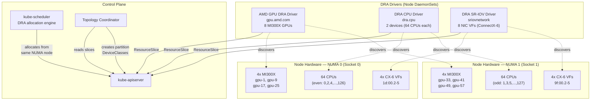
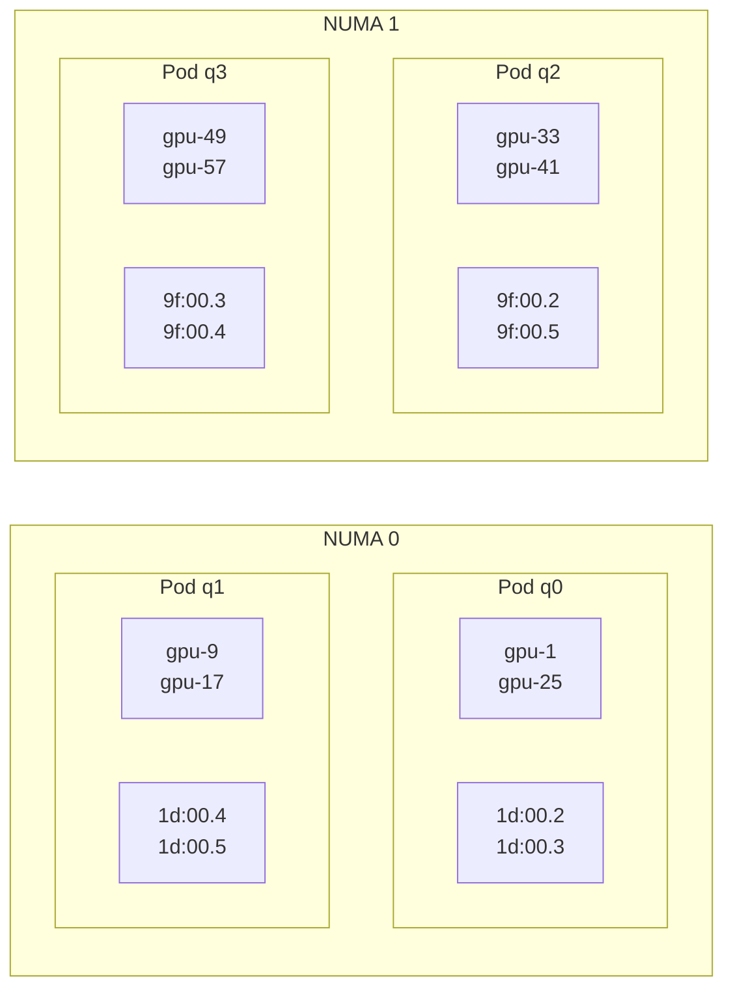
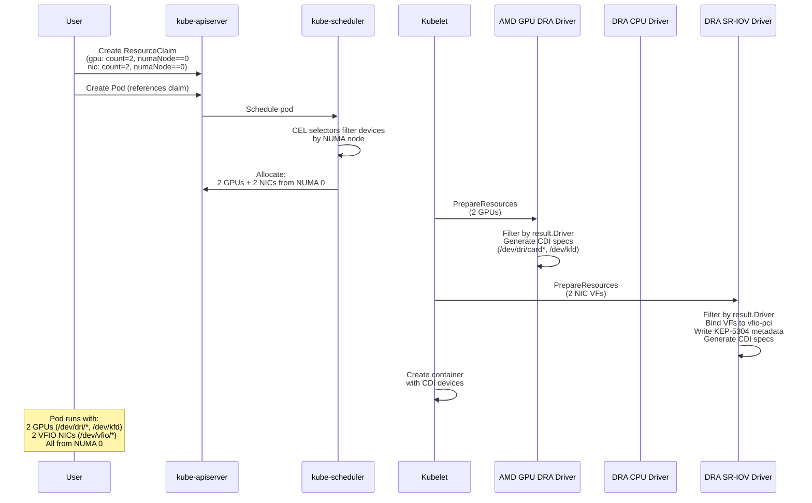
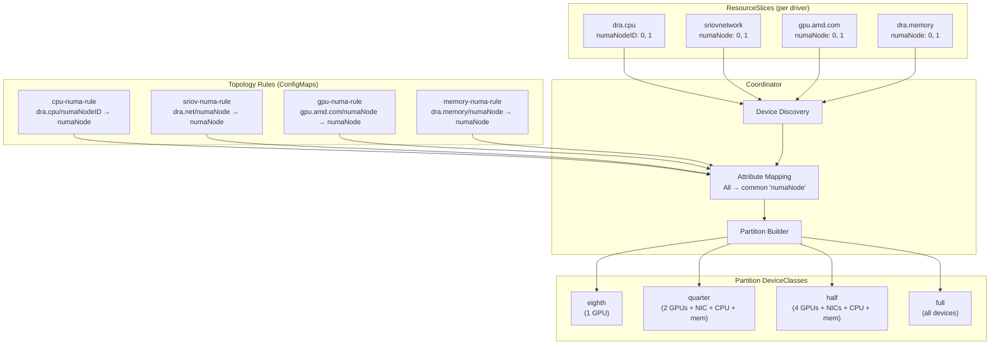
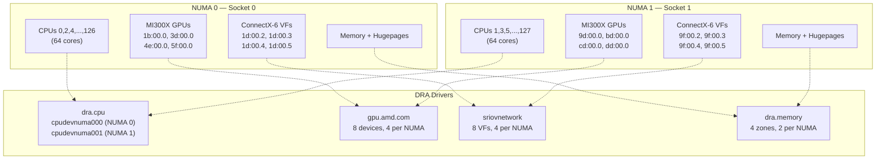
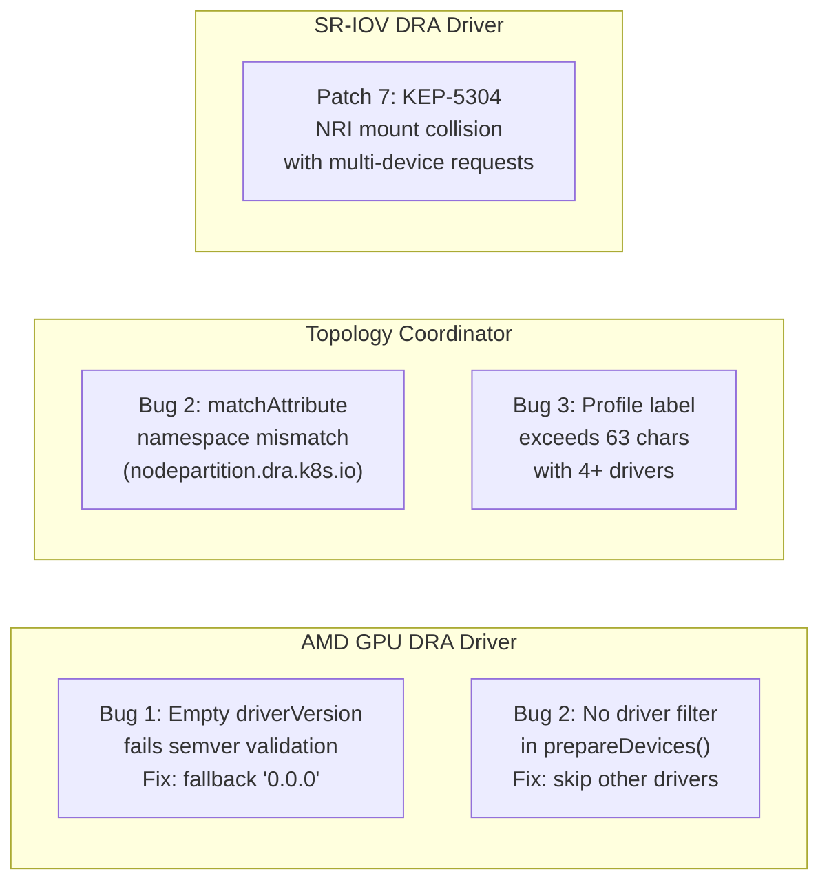

# DRA 3-Driver NUMA-Isolated Architecture — 2026-04-14

## Full Stack: GPU + CPU + NIC via DRA

## Four-Pod Quarter-Machine Allocation

## DRA Allocation Flow

## Topology Coordinator Rules

## Device-to-NUMA Mapping (Dell XE9680)

## Bugs Found

