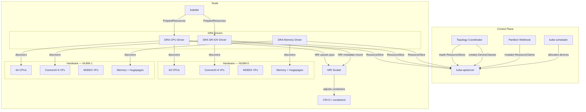
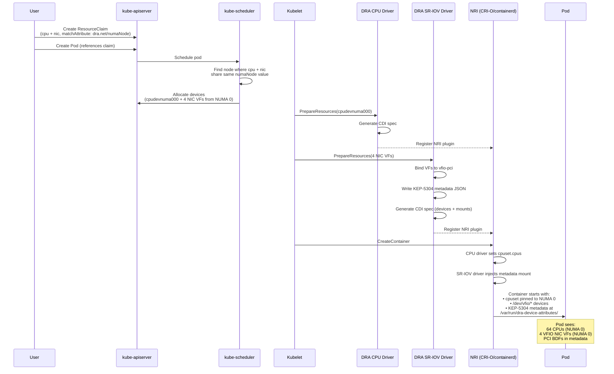
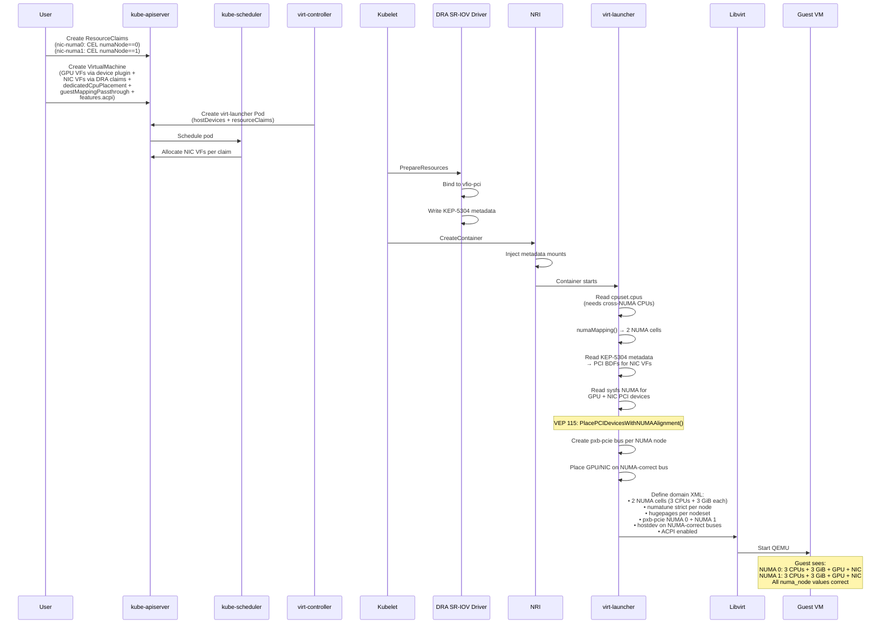
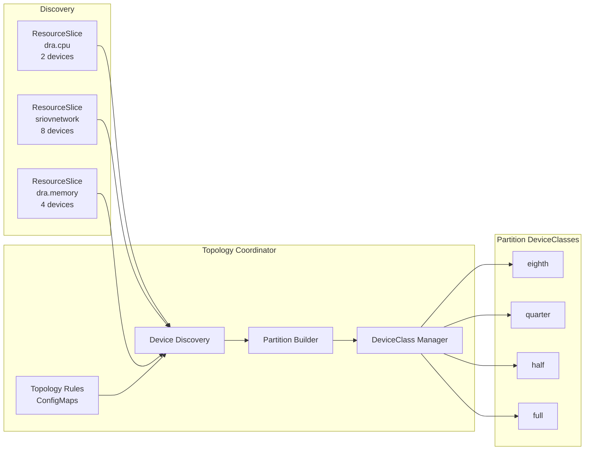
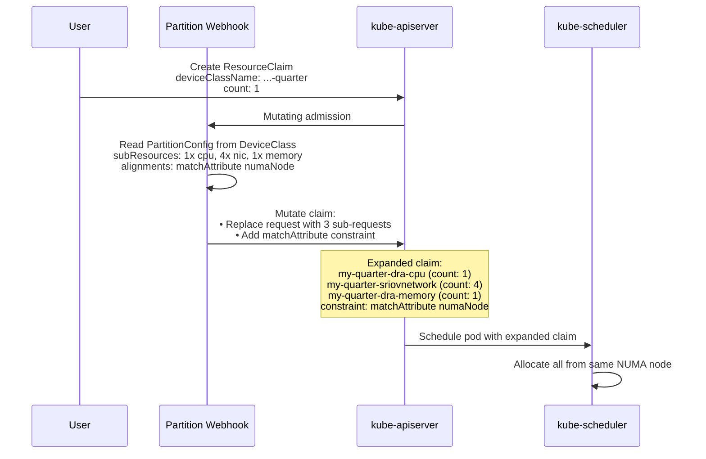
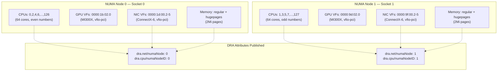
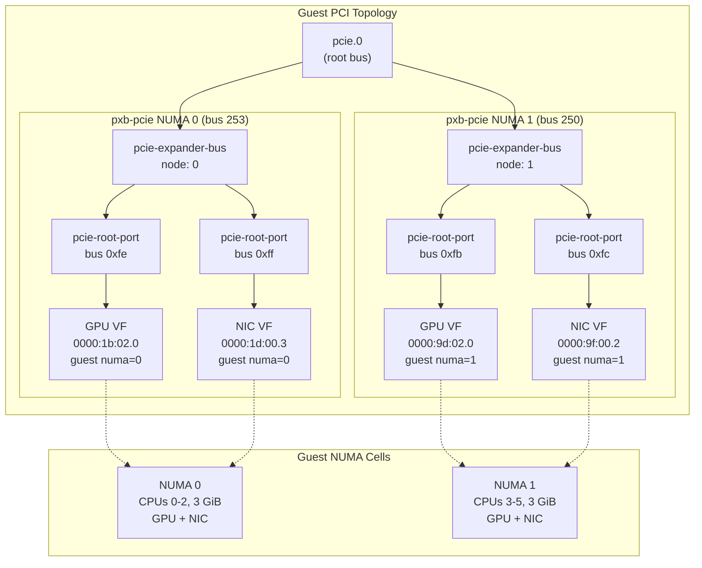

# DRA Topology-Aware Co-Placement Architecture

## Overview

DRA (Dynamic Resource Allocation) enables NUMA-aware device co-placement across multiple drivers. The topology coordinator discovers devices from all DRA drivers, creates partition DeviceClasses with NUMA alignment constraints, and a webhook expands simple partition claims into multi-driver requests.

---

## Component Architecture

---

## Plain Pod Flow

How a NUMA-aligned pod gets CPU + NIC VFs from the same NUMA node.

---

## KubeVirt VM Flow

How a VM gets 2 guest NUMA nodes with GPU + NIC devices NUMA-aligned via VEP 115.

---

## Topology Coordinator Partition Flow

How the coordinator creates partition DeviceClasses and the webhook expands claims.

---

## Device-to-NUMA Mapping (Dell XE9680)

---

## KubeVirt Guest PCI NUMA Topology (VEP 115)

---

## Known Issues

| Issue | Impact | Status |
|-------|--------|--------|
| Coordinator bug #2: `matchAttribute` uses `nodepartition.dra.k8s.io/numaNode` | Webhook-expanded claims unsatisfiable | Workaround: use `dra.net/numaNode` manually |
| SR-IOV driver needs opaque config | PrepareResources fails without VfConfig | Workaround: default config in DeviceClass |
| CPU pinning needs K8s 1.36 | cpuset swap hack required on K8s 1.34 | Fixed with `DRAConsumableCapacity` (K8s 1.36) |
| KubeVirt ACPI not auto-enabled | Guest PCI `numa_node=-1` without `features.acpi` | Workaround: add `features.acpi: {}` to VM spec |
| Memory driver capacity | PrepareResources fails on K8s 1.34 | Fixed with `DRAConsumableCapacity` (K8s 1.36) |
