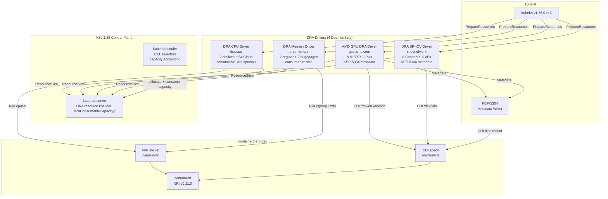
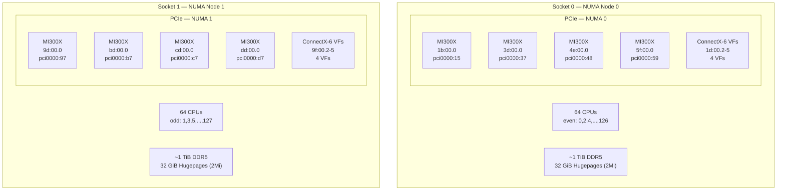
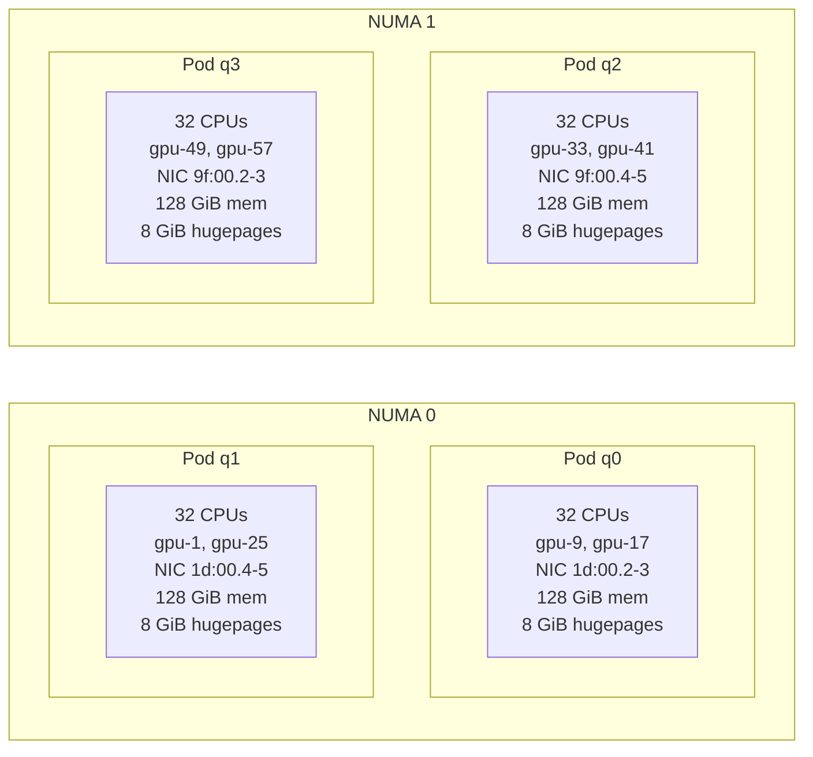
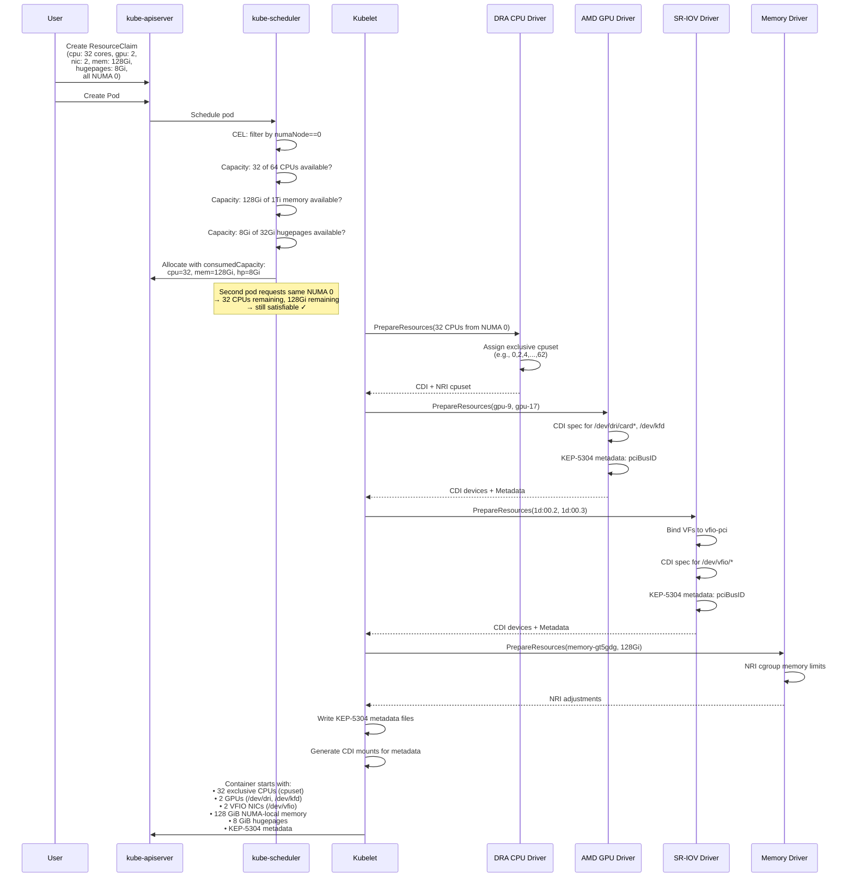
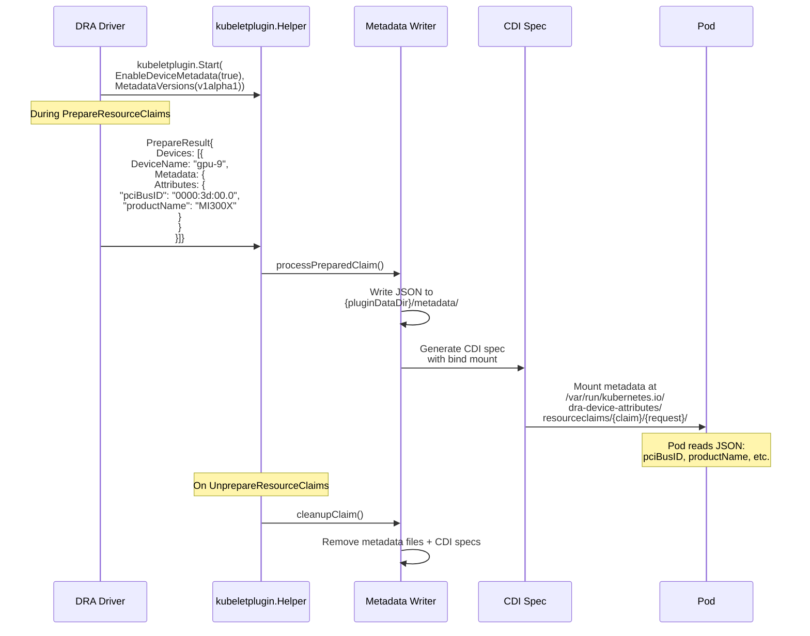
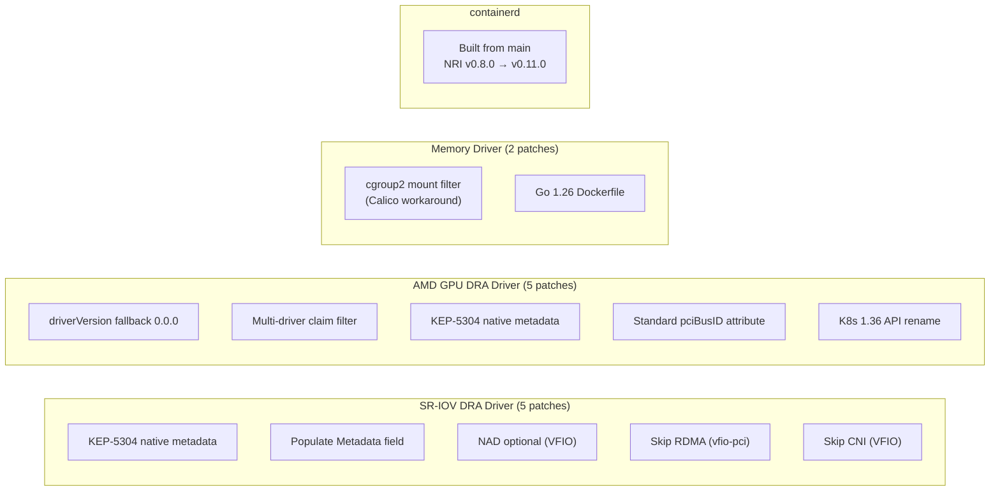
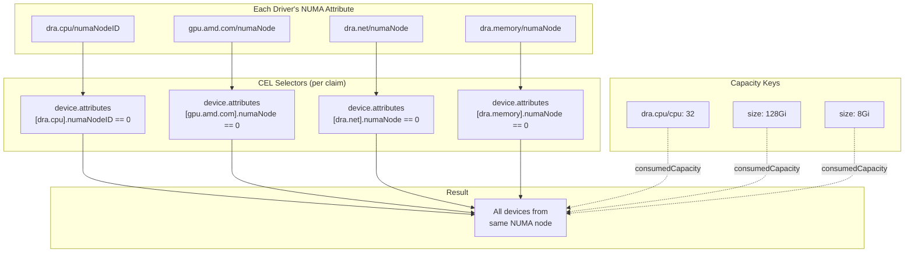

# DRA Topology-Aware Co-Placement Architecture — Fedora 43 + K8s 1.36

## Full Stack Overview

## Dell XE9680 Hardware Layout

## Quarter-Machine Allocation (4 Pods)

## DRAConsumableCapacity Flow

## KEP-5304 Native Metadata Flow (K8s 1.36)

## Patch Summary

## Device Attribute Namespaces

