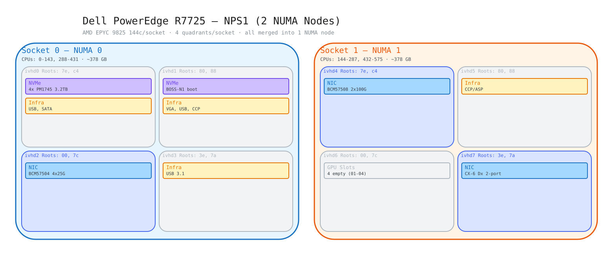
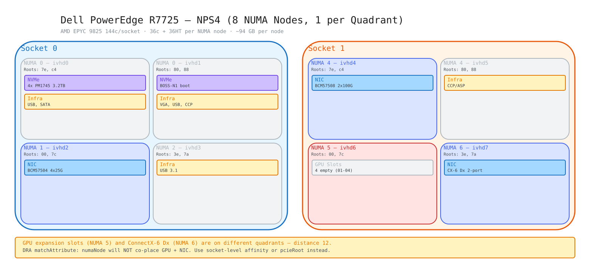
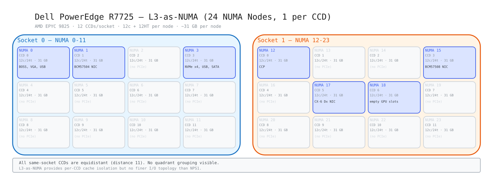

# Dell PowerEdge R7725 — Hardware Topology

**Address:** 10.6.131.1
**Date collected:** 2026-05-26
**BIOS NPS mode:** NPS4

## Quick Reference

| | Socket 0 (NUMA 0-3) | Socket 1 (NUMA 4-7) |
|---|---|---|
| **CPU** | AMD EPYC 9825 144c/288t (Zen 5c) | AMD EPYC 9825 144c/288t (Zen 5c) |
| **CPUs** | 0-143, 288-431 | 144-287, 432-575 |
| **PCI Domain** | `0000:` | `0001:` |
| **GPUs** | — | — (4 empty slots, NUMA 5) |
| **NICs** | BCM57504 4x25G (NUMA 1) | CX-6 Dx (NUMA 6) + BCM57508 2x100G (NUMA 4) |
| **NVMe** | 4x Samsung PM1745 3.2TB (NUMA 0) | — |

## NPS Mode Topology Diagrams

### NPS1 — 2 NUMA Nodes (1 per socket)

### NPS4 — 8 NUMA Nodes (1 per IOD quadrant, current)

### L3-as-NUMA — 24 NUMA Nodes (1 per CCD)

## Key Findings

- **No GPUs installed** — compute-only configuration with 4 empty GPU slots on Socket 1
- **GPU slots and NICs on different NUMA nodes** — GPU expansion on NUMA 5, ConnectX-6 Dx on NUMA 6, BCM57508 on NUMA 4. DRA `matchAttribute: numaNode` would not co-place GPU+NIC
- **Turin Dense (Zen 5c)** with same IOD quadrant structure as Turin Classic (4 quadrants/socket)
- **Dual PCI domains** (one per socket) unlike single-domain SMC6216GPU
- **Tested NPS1, NPS4, and L3-as-NUMA** — topology outputs for each mode captured

## Files

| File | Description |
|------|-------------|
| [`system-summary.md`](system-summary.md) | Full hardware inventory with IOD quadrants, NPS4 NUMA mapping, NICs, storage |
| [`hw-topology.txt`](hw-topology.txt) | hw-topology.sh output (NPS1) |
| [`hw-topology-nps4.txt`](hw-topology-nps4.txt) | hw-topology.sh output (NPS4, current) |
| [`hw-topology-l3-numa.txt`](hw-topology-l3-numa.txt) | hw-topology.sh output (L3-as-NUMA, 24 nodes) |
| [`pcie-tree.txt`](pcie-tree.txt) | Raw `lspci -tv` output |
| [`lscpu.txt`](lscpu.txt) | CPU topology and features |
| [`iommu-df.txt`](iommu-df.txt) | IOMMU instances and Data Fabric nodes |
| [`numa-memory.txt`](numa-memory.txt) | NUMA memory and node distances |
| [`r7725-nps1.excalidraw`](r7725-nps1.excalidraw) | NPS1 topology diagram |
| [`r7725-nps1.svg`](r7725-nps1.svg) | NPS1 topology SVG |
| [`r7725-nps4.excalidraw`](r7725-nps4.excalidraw) | NPS4 topology diagram |
| [`r7725-nps4.svg`](r7725-nps4.svg) | NPS4 topology SVG |
| [`r7725-l3-numa.excalidraw`](r7725-l3-numa.excalidraw) | L3-as-NUMA topology diagram |
| [`r7725-l3-numa.svg`](r7725-l3-numa.svg) | L3-as-NUMA topology SVG |
