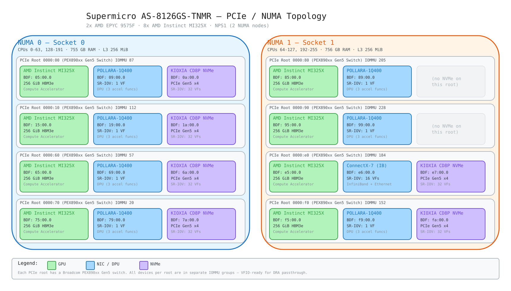
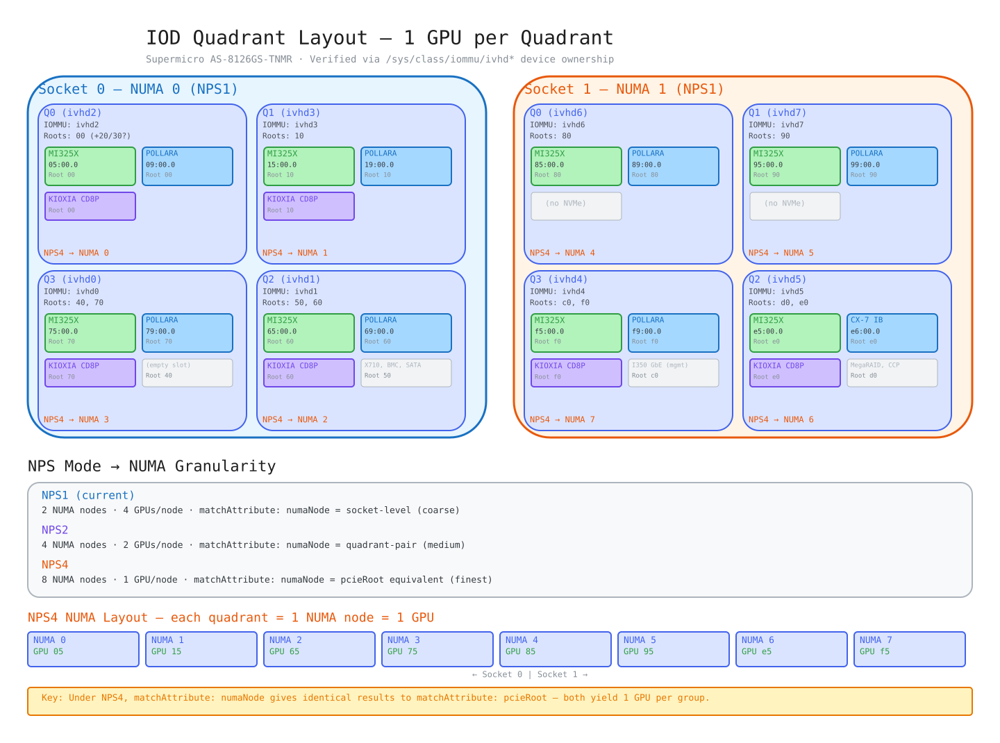
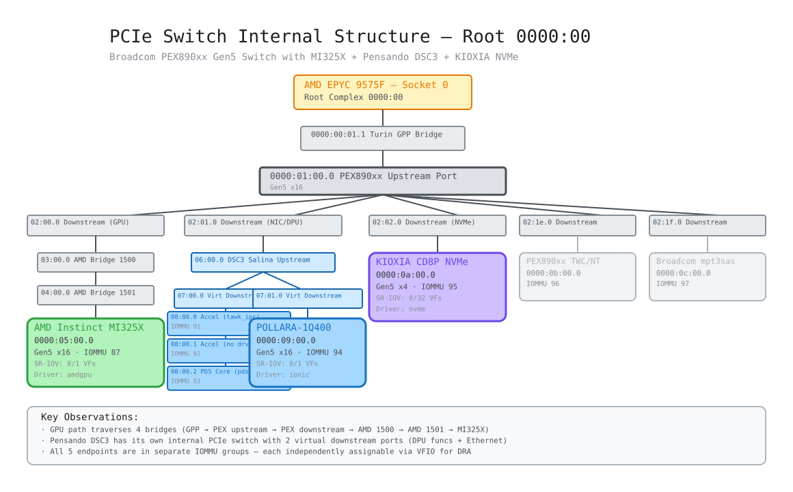

# Supermicro AS-8126GS-TNMR — Hardware Topology

**Hostname:** smc6216gpu
**Date collected:** 2026-05-20
**OS:** RHCOS 9.6 (OpenShift 4.21)

## System Topology Diagram

Open [`topology.excalidraw`](topology.excalidraw) in [excalidraw.com](https://excalidraw.com) for an interactive view, or see the exported SVG:

## IOD Quadrant / NPS Mode Comparison

Each socket has 1 IOD with 4 quadrants, each with its own IOMMU instance (ivhd). Every quadrant has exactly 1 GPU. Under NPS4, each quadrant becomes its own NUMA node — matching `pcieRoot` granularity exactly.

## PCIe Switch Internal Structure

Each GPU root has a Broadcom PEX890xx Gen5 switch with 5 downstream ports. The Pensando DSC3 has its own internal PCIe switch with 4 independently-assignable functions.

## Quick Reference

| | Socket 0 (NUMA 0) | Socket 1 (NUMA 1) |
|---|---|---|
| **CPU** | AMD EPYC 9575F, 64c/128t | AMD EPYC 9575F, 64c/128t |
| **CPUs** | 0-63, 128-191 | 64-127, 192-255 |
| **GPUs** | 4x MI325X (roots 00/10/60/70) | 4x MI325X (roots 80/90/e0/f0) |
| **NICs** | 4x POLLARA-1Q400 | 3x POLLARA-1Q400 + 1x ConnectX-7 IB |
| **NVMe** | 4x KIOXIA CD8P | 2x KIOXIA CD8P (roots 80/90 empty) |

## Co-Placement Coverage

For DRA topology-aware scheduling with `matchAttribute`:

| Constraint | GPU↔NIC | GPU↔NVMe | GPU↔NIC↔NVMe |
|------------|---------|----------|--------------|
| `pcieRoot` | 8/8 (100%) | 6/8 (75%) | 6/8 (75%) |
| `numaNode` (NPS1) | 8/8 (100%) | 6/8 (75%) | 6/8 (75%) |
| `numaNode` (NPS4) | 8/8 (100%) | 6/8 (75%) | 6/8 (75%) |

Under NPS1, `pcieRoot` is strictly finer than `numaNode` (8 groups vs 2). Under NPS4, each IOD quadrant becomes its own NUMA node with exactly 1 GPU — making `numaNode` and `pcieRoot` equivalent in granularity.

## Files

| File | Description |
|------|-------------|
| [`system-summary.md`](system-summary.md) | Full hardware inventory with BDFs, IOMMU groups, SR-IOV, IOD quadrants |
| [`hw-topology.txt`](hw-topology.txt) | Full NUMA-aware PCIe topology with drivers, IOMMU groups, SR-IOV, link speeds |
| [`pcie-tree.txt`](pcie-tree.txt) | Raw `lspci -tv` output |
| [`topology.excalidraw`](topology.excalidraw) | System topology diagram — all 8 GPU roots across 2 NUMA nodes |
| [`topology.svg`](topology.svg) | Exported SVG of system topology |
| [`iod-quadrants.excalidraw`](iod-quadrants.excalidraw) | IOD quadrant layout with NPS1 vs NPS4 comparison |
| [`iod-quadrants.svg`](iod-quadrants.svg) | Exported SVG of IOD quadrant diagram |
| [`pcie-switch-detail.excalidraw`](pcie-switch-detail.excalidraw) | PCIe switch internal structure (root 0000:00 example) |
| [`pcie-switch-detail.svg`](pcie-switch-detail.svg) | Exported SVG of PCIe switch detail |
| [`vm-use-cases.md`](vm-use-cases.md) | VM use case configurations (inference, multi-tenant, developer, mixed) |
