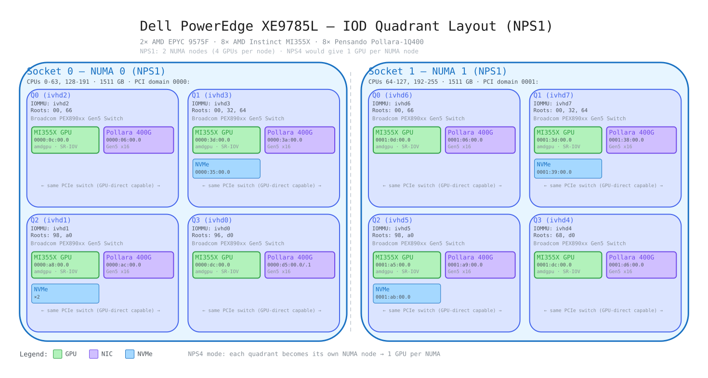

# Dell PowerEdge XE9785L — Hardware Topology

**Hosts:**
- `redhat@dell-mi355x-3.bmas-001.lab.rdu2.dc.redhat.com`
- `redhat@dell-mi355x-4.bmas-001.lab.rdu2.dc.redhat.com`

**Date collected:** 2026-05-28
**BIOS NPS mode:** NPS1

## Quick Reference

| | Socket 0 (NUMA 0) | Socket 1 (NUMA 1) |
|---|---|---|
| **CPU** | AMD EPYC 9575F 64c/128t (Turin) | AMD EPYC 9575F 64c/128t (Turin) |
| **CPUs** | 0-63, 128-191 | 64-127, 192-255 |
| **Memory** | 1511 GB | 1511 GB |
| **PCI Domain** | `0000:` | `0001:` |
| **GPUs** | 4x AMD MI355X (amdgpu, SR-IOV) | 4x AMD MI355X (amdgpu, SR-IOV) |
| **NICs** | 4x Pensando Pollara 400G + 1x CX-6 Dx (2-port) | 4x Pensando Pollara 400G + 1x CX-6 Dx (2-port) |
| **NVMe** | 2 quadrants w/ NVMe | 2 quadrants w/ NVMe |

## IOD Quadrant Layout

## IOD Quadrant Mapping (NPS1)

Each IOD quadrant pairs exactly 1 GPU + 1 Pollara NIC behind a Broadcom PEX890xx Gen5 switch.
Two quadrants (ivhd0, ivhd6) also have a ConnectX-6 Dx dual-port on the same switch.
NPS4 would expose 8 NUMA nodes (1 GPU per node), matching physical PCIe topology.

| Quadrant | Socket | GPU | Pollara NIC | ConnectX-6 Dx | NVMe |
|----------|--------|-----|-------------|---------------|------|
| ivhd0 | 0 | `0000:dc:00.0` | `0000:d9:00.0` | `0000:d5:00.0/.1` | — |
| ivhd1 | 0 | `0000:a8:00.0` | `0000:ac:00.0` | — | 2x NVMe |
| ivhd2 | 0 | `0000:0c:00.0` | `0000:06:00.0` | — | — |
| ivhd3 | 0 | `0000:3d:00.0` | `0000:3a:00.0` | — | 1x NVMe |
| ivhd4 | 1 | `0001:dc:00.0` | `0001:d6:00.0` | — | — |
| ivhd5 | 1 | `0001:a5:00.0` | `0001:a9:00.0` | — | 1x NVMe |
| ivhd6 | 1 | `0001:0d:00.0` | `0001:06:00.0` | `0001:07:00.0/.1` | — |
| ivhd7 | 1 | `0001:3d:00.0` | `0001:38:00.0` | — | 1x NVMe |

## Key Findings

- **8x AMD MI355X GPUs** — all Gen5 x16, SR-IOV capable (0/1 VFs), `amdgpu` driver loaded
- **1:1 GPU-NIC affinity** — each GPU shares a PCIe switch with a Pollara 400G NIC, ideal for GPU-direct RDMA and topology-aware co-placement
- **2x ConnectX-6 Dx** (dual-port, Gen4 x16, mlx5_core, SR-IOV 0/8 VFs) — one in ivhd0 (Socket 0), one in ivhd6 (Socket 1), co-located with GPU on same PCIe switch
- **NPS1 → NPS4 opportunity** — current NPS1 collapses 4 GPUs per NUMA node; NPS4 would give 1 GPU per NUMA node matching the IOD quadrant granularity
- **Dual PCI domains** (`0000:` / `0001:`) — one per socket, same pattern as R7725 and XE9680
- **Both mi355x-3 and mi355x-4 are identical** in topology
- **Broadcom PEX890xx Gen5 switches** — each quadrant's GPU and NIC sit behind the same switch fabric

## Files

| File | Description |
|------|-------------|
| [`hw-topology-mi355x-3.txt`](hw-topology-mi355x-3.txt) | Full hw-topology.sh output (mi355x-3) |
| [`hw-topology-mi355x-4.txt`](hw-topology-mi355x-4.txt) | Full hw-topology.sh output (mi355x-4) |
| [`hw-topology-accelerators-mi355x-3.txt`](hw-topology-accelerators-mi355x-3.txt) | Accelerator-only topology (mi355x-3) |
| [`hw-topology-accelerators-mi355x-4.txt`](hw-topology-accelerators-mi355x-4.txt) | Accelerator-only topology (mi355x-4) |
| [`lscpu-mi355x-3.txt`](lscpu-mi355x-3.txt) | CPU topology and features (mi355x-3) |
| [`lscpu-mi355x-4.txt`](lscpu-mi355x-4.txt) | CPU topology and features (mi355x-4) |
| [`xe9785l-nps1.excalidraw`](xe9785l-nps1.excalidraw) | IOD quadrant diagram (editable, drag into excalidraw.com) |
| [`xe9785l-nps1.svg`](xe9785l-nps1.svg) | IOD quadrant diagram (rendered SVG) |
| [`vm-use-cases.md`](vm-use-cases.md) | VM use case configurations (inference, multi-tenant, developer, mixed) |
