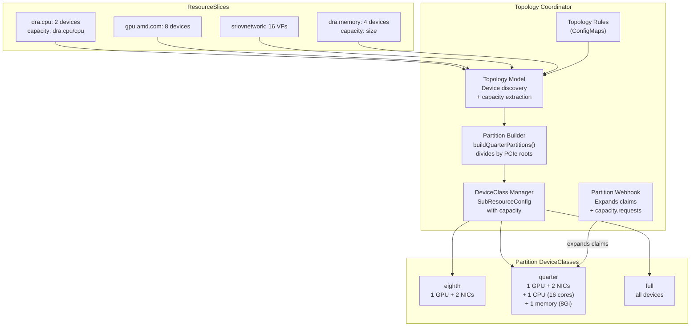
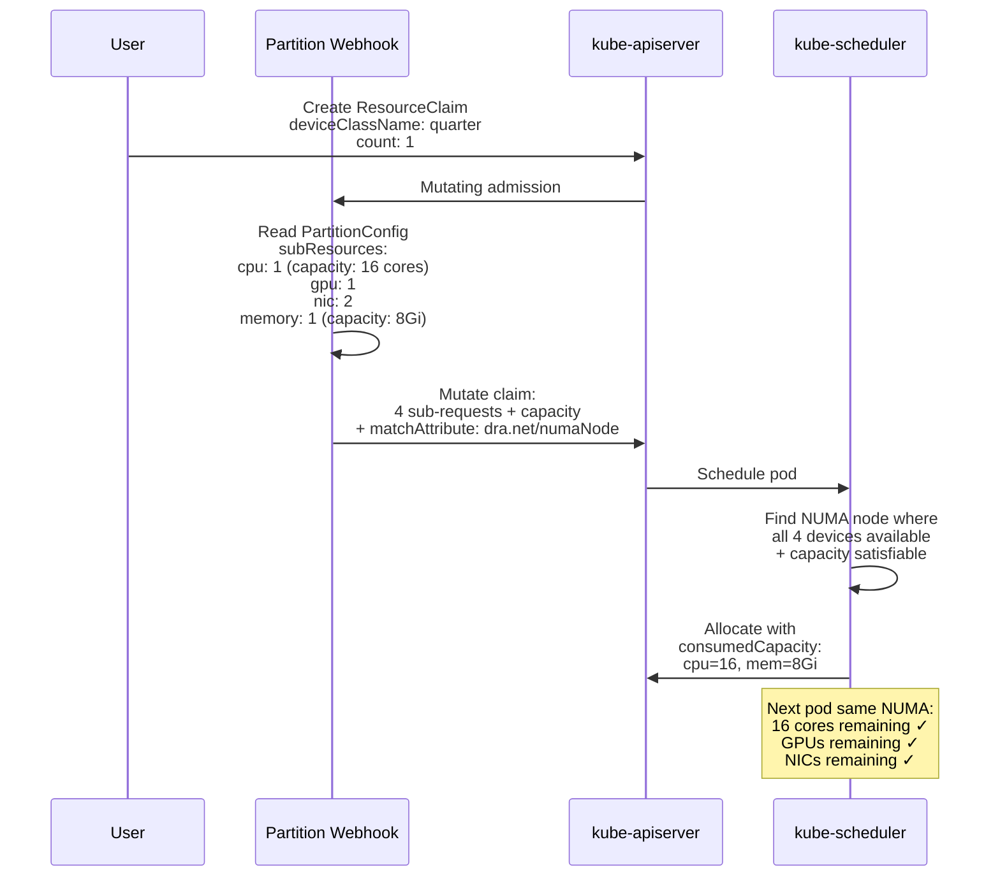
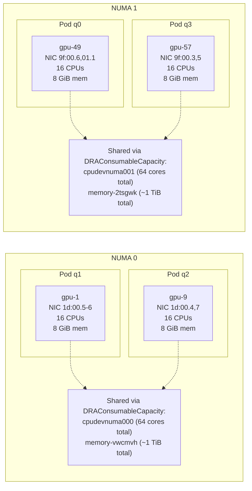

# Topology Coordinator Quarter-Machine Partitioning — K8s 1.36

**Date:** 2026-04-14/15
**Platform:** Fedora 43 + K8s 1.36.0-rc.0, Dell XE9680

---

## Summary

Four pods each receive a quarter of the machine — 1 GPU + 2 NICs + 16 CPU cores + 8 GiB memory — all NUMA-aligned, all allocated via the topology coordinator's partition webhook with `DRAConsumableCapacity`.

The user creates a simple one-line ResourceClaim referencing a partition DeviceClass. The webhook expands it into 4 sub-requests (CPU, GPU, NIC, memory) with a `matchAttribute: dra.net/numaNode` constraint. The scheduler allocates all devices from the same NUMA node. Shared devices (CPU, memory) are subdivided via `DRAConsumableCapacity` — two pods share the same CPU device with 16 exclusive cores each.

### Result

| Pod | NUMA | CPU (16 cores) | GPU | NICs | Memory (8 GiB) |
|-----|------|----------------|-----|------|----------------|
| q0 | 1 | cpudevnuma001 | gpu-49 | 9f:00.6, 9f:01.1 | memory-2tsgwk |
| q1 | 0 | cpudevnuma000 | gpu-1 | 1d:00.5, 1d:00.6 | memory-vwcmvh |
| q2 | 0 | cpudevnuma000 | gpu-9 | 1d:00.4, 1d:00.7 | memory-vwcmvh |
| q3 | 1 | cpudevnuma001 | gpu-57 | 9f:00.3, 9f:00.5 | memory-2tsgwk |

- q1 & q2 share `cpudevnuma000` + `memory-vwcmvh` (NUMA 0) via `DRAConsumableCapacity`
- q0 & q3 share `cpudevnuma001` + `memory-2tsgwk` (NUMA 1) via `DRAConsumableCapacity`
- Each pod gets an exclusive GPU and exclusive NICs

### What the User Creates

```yaml
apiVersion: resource.k8s.io/v1
kind: ResourceClaim
metadata:
  name: q0
spec:
  devices:
    requests:
    - name: q
      exactly:
        deviceClassName: dra-cpu-2-dra-memory-2-gpu-amd-com-8-sriovnetw-a8e66b43-quarter
        count: 1
```

### What the Webhook Expands It To

```yaml
requests:
- name: q-dra-cpu
  exactly: {deviceClassName: dra.cpu, count: 1, capacity: {requests: {dra.cpu/cpu: "16"}}}
- name: q-gpu-amd-com
  exactly: {deviceClassName: gpu.amd.com, count: 1}
- name: q-sriovnetwork-k8snetworkplumbingwg-io
  exactly: {deviceClassName: sriovnetwork.k8snetworkplumbingwg.io, count: 2}
- name: q-dra-memory
  exactly: {deviceClassName: dra.memory, count: 1, capacity: {requests: {size: "8Gi"}}}
constraints:
- matchAttribute: dra.net/numaNode
  requests: [q-dra-cpu, q-gpu-amd-com, q-sriovnetwork-k8snetworkplumbingwg-io, q-dra-memory]
```

---

## Coordinator Patches (4 patches on top of PR #1)

| # | File | Change |
|---|------|--------|
| 1 | `topology_model.go` | `AttrNUMANode` changed from `nodepartition.dra.k8s.io/numaNode` to `dra.net/numaNode` (bug #2 fix) |
| 2 | `topology_model.go` | Extract device capacity from ResourceSlice into `TopologyDevice.Capacity` |
| 3 | `deviceclass_manager.go` | `SubResourceConfig.Capacity` field for shared devices; `truncateLabel()` for >63 char profiles (bug #3 fix); removed cross-driver pcieRoot constraint |
| 4 | `partition_builder.go` | `buildQuarterPartitions()` subdivides NUMA nodes by PCIe root count; shared devices (count=1) get proportional capacity via `divideQuantity()`; `DeviceCapacity` field on `PartitionDevice` |
| 5 | `webhook.go` | Emit `capacity.requests` on `ExactDeviceRequest` when `SubResourceConfig.Capacity` is set |

### Bugs Fixed

| Bug | Description | Fix |
|-----|-------------|-----|
| #2 | `matchAttribute` uses `nodepartition.dra.k8s.io/numaNode` — no device publishes this | Changed `AttrNUMANode` to `dra.net/numaNode` |
| #3 | Profile label exceeds 63 chars with 4+ drivers | `truncateLabel()` uses SHA256 hash suffix |
| New | pcieRoot constraint between GPU and NIC is unsatisfiable (different PCIe roots) | Removed cross-driver pcieRoot alignment |
| New | Quarter partition puts all NICs in one partition | `buildQuarterPartitions()` divides NICs proportionally |
| New | CPU/memory have count=1 per NUMA — can't subdivide for 4 pods | `DRAConsumableCapacity` with divided capacity per partition |

---

## Architecture







---

## YAML Files

### Topology Rules

```yaml
# topology-rules.yaml
apiVersion: v1
kind: ConfigMap
metadata:
  name: cpu-numa-rule
  namespace: nodepartition
  labels:
    nodepartition.dra.k8s.io/topology-rule: "true"
data:
  attribute: dra.cpu/numaNodeID
  type: int
  driver: dra.cpu
  mapsTo: numaNode
  partitioning: group
---
apiVersion: v1
kind: ConfigMap
metadata:
  name: sriov-numa-rule
  namespace: nodepartition
  labels:
    nodepartition.dra.k8s.io/topology-rule: "true"
data:
  attribute: dra.net/numaNode
  type: int
  driver: sriovnetwork.k8snetworkplumbingwg.io
  mapsTo: numaNode
  partitioning: group
---
apiVersion: v1
kind: ConfigMap
metadata:
  name: gpu-numa-rule
  namespace: nodepartition
  labels:
    nodepartition.dra.k8s.io/topology-rule: "true"
data:
  attribute: gpu.amd.com/numaNode
  type: int
  driver: gpu.amd.com
  mapsTo: numaNode
  partitioning: group
---
apiVersion: v1
kind: ConfigMap
metadata:
  name: memory-numa-rule
  namespace: nodepartition
  labels:
    nodepartition.dra.k8s.io/topology-rule: "true"
data:
  attribute: dra.memory/numaNode
  type: int
  driver: dra.memory
  mapsTo: numaNode
  partitioning: group
```

### Self-Signed Issuer (for webhook TLS)

```yaml
# selfsigned-issuer.yaml
apiVersion: cert-manager.io/v1
kind: ClusterIssuer
metadata:
  name: selfsigned-issuer
spec:
  selfSigned: {}
```

### Quarter-Machine Claims (4 pods)

```yaml
# quarter-machine-coordinator.yaml
apiVersion: resource.k8s.io/v1
kind: ResourceClaim
metadata:
  name: q0
  namespace: test
spec:
  devices:
    requests:
    - name: q
      exactly:
        deviceClassName: dra-cpu-2-dra-memory-2-gpu-amd-com-8-sriovnetw-a8e66b43-quarter
        count: 1
        selectors:
        - cel:
            expression: 'device.attributes["dra.net"].numaNode == 0'
---
apiVersion: resource.k8s.io/v1
kind: ResourceClaim
metadata:
  name: q1
  namespace: test
spec:
  devices:
    requests:
    - name: q
      exactly:
        deviceClassName: dra-cpu-2-dra-memory-2-gpu-amd-com-8-sriovnetw-a8e66b43-quarter
        count: 1
        selectors:
        - cel:
            expression: 'device.attributes["dra.net"].numaNode == 0'
---
apiVersion: resource.k8s.io/v1
kind: ResourceClaim
metadata:
  name: q2
  namespace: test
spec:
  devices:
    requests:
    - name: q
      exactly:
        deviceClassName: dra-cpu-2-dra-memory-2-gpu-amd-com-8-sriovnetw-a8e66b43-quarter
        count: 1
        selectors:
        - cel:
            expression: 'device.attributes["dra.net"].numaNode == 1'
---
apiVersion: resource.k8s.io/v1
kind: ResourceClaim
metadata:
  name: q3
  namespace: test
spec:
  devices:
    requests:
    - name: q
      exactly:
        deviceClassName: dra-cpu-2-dra-memory-2-gpu-amd-com-8-sriovnetw-a8e66b43-quarter
        count: 1
        selectors:
        - cel:
            expression: 'device.attributes["dra.net"].numaNode == 1'
---
apiVersion: v1
kind: Pod
metadata:
  name: q0
  namespace: test
spec:
  containers:
  - name: w
    image: registry.access.redhat.com/ubi9/ubi-minimal:latest
    command: ["/bin/sleep", "infinity"]
  resourceClaims:
  - name: d
    resourceClaimName: q0
---
apiVersion: v1
kind: Pod
metadata:
  name: q1
  namespace: test
spec:
  containers:
  - name: w
    image: registry.access.redhat.com/ubi9/ubi-minimal:latest
    command: ["/bin/sleep", "infinity"]
  resourceClaims:
  - name: d
    resourceClaimName: q1
---
apiVersion: v1
kind: Pod
metadata:
  name: q2
  namespace: test
spec:
  containers:
  - name: w
    image: registry.access.redhat.com/ubi9/ubi-minimal:latest
    command: ["/bin/sleep", "infinity"]
  resourceClaims:
  - name: d
    resourceClaimName: q2
---
apiVersion: v1
kind: Pod
metadata:
  name: q3
  namespace: test
spec:
  containers:
  - name: w
    image: registry.access.redhat.com/ubi9/ubi-minimal:latest
    command: ["/bin/sleep", "infinity"]
  resourceClaims:
  - name: d
    resourceClaimName: q3
```

Note: The DeviceClass name includes a hash suffix that changes when the driver profile changes. Use `kubectl get deviceclass -l nodepartition.dra.k8s.io/partitionType=quarter` to find the current name.

---

## Issues

| Issue | Impact | Status |
|-------|--------|--------|
| Webhook down during coordinator restart | Claims created without expansion → pods stuck | Retry after coordinator pod is running |
| No anti-affinity across NUMA | All 4 pods may land on same NUMA | Add CEL `numaNode==0/1` selector to spread |
| Partition names are not intuitive | "quarter" in coordinator = quarter of NUMA, not quarter of machine | Document partition semantics |
| GPU DRA driver instability | Driver restarts 3-4 times during heavy allocation | Remove liveness probe |
| `dra.net/numaNode` must be published by all drivers | GPU driver needed patching to add this attribute | Patch #9 on AMD GPU driver |
| No hugepages in partition | Coordinator treats all `dra.memory` devices as interchangeable — doesn't distinguish regular memory from hugepages | Need DeviceClass-aware sub-resources in partition builder, or add hugepages as separate manual claim |
