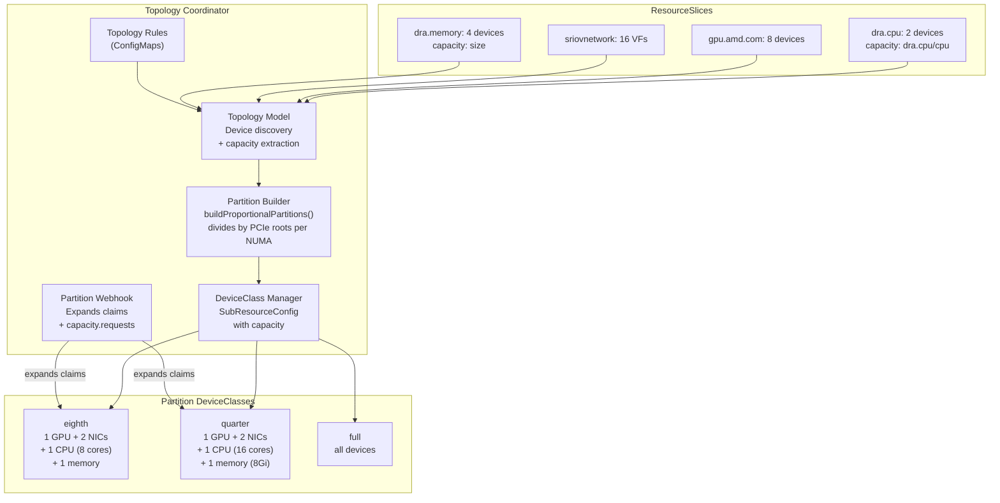
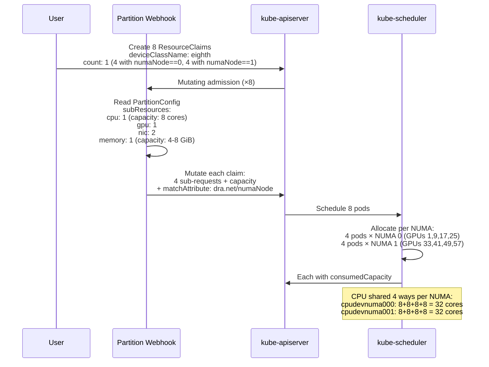
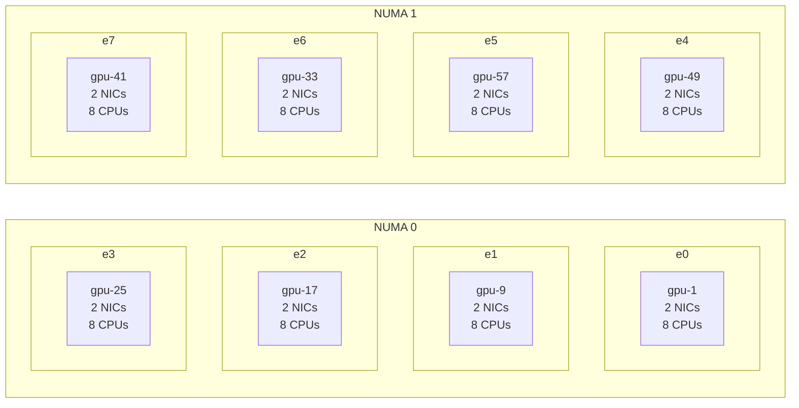

# Topology Coordinator Machine Partitioning — K8s 1.36

**Date:** 2026-04-14/15
**Platform:** Fedora 43 + K8s 1.36.0-rc.0, Dell XE9680

---

## Summary

The topology coordinator automatically discovers devices from 4 DRA drivers (CPU, GPU, NIC, memory), computes proportional partitions at multiple granularities, and exposes them as DeviceClasses. A mutating webhook expands simple one-line claims into multi-driver sub-requests with NUMA alignment constraints and `DRAConsumableCapacity` capacity sharing.

### Full Machine Divided into 8 Slices

8 pods, each receiving 1/8th of the machine — 1 GPU + 2 NICs + 8 CPU cores + memory — all NUMA-aligned, all allocated via the topology coordinator:

| Pod | NUMA | GPU | NICs | CPU (8 cores) | Memory |
|-----|------|-----|------|---------------|--------|
| e0 | 0 | gpu-1 | 1d:00.5, 1d:00.6 | cpudevnuma000 | memory-vwcmvh |
| e1 | 0 | gpu-9 | 1d:00.4, 1d:00.7 | cpudevnuma000 | memory-vwcmvh |
| e2 | 0 | gpu-17 | 1d:00.2, 1d:01.0 | cpudevnuma000 | memory-vwcmvh |
| e3 | 0 | gpu-25 | 1d:00.3, 1d:01.1 | cpudevnuma000 | memory-vwcmvh |
| e4 | 1 | gpu-49 | 9f:00.6, 9f:01.1 | cpudevnuma001 | memory-2tsgwk |
| e5 | 1 | gpu-57 | 9f:00.3, 9f:00.5 | cpudevnuma001 | memory-2tsgwk |
| e6 | 1 | gpu-33 | 9f:00.7, 9f:01.0 | cpudevnuma001 | memory-2tsgwk |
| e7 | 1 | gpu-41 | 9f:00.2, 9f:00.4 | cpudevnuma001 | memory-2tsgwk |

- All 8 GPUs allocated (exclusive, 1 per pod)
- All 16 NIC VFs allocated (exclusive, 2 per pod)
- CPU shared 4 ways per NUMA via `DRAConsumableCapacity` (8 exclusive cores each)
- Memory shared 4 ways per NUMA via `DRAConsumableCapacity`
- 4 pods on NUMA 0, 4 pods on NUMA 1
- Zero cross-NUMA contamination

### Also Tested: 4 Quarter-Machine Pods

| Pod | NUMA | GPU | NICs | CPU (16 cores) | Memory (8 GiB) |
|-----|------|-----|------|----------------|----------------|
| q0 | 1 | gpu-49 | 9f:00.6, 9f:01.1 | cpudevnuma001 | memory-2tsgwk |
| q1 | 0 | gpu-1 | 1d:00.5, 1d:00.6 | cpudevnuma000 | memory-vwcmvh |
| q2 | 0 | gpu-9 | 1d:00.4, 1d:00.7 | cpudevnuma000 | memory-vwcmvh |
| q3 | 1 | gpu-57 | 9f:00.3, 9f:00.5 | cpudevnuma001 | memory-2tsgwk |

### What the User Creates

```yaml
apiVersion: resource.k8s.io/v1
kind: ResourceClaim
metadata:
  name: e0
spec:
  devices:
    requests:
    - name: e
      exactly:
        deviceClassName: <eighth-class-name>
        count: 1
        selectors:
        - cel:
            expression: 'device.attributes["dra.net"].numaNode == 0'
```

### What the Webhook Expands It To

```yaml
requests:
- name: e-dra-cpu
  exactly: {deviceClassName: dra.cpu, count: 1, capacity: {requests: {dra.cpu/cpu: "8"}}}
- name: e-gpu-amd-com
  exactly: {deviceClassName: gpu.amd.com, count: 1}
- name: e-sriovnetwork-k8snetworkplumbingwg-io
  exactly: {deviceClassName: sriovnetwork.k8snetworkplumbingwg.io, count: 2}
- name: e-dra-memory
  exactly: {deviceClassName: dra.memory, count: 1, capacity: {requests: {size: "8Gi"}}}
constraints:
- matchAttribute: dra.net/numaNode
  requests: [e-dra-cpu, e-gpu-amd-com, e-sriovnetwork-k8snetworkplumbingwg-io, e-dra-memory]
```

---

## Partition Levels

The coordinator computes three partition granularities plus full:

| Level | GPU | NICs | CPU | Memory | Partitions per Machine |
|-------|-----|------|-----|--------|----------------------|
| **Eighth** | 1 | 2 | 1 (8 cores) | 1 (4-8 GiB) | 8 (4 per NUMA) |
| **Quarter** | 1 | 2 | 1 (16 cores) | 1 (8 GiB) | 8 (4 per NUMA)* |
| **Full** | 8 | 16 | 2 | 4 | 1 |

*On this hardware, eighth and quarter produce the same subdivision factor (4 PCIe roots per NUMA). They differ on systems where PCIe roots group multiple devices.

Both eighth and quarter use `buildProportionalPartitions()` which:
1. Counts unique PCIe roots per NUMA node
2. Divides all device types proportionally by that count
3. For shared devices (count=1 per NUMA), uses `DRAConsumableCapacity` to divide capacity

---

## Architecture







---

## Coordinator Patches (6 patches on top of PR #1)

| # | File | Change |
|---|------|--------|
| 1 | `topology_model.go` | `AttrNUMANode` → `dra.net/numaNode` (bug #2 fix) |
| 2 | `topology_model.go` | Extract device capacity from ResourceSlice into `TopologyDevice.Capacity` |
| 3 | `deviceclass_manager.go` | `SubResourceConfig.Capacity` field; `truncateLabel()` for >63 char profiles (bug #3); removed cross-driver pcieRoot constraint |
| 4 | `partition_builder.go` | `buildProportionalPartitions()` — proportional subdivision of NUMA nodes by PCIe root count for both eighth and quarter levels |
| 5 | `partition_builder.go` | Shared devices (count=1) get proportional capacity via `divideQuantity()` + `DeviceCapacity` on `PartitionDevice` |
| 6 | `webhook.go` | Emit `capacity.requests` on `ExactDeviceRequest` when `SubResourceConfig.Capacity` is set |

---

## YAML Files

### Eighth-Machine Claims (8 pods, full machine)

```yaml
# eighth-machine-coordinator.yaml
# Find current DeviceClass name:
#   kubectl get deviceclass -l nodepartition.dra.k8s.io/partitionType=eighth

# NUMA 0 pods (e0-e3)
apiVersion: resource.k8s.io/v1
kind: ResourceClaim
metadata: {name: e0, namespace: test}
spec:
  devices:
    requests:
    - name: e
      exactly:
        deviceClassName: <EIGHTH_CLASS>
        count: 1
        selectors:
        - cel:
            expression: 'device.attributes["dra.net"].numaNode == 0'
---
# Repeat for e1, e2, e3 (same, numaNode == 0)
# Repeat for e4, e5, e6, e7 (same, numaNode == 1)
---
apiVersion: v1
kind: Pod
metadata: {name: e0, namespace: test}
spec:
  containers:
  - name: w
    image: registry.access.redhat.com/ubi9/ubi-minimal:latest
    command: ["/bin/sleep", "infinity"]
  resourceClaims:
  - name: d
    resourceClaimName: e0
# Repeat for e1-e7
```

See `testing/manifests/claims/quarter-machine-coordinator.yaml` for the full 4-pod quarter-machine version.

### Topology Rules

See `testing/manifests/coordinator/topology-rules.yaml`.

---

## Issues

| Issue | Impact | Status |
|-------|--------|--------|
| Webhook down during coordinator restart | Claims created without expansion → pods stuck | Retry after controller pod is running |
| No anti-affinity across NUMA | All pods may land on same NUMA without CEL selector | Add `numaNode==0/1` selectors to spread |
| No hugepages in partitions | Coordinator doesn't distinguish regular memory from hugepages | Need DeviceClass-aware sub-resources |
| GPU DRA driver instability | Driver restarts during heavy allocation | Remove liveness probe |
| `dra.net/numaNode` required on all drivers | GPU driver needed patching to add this attribute | Patch #9 on AMD GPU driver |
| Partition naming unintuitive | "eighth" = 1/8 of machine, "quarter" = also 1/8 on this hardware | Document or make configurable |
| Eighth and quarter identical on this hardware | 4 PCIe roots per NUMA = same subdivision for both | Different on systems with PCIe switches |
